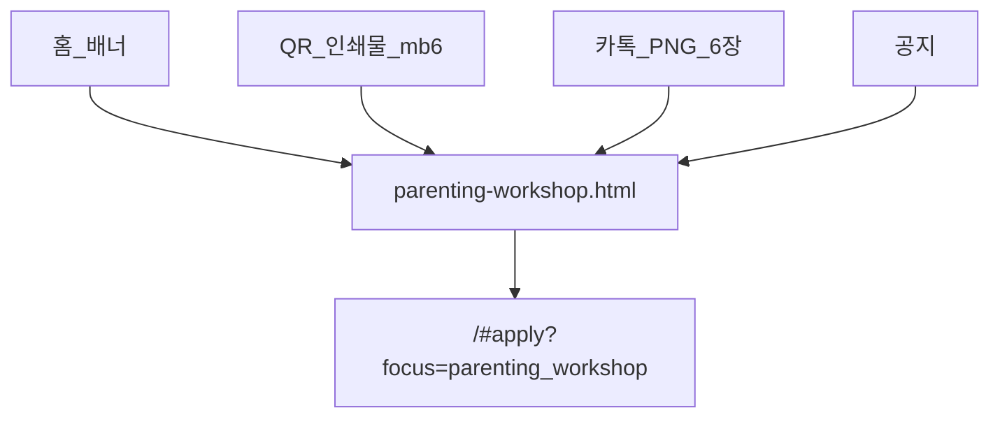

# Parenting 워크샵 — 유입 경로

| 채널 | 역할 |
|------|------|
| **카톡 PNG** | `parenting-workshop/mb1–mb6.png` — 홍보 스토리 (웹 URL 없음) |
| [parenting-workshop.html](../../../parenting-workshop.html) | 웹 랜딩 · 신청 CTA |
| [parents-workshop.html](../../../parents-workshop.html) | 구 URL → 랜딩 리다이렉트 |
| `#apply?focus=parenting_workshop` | 신청 폼 |

QR(mb6)는 **랜딩**만 가리킵니다.
