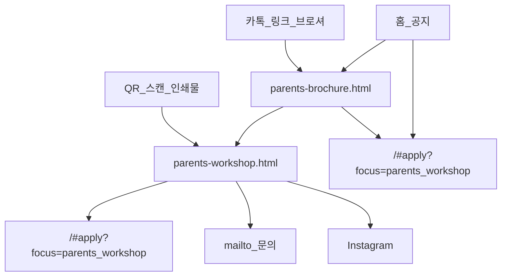

# Parents 워크샵 — 유입 경로

| 페이지 | 역할 |
|--------|------|
| [parents-workshop.html](../../../parents-workshop.html) | **QR 도착** — 1화면 요약 + 신청/문의/브로셔 |
| [parents-brochure.html](../../../parents-brochure.html) | **홍보** — 6페이지 스토리 |
| SPA `#apply?focus=parents_workshop` | **전환** — 실제 신청 폼 |

QR은 랜딩만 가리킵니다. 신청 폼 URL을 바꿔도 QR 인쇄물을 다시 찍을 필요가 없습니다.
