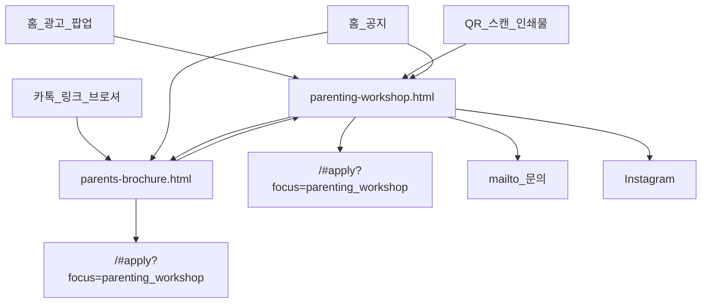

# Parenting 워크샵 — 유입 경로

| 페이지 | 역할 |
|--------|------|
| [parenting-workshop.html](../../../parenting-workshop.html) | **웹 랜딩** — 팝업·QR·공지에서 도착하는 안내 페이지 (브로셔 아님) |
| [parents-brochure.html](../../../parents-brochure.html) | **모바일 브로셔** — 6페이지 스토리 (홍보용) |
| [parents-workshop.html](../../../parents-workshop.html) | **리다이렉트** → `parenting-workshop.html` (구 URL 호환) |
| SPA `#apply?focus=parenting_workshop&apply_source=…` | **전환** — 신청 폼 (`source`에 qr·brochure·home_banner 등 저장) |

공지(id 3·4)는 Supabase `public_notices`에 없으면 `js/strings.js` 폴백이 목록에 병합됩니다.

QR·인쇄물은 **랜딩**(`parenting-workshop.html`)만 가리킵니다. 신청 폼 URL을 바꿔도 QR을 다시 찍을 필요가 없습니다.
