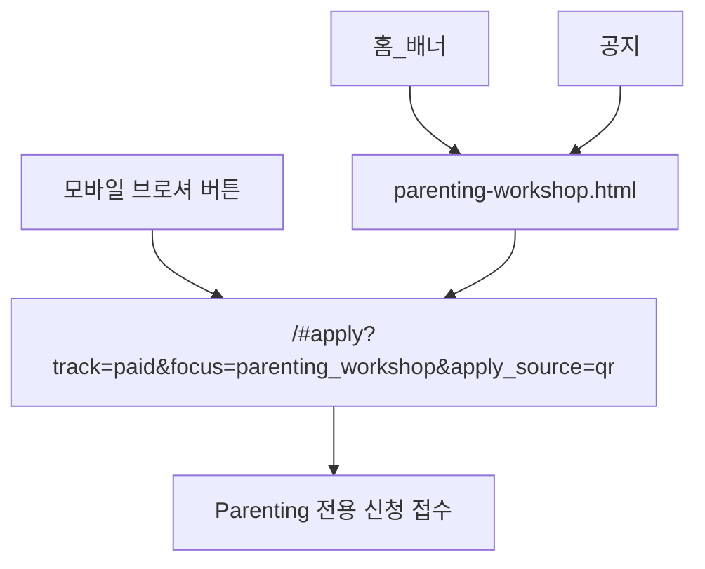

# Parenting 워크샵 — 유입 경로

| 채널 | 역할 |
|------|------|
| **모바일 브로셔 버튼** | `/#apply?track=paid&focus=parenting_workshop&apply_source=qr` — 전용 신청 화면으로 바로 연결 |
| [parenting-workshop.html](../../../parenting-workshop.html) | 웹 랜딩 · 신청 CTA |
| [parents-workshop.html](../../../parents-workshop.html) | 구 URL → 랜딩 리다이렉트 |
| `#apply?focus=parenting_workshop` | 신청 폼 |

모바일 브로셔 안의 신청 버튼 주소는 변경하지 않고, `qr` 유입값을 보존한 전용 신청 화면으로 바로 연결합니다.
