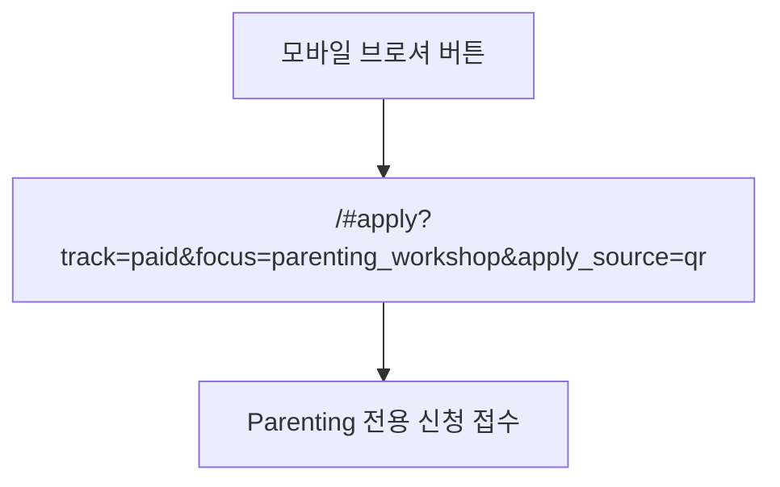

# Parenting Focused Apply Route Implementation Plan

> **For agentic workers:** REQUIRED SUB-SKILL: Use superpowers:subagent-driven-development (recommended) or superpowers:executing-plans to implement this plan task-by-task. Steps use checkbox (`- [ ]`) syntax for tracking.

**Goal:** Make the existing mobile brochure button route render a calm, direct Enneagram for Parenting application screen while preserving secure submission and QR attribution.

**Architecture:** The SPA remains the entrypoint because the distributed button already points to `#apply`. `renderApply` branches only for normalized `parenting_workshop` focus, with a dedicated form that submits through the existing API function. A route-level body class makes the global shell quiet on the focused form and thank-you screen without affecting general application routes.

**Tech Stack:** Static HTML, Tailwind utility classes, focused CSS, vanilla JavaScript SPA routing, Node built-in tests, Cloudflare Pages deployment.

---

### Task 1: Lock The Brochure Button Route In Documentation And Tests

**Files:**
- Modify: `docs/superpowers/specs/2026-05-25-parenting-direct-application-design.md`
- Create: `tests/apply-workshop-render.test.mjs`

- [ ] **Step 1: Update the approved design for the actual distributed button route**

Record `https://er-coaching.com/#apply?track=paid&focus=parenting_workshop&apply_source=qr` as the unchanged entrypoint and scope the implementation to `renderApply(payload)` rather than `parenting-workshop.html`.

- [ ] **Step 2: Write focused renderer tests that initially fail**

Create a VM-based test harness for `js/sections/apply.js` and assert:

```javascript
const workshopHtml = renderer.renderApply({
  track: 'paid',
  focus: 'parenting_workshop',
  apply_source: 'qr'
});
assert.match(workshopHtml, /4주 워크샵 신청/);
assert.match(workshopHtml, /assets\/er-visual\/hero-home\.jpg/);
assert.match(workshopHtml, /type="hidden" name="category" value="Enneagram for Parenting 4주 \(\$120\)"/);
assert.doesNotMatch(workshopHtml, /희망하는 세션|<select/);
assert.doesNotMatch(workshopHtml, /Enneagram for Parenting 4주 워크샵 신청합니다\./);
assert.match(workshopHtml, /4주 워크샵 신청하기/);
```

Also assert the generic `renderApply({ track: 'paid' })` output still includes `희망하는 세션` and a `<select>`.

- [ ] **Step 3: Run the renderer test and verify it fails before the UI branch exists**

Run: `node --test tests/apply-workshop-render.test.mjs`
Expected: FAIL because the current Parenting output still includes the generic selector/prefilled message and has no photo accent.

### Task 2: Render The Focused Parenting Form

**Files:**
- Modify: `js/sections/apply.js`
- Create: `css/parenting-application.css`
- Modify: `index.html`

- [ ] **Step 1: Add a dedicated focused-form renderer**

Define a focused renderer in `js/sections/apply.js` and return it only when normalized focus is `parenting_workshop`. It must include:

```html
<input type="hidden" name="category" value="Enneagram for Parenting 4주 ($120)">
<textarea name="message" placeholder="전하고 싶은 내용이 있으시면 편하게 남겨주세요."></textarea>
<button id="apply-submit-btn" data-default-label="4주 워크샵 신청하기" data-loading-label="접수 중...">
  4주 워크샵 신청하기
</button>
```

Use `/assets/er-visual/hero-home.jpg` for a shallow visual accent and keep the existing fields `name`, `contact`, `country`, `preferred_time`, `turnstile_token`.

- [ ] **Step 2: Add focused-route styling and load it**

Create `css/parenting-application.css` with a route class:

```css
body.parenting-focused-apply footer,
body.parenting-focused-apply #navbar .desktop-nav,
body.parenting-focused-apply #navbar .xl\:hidden {
  display: none;
}
body.parenting-focused-apply #navbar > div > div {
  justify-content: center;
}
```

Add `<link rel="stylesheet" href="css/parenting-application.css?v=20260525a" />` to `index.html` and bump the `js/sections/apply.js` asset version.

- [ ] **Step 3: Run the renderer tests**

Run: `node --test tests/apply-workshop-render.test.mjs`
Expected: PASS.

### Task 3: Preserve Focused State Through Submission

**Files:**
- Modify: `js/app-core.js`
- Modify: `js/api.js`
- Modify: `js/sections/apply.js`

- [ ] **Step 1: Apply a body class only for the focused application journey**

In `renderSection`, compute whether the current view is `apply` or `thankyou` with `payload.focus === 'parenting_workshop'`, including the legacy `parents_workshop` alias, and toggle:

```javascript
document.body.classList.toggle('parenting-focused-apply', isParentingFocusedView);
```

- [ ] **Step 2: Carry focus into successful confirmation**

Pass a success payload from the dedicated form:

```html
onsubmit="handleApplySubmit(event, 'paid:parenting_workshop:qr', { focus: 'parenting_workshop' })"
```

Update the shared submission handler to call:

```javascript
renderSection('thankyou', successPayload || null);
```

Update `renderThankYou(payload)` to show focused workshop confirmation text only for Parenting focus, leaving general confirmation unchanged.

- [ ] **Step 3: Display a focused inline submission error**

Add `<p id="apply-submit-status" ... role="status" aria-live="polite"></p>` to the focused form and set it from `js/api.js` on failed submission while preserving all typed fields and resetting Turnstile.

- [ ] **Step 4: Run static tests**

Run: `node --test tests/apply-workshop-render.test.mjs tests/render-smoke.test.mjs tests/test-scoring.test.mjs`
Expected: all tests PASS.

### Task 4: Update Funnel Documentation And Validate In Browser

**Files:**
- Modify: `docs/projects/parents-brochure/FUNNEL.md`

- [ ] **Step 1: Correct the documented conversion route**

Replace the landing-to-form funnel for the mobile brochure button with:



- [ ] **Step 2: Validate locally in the rendered browser**

Serve the static site, open the exact hash URL, and verify mobile and desktop screens show the compact photo identity and direct form, hide the program selector and generic footer, and retain `qr` in the route.

- [ ] **Step 3: Validate regression behavior**

Open `/#apply?track=paid` and verify ordinary applications retain the category selector and standard layout.

### Task 5: Publish And Confirm Production

**Files:**
- Commit only files listed above and the already-approved design/plan documents.

- [ ] **Step 1: Commit and push the feature branch**

Stage only scoped files, commit with `feat(parenting): make brochure link a focused application flow`, and push `codex/parenting-direct-application`.

- [ ] **Step 2: Merge through GitHub**

Create and merge a PR to protected `main`, preserving the user-uploaded `parenting-workshop/mobile-brochure.pdf` already present on current `main`.

- [ ] **Step 3: Confirm Cloudflare Pages deployment**

Wait for the `main` deployment and reopen:

```text
https://er-coaching.com/#apply?track=paid&focus=parenting_workshop&apply_source=qr
```

Expected: the focused Parenting application form is publicly visible and the generic selector/stepper/prefilled message no longer appears.
