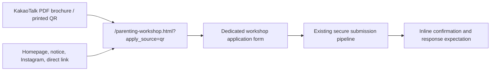

# Enneagram for Parenting Direct Application Page Design

Date: 2026-05-25
Status: User-approved direction, ready for implementation planning

## Decision

The mobile brochure already explains the workshop and builds interest. The QR destination should therefore stop repeating promotional content and become a focused application experience.

- Keep the distributed QR destination unchanged: `https://er-coaching.com/parenting-workshop.html?apply_source=qr`.
- Keep the page path `/parenting-workshop.html` stable for homepage, notice, Instagram, and manual sharing traffic.
- Replace the long promotional landing content on that page with a dedicated `Enneagram for Parenting` application screen.
- Preserve `apply_source` attribution, especially the `qr` value embedded in the distributed brochure.
- Do not edit the completed brochure PDF or regenerate/replace the QR image as part of this work.

## Current Context

As of 2026-05-25, the latest GitHub `main` renders `/parenting-workshop.html` as a long landing page whose CTA sends visitors to the general SPA form at `/#apply?track=paid&focus=parenting_workshop&apply_source=...`. The application pipeline already supports:

- the `parenting_workshop` focused application category,
- `name`, `contact`, optional `country`, optional `preferred_time`, and message values,
- Cloudflare Turnstile validation,
- attribution stored through `buildApplySubmitSource(...)`.

The production page observed during design review was temporarily behind GitHub `main`, still displaying a removed brochure CTA. Final verification must confirm the deployed page matches the merged implementation.

## Goals

- Let a parent who scans the brochure QR begin applying immediately, without another CTA click.
- Keep the page calm, warm, and visually connected to the approved ER homepage/brochure artwork.
- Reduce friction: show only information needed to confirm the workshop and complete an application.
- Reuse the existing secure submission pipeline and source tracking.
- Provide a clear success/error experience on the standalone page.

## Non-Goals

- Rewriting the brochure, its PDF export, or its QR asset.
- Repeating the curriculum, ER perspective, or promotional narrative already contained in the brochure.
- Redesigning the general application section for all other ER programs.
- Changing workshop pricing, schedule, eligibility, or business rules.

## Visitor Flow

The old compatibility URL `/parents-workshop.html` should continue to forward to `/parenting-workshop.html`; it is separate from the distributed QR URL and does not require a QR change.

## Screen Design

### Mobile-First Layout

The first mobile viewport should contain the ER header, a compact workshop identity block, key facts, and the beginning of the form. It must not make the visitor scroll through another sales presentation before applying.

1. Minimal sticky header with ER logo and no redundant `신청하기` jump button.
2. A shallow photo accent using the existing approved chair/window image (`assets/er-visual/hero-home.jpg`) with a restrained warm overlay; it is a bridge from the brochure, not a full hero.
3. Compact title block:
   - `Enneagram for Parenting`
   - `4주 워크샵 신청`
   - facts: `온라인 Zoom`, `총 10시간`, `$120`, `소규모 선착순`
   - one functional line: `신청 내용을 남겨주시면 일정과 참여 안내를 보내드립니다.`
4. Application fields begin immediately after the identity block.
5. Small inquiry links below the form: email and Instagram only.

Desktop should preserve the same reading order in a centered, restrained layout. A two-column arrangement may place the compact identity/photo at left and the form at right only when it keeps the form prominent and does not become a marketing hero.

### Removed From This Page

- `이 과정이 다른 점` feature cards.
- `4주 커리큘럼` section.
- Long promotional introduction and repeated invitation copy.
- `모바일 브로셔` button.
- Repeated upper/lower `워크샵 신청하기` navigation buttons.

## Form Content

The page is already program-specific, so the visitor must not select a program category.

| Field | Behavior |
| --- | --- |
| 이름 | Required |
| 연락받으실 곳 | Required; phone number or email |
| 거주 국가 | Optional; retained because the program is online and international |
| 희망 시간대 | Optional; retained while class time is finalized |
| 전하고 싶은 내용 | Optional textarea; no prefilled promotional sentence |
| 신청 분야 | Hidden, fixed to `Enneagram for Parenting 4주 ($120)` |
| 보안 확인 | Required Turnstile validation |

The brochure already states that this is a deeper course for parents who know their type to some degree. No required qualification question is added here; that extra gate would add friction after an informed QR visit.

Primary submit button: `4주 워크샵 신청하기`.

Secondary links beneath submission: `신청 전 문의` followed by email and Instagram links in quiet text styling.

## Data And Integration

- `/parenting-workshop.html` hosts the dedicated form directly instead of redirecting through a CTA into the generic `#apply` view.
- The standalone screen reuses the existing Supabase submission endpoint and Turnstile flow rather than creating a second application backend.
- The hidden category value must remain compatible with existing application records: `Enneagram for Parenting 4주 ($120)`.
- Query attribution must be carried through submission. A QR visit with `?apply_source=qr` must be stored as the workshop application source equivalent of `paid:parenting_workshop:qr`.
- Unknown attribution values should continue to be normalized/ignored according to the existing allowed-source behavior.
- `js/api.js` remains the single submission implementation and will support a small optional page-level success/error UI hook, while retaining the existing SPA thank-you fallback for other forms.
- A narrowly scoped parenting-page script will initialize hidden category/source values and render the standalone confirmation state through that hook.

## States And Messages

### Submitting

- Disable the primary button while sending.
- Change button label to `접수 중...`.
- Prevent duplicate submissions.

### Success

Replace the form area with a compact confirmation state:

- Heading: `신청이 접수되었습니다`
- Body: `남겨주신 연락처로 일정과 참여 안내를 보내드리겠습니다.`
- Supporting note: `보통 24시간 이내에 연락드립니다.`
- Quiet options: return to ER homepage or open Instagram.

### Failure

- Preserve typed field values.
- Reset/reload Turnstile when required.
- Show a readable inline failure message near the submit area with a retry action; do not depend only on an alert dialog.

## Visual Direction

- Use the existing ER warm neutral palette and Pretendard typography.
- Carry the approved chair/window image only as a compact accent so the form remains the first task.
- Avoid decorative cards stacked inside other cards; the form surface is the one framed tool.
- Use restrained spacing and normal form typography rather than oversized hero text.
- Keep text wrapping natural on narrow Korean mobile screens and preserve clear contrast over the photograph.

## Files Expected To Change During Implementation

- `parenting-workshop.html` for the direct form screen and its content.
- `css/parenting-workshop-landing.css` for the new compact layout and form presentation.
- `js/api.js` for the optional standalone UI hook without regressing the SPA form.
- A narrowly scoped parenting-page script for source/category initialization and standalone confirmation rendering.
- `docs/projects/parents-brochure/FUNNEL.md` to document that the landing URL now contains the form directly.

The implementation must not change `assets/parents-brochure/qr-apply.png` or the final brochure PDF.

## Verification

- Open `/parenting-workshop.html?apply_source=qr` on a mobile viewport and verify form fields begin in the first screen without a promotional-scroll detour.
- Verify desktop layout is balanced and keeps the form as the primary action.
- Verify the chair photo renders correctly, is not overly dark, and does not obscure text.
- Verify no visible brochure button, curriculum section, or feature-card section remains on this QR destination.
- Submit a workshop application through the secure pipeline and verify category and `qr` attribution are retained.
- Test Turnstile unavailable/failure and submission error handling.
- Verify `/parents-workshop.html` compatibility redirect still reaches the stable workshop page.
- After merge/deployment, verify the public URL at `https://er-coaching.com/parenting-workshop.html?apply_source=qr` reflects the new direct application experience.
