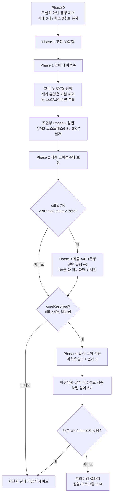

# ER 에니어그램 진단 테스트 — 운영·평가·수정 통합 명세

> 이 문서는 현재 ER Website에서 실행되는 에니어그램 진단의 **운영 스냅샷, 채점 명세, 전체 문항 원문, 결과지·실험 데이터 계약, 검증 절차**를 한곳에 모은 문서다.
> 목적은 새 개발자·연구자·AI가 과거 계획 문서나 미연결 모듈을 운영 코드로 오인하지 않고, 현재 테스트를 재현 가능하게 평가·수정·발전시키는 것이다.

---

## 0. 문서 신분증과 사용 규칙

| 항목 | 값 |
|---|---|
| 문서 기준일 | 2026-08-10 (Asia/Seoul) |
| 저장소 HEAD | `332655db2eb2a77c22676f43211b97bd42f05cea` |
| 운영 트랙 | `test` |
| 실제 실행 진입점 | `test.html → js/test.js` |
| 기본 언어 | 한국어. `?lang=en`이면 영문 UI/문항 분기 |
| 실험 모드 | `?experiment=1` |
| `js/test.js` Git blob | `3c705e1cf795eb7093031095976717a316f16b63` |
| `js/test.js` SHA-256 | `c5d1a1305c9fa9433835af56c1bfbd639883a64142423811ee3ea1c55f9dcdef` |
| `test.html` SHA-256 | `9f0fc489237e58155456e86d82dba7a240e30d5126ebfd376f1771bbdfc8fdb6` |
| `js/diagnostic-experiment.js` SHA-256 | `27e16e65e930535e5e10db04b23f4927446a60e006023717e096916dc9886c78` |
| `js/diagnostic-report-content.js` SHA-256 | `8c783cdff45a02ee03e671ce1e1904ba0a467f053c05afe4abeb0d387e515397` |
| `js/report-support-materials.js` SHA-256 | `52f0033a9c4dc698036bc70429e48fd31f6b0366f0b3a1374493d3ae036f9500` |

### 0.1 가장 중요한 원칙

1. 이 문서는 특정 코드 스냅샷을 사람이 읽을 수 있게 풀어쓴 **파생 명세**다.
2. 실행 동작의 최종 진실은 항상 현재 `test.html`이 실제로 로드하는 `js/test.js`다.
3. 문서와 코드가 다르면 코드를 먼저 재현하고, 차이를 결함으로 기록한 뒤 문서 또는 코드를 의도적으로 고친다.
4. 문항 문구, 가중치, 분기 임계값, 결과 콘텐츠를 한 번에 바꾸지 않는다. 원인을 식별할 수 있도록 변경 축을 분리한다.
5. “테스트가 통과했다”는 말은 **운영 경로를 검증하는 테스트가 통과했는지**까지 확인해야 유효하다.
6. 심리검사에서 “오차 0”은 보장할 수 없다. 이 문서가 보장하려는 것은 **구현 오해와 변경 실수의 최소화, 계산의 재현성, 오차의 측정 가능성**이다.

### 0.2 변경 전 기준선 확인

```bash
git status --short --branch
git rev-parse HEAD
shasum -a 256 js/test.js test.html js/diagnostic-experiment.js
```

위 해시가 문서 상단과 다르면 질문 부록과 채점 설명을 그대로 신뢰하지 말고, `js/test.js`에서 다시 추출·대조한다.

---

## 1. 운영 SSOT와 레거시 경계

### 1.1 현재 브라우저 로드 순서

`test.html` 하단의 실제 순서는 다음과 같다.

1. `js/config.js`
2. Supabase JavaScript CDN
3. `js/supabase-client.js`
4. `js/diagnostic-experiment.js`
5. `js/program-catalog.js`
6. `js/diagnostic-report-content.js`
7. `js/report-support-materials.js`
8. `js/test.js`

역할은 다음과 같다.

| 파일 | 운영 역할 |
|---|---|
| `test.html` | 4단계 폼, 실험 동의 게이트, 결과 호스트, 스크립트 로드 |
| `js/test.js` | 질문 정의, 렌더링, 상태 머신, 모든 운영 채점, 보정, 결과 분기, 프리미엄 결과 렌더 |
| `js/diagnostic-experiment.js` | 실험 모드 동의, 결과 피드백 UI, Supabase INSERT payload |
| `js/diagnostic-report-content.js` | 코어·본능·날개별 결과지 콘텐츠와 합성 문구 |
| `js/report-support-materials.js` | 결과·대상 맥락별 보조자료 선택 |
| `js/program-catalog.js` | 결과지 CTA와 프로그램 이동 payload |
| `js/supabase-client.js` | Supabase 클라이언트 초기화 |
| `css/test.css` | 테스트·결과지·PDF 출력 스타일 |

메인 사이트에서는 `js/sections/test-embed.js`가 `test.html?lang=ko|en`을 iframe으로 연다. 이 파일과 `js/app-state.js`, `js/app-core.js`는 진단 iframe의 부모 상태·이동을 담당하지만 deploy 분류는 `site`다.

현재 iframe 발신부는 `window.parent.postMessage(..., '*')`를 사용하고 부모 수신부는 `event.origin`과 `event.source`를 확인하지 않는다. 같은 도메인 iframe이라는 현재 전제에 기대고 있으므로, 메시지 처리 변경 시 허용 origin과 실제 `adaptive-test-iframe.contentWindow`를 함께 검증해야 한다.

### 1.2 운영으로 오인하면 안 되는 파일

아래 파일은 저장소에 있어도 `test.html`이 로드하지 않는다.

- `js/test-scoring.js`
- `js/test-result-renderer.js`
- `js/test-charts.js`
- `js/subtypes-27-data.js`
- `js/app-adaptive.js` 및 `js/app-adaptive-*.js`

따라서 다음과 같이 해석한다.

- `tests/test-scoring.test.mjs`가 통과해도 `js/test-scoring.js`의 독립 helper가 맞다는 뜻일 뿐, 운영 `js/test.js`의 결과가 맞다는 증거가 아니다.
- `tests/render-smoke.test.mjs` 중 레거시 렌더러를 대상으로 하는 검증도 운영 결과지의 완전한 보증이 아니다.
- 과거 `PHASE_PLAN.md`, `PHASE_2_PLAN.md` … `PHASE_6_PLAN.md`는 역사 자료다. 새 구현 지시로 쓰지 않는다.
- 현재 계획 판단은 `docs/_meta/enneagram/ACTIVE_EVOLUTION_PLAN.md`, 현재 상태는 `WORK_STATUS.md`, 운영/레거시 경계는 `CODE_GAP_AUDIT.md`를 우선한다.

---

## 2. 시스템 전체 흐름



### 2.1 화면 상태

| 상태 | 표시 | 제출 함수 | 다음 상태 |
|---|---|---|---|
| Phase 0 | `#phase0-form` 9유형 제거 카드 | `submitTypeElimination()` | Phase 1 |
| Phase 1 | 고정 39문항 (`#phase1-form`, 초기 hidden) | `submitPhase1()` | Phase 2 |
| Phase 2 | 후보별·조건부 문항 | `submitPhase2()` | Phase 3, Phase 4 또는 결과 |
| Phase 3 | 조건부 A/B 1문항 | `submitPhase3()` | Phase 4 또는 결과 |
| Phase 4 | 조건부 6문항 | `submitPhase4()` | 결과 |
| 결과 | 프리미엄 결과지 또는 저신뢰 게이트 | — | 종료/재검사/CTA |

UI상 주의점:

- 단계 카운터는 `1 / 5`부터 `5 / 5`까지다. 1단계는 제거, 2단계는 기존 Phase 1 문항이다.
- 진행률은 대략 20→40→60→80→100%로 단계 진입을 표시할 뿐, 실제 문항 진행률은 아니다.
- Phase 2 버튼은 “결과 보기”지만 Phase 3 또는 Phase 4가 이어질 수 있다.
- 모든 표시 문항은 응답해야 다음 단계로 간다. Likert의 `U`와 A/B의 `둘 다 아니다(U)`도 “응답함”으로 인정되지만 비채점이다.
- Phase 0에서 제거하지 않아도 된다. 확신이 있을 때만 “확실히 아님”을 표시한다.

### 2.2 실제 응답 문항 수

Phase 2의 기본 문항은 후보 하나당 `deep 2 + countertype 1 = 3`개다.

- 후보 3~5개 → 기본 9~15문항
- 상위 2개 16% 이내 감별 → 0~3문항 추가
- 고스트레스 6번 감별 → 0~8문항 추가, 중복 ID는 재추가하지 않음
- 3↔SX 특수 감별 → 0~2문항
- 7번 날개 감별 → 0~2문항

이론적 Phase 2 범위는 9~30문항이다. 따라서:

- 저신뢰 조기 종료: 최소 48문항(39+9), 조건에 따라 증가
- 코어 확정 후 정상 결과: 최소 54문항(39+9+Phase 4의 6)
- 모든 조건이 겹치는 상한: 대략 76문항(39+30+Phase 3의 1+Phase 4의 6)

기존 문서의 “보통 47~56”은 후보당 countertype 1문항과 확장된 전용 감별 풀을 충분히 반영하지 않은 낡은 추정이다.

---

## 3. 질문 형식과 응답 인코딩

### 3.1 `abc`

- 라디오 3지선다.
- `centerChoice`: 값 `heart/head/body`, 선택 센터의 세 유형에 각각 점수.
- `instinctChoice`: 값 `sp/sx/so`, 선택 본능에 점수.
- `subtypeChoice`: 값 `sp/so/sx`, Phase 4 다수결 표.

### 3.2 `ab`

- 값은 대문자 `A`, `B`, 또는 `U`.
- `U = 둘 다 아니다 (비채점)`.
- 일반 코어 비교에서는 A가 `leftType`, B가 `rightType`. `U`면 점수를 주지 않는다.
- Phase 3에서도 `U`면 post-tie boost를 적용하지 않는다.
- Phase 4 날개에서는 A가 `leftWing`, B가 `rightWing`. `U`면 해당 문항 표를 버린다.

### 3.3 기본 Likert

표시 선택지:

- 1, 2, 3, 4, 5, 6
- `U = 잘 모르겠다 / 상황 따라 다름 (비채점)`

화면 양끝 라벨:

- 1쪽: “거의 아니다”
- 6쪽: “거의 항상 그렇다”

`toScore()`는 `U`, `undefined`, `null`을 `null`로 바꾼다. 숫자 문자열은 숫자로 변환한다.

### 3.4 검증과 타이밍

- `validate()`는 표시된 각 문항에 checked radio가 있는지 확인한다.
- 미응답 블록은 붉게 표시하고 첫 미응답으로 스크롤·포커스한다.
- 첫 Phase 1 렌더 시 전체 타이머가 시작된다.
- 각 문항의 첫 변경 시각만 `firstAnswerAt`에 저장된다.
- 최종 평균 시간은 “전체 시작~결과 생성 시간 / 전체 응답 수”다. 휴식·스크롤·단계 전환 시간도 포함한다.
- `firstAnswerAt`은 저장되지만 현재 품질 판정에는 사용하지 않는다.

---

## 4. 실행 설정값과 실제 사용 여부

### 4.1 가중치

| 설정 | 값 | 실제 의미 |
|---|---:|---|
| `phase1Core` | 1.5 | `c*` Likert 배수 |
| `phase1CenterChoice` | 0.6 | 센터 선택 시 센터 소속 각 유형 가점 |
| `phase1Binary` | 1.8 | Phase 1 고정 A/B 선택 유형 가점 |
| `instinctAttentionChoice` | 3.0 | 본능 주의선택 가점 |
| `phase2Base` | 2.0 | deep Likert 기본 배수 |
| `postTieBreak` | 6.0 | Phase 3 선택 유형 가점 |
| `tieBreaker.default` | 1.8 | generic 감별 및 일부 특수 기준 |
| `tieBreaker.near` | 1.95 | 대부분 전용 상위2 감별 세트의 총 기본량 |
| `tieBreaker.close` | 2.1 | 3↔SX close 기준 |
| `tieBreaker.type71Default` | 2.0 | 1↔7 세트 총 기준 |
| `tieBreaker.type78Default` | 2.0 | 7↔8 세트 총 기준 |
| `tieBreaker.wing7` | 2.0 | 7번 날개 Likert 배수 |
| `tieBreaker.counterType` | 0.75 | countertype 응답의 코어 배수 |
| `tieBreaker.counterInstinct` | 0.55 | countertype 응답의 본능 배수 |

현재 죽은 설정:

- `tieBreaker.type71Close = 2.2`
- `tieBreaker.type78Close = 2.2`

### 4.2 임계값

| 설정 | 값 | 실제 의미 |
|---|---:|---|
| `candidateRatio` | 0.70 | 최고점의 70% 이상을 예비 후보로 |
| `minCandidates` | 3 | 최소 후보 수 |
| `maxCandidates` | 5 | 최대 후보 수 |
| `top2TieMargin` | 0.16 | Phase 1 상위2 전용 감별 발동 |
| `tie3sxMargin` | 0.10 | 3↔SX 후보 근접 기준 |
| `tieCloseBand` | 0.03 | 3↔SX close weight 기준 |
| `tie3sxNearTopInstinctGap` | 1 | SX가 본능 최고점보다 1점 이내 |
| `confidenceHigh` | 0.20 | 기본 고신뢰 격차 |
| `confidenceMedium` | 0.08 | 기본 보통 격차 |
| `confidenceStrongTop3Primary` | 44 | 상위3 안 1위 비중 보강 조건 |
| `confidenceStrongTop3Secondary` | 40 | 상위3 안 2위 비중 보강 조건 |
| `confidenceStrongTop2Mass` | 0.80 | 전체 점수 중 상위2 집중 보강 조건 |
| `postTieBreakDiff` | 0.07 | Phase 3 격차 조건 |
| `postTieBreakTop2Mass` | 0.78 | Phase 3 상위2 집중 조건 |
| `coreReserveDiff` | 0.04 | 코어 확정 최소 격차 |
| `stressCorrectionStart` | 5 | 상태 보정 시작 평균 |
| `stressCorrectionMargin` | 6.0 | 1↔7 보정 절대 점수차 |
| `wingActivationRatio` | 0.85 | Phase 4 이전 임시 날개 기준 |
| `stateAnxietySixRivalMargin` | 0.18 | 6↔1/5/9 상태 감별 기준 |

현재 죽은 설정:

- `tie36Margin = 0.08`
- `tie31Margin = 0.10`
- `tie71Margin = 0.12`
- `tie78Margin = 0.12`
- `tie18Margin = 0.12`
- `tieNearBand31 = 0.04`
- `tieNearBand718 = 0.05`

이 값들은 이름이 그럴듯해도 현재 실행 경로에서 참조되지 않는다.

### 4.3 보정 상수

| 설정 | 값 |
|---|---:|
| `sxDampFactor` | 0.45 |
| `sxDampMaxCoreRatio` | 0.06 |
| `sxBoostFactor` | 0.35 |
| `sxBoostCap` | 1.5 |
| `stressType1Damp` | 1.0 |
| `stressType7Boost` | 0.6 |
| `stateAnxietyType6Damp` | 0.9 |
| `stateAnxietyType6MaxDampRatio` | 0.12 |
| `stateAnxietyTieWeightBoost` | 1.15 |
| `soPenaltyHighLead` | 2 |
| `soPenaltyLowLead` | 1 |
| `soPenaltyHigh` | 2.0 |
| `soPenaltyLow` | 1.0 |

---

## 5. Phase 0 — 확실히 아닌 유형 제거 (elimination-first)

인터뷰와 같이 **“이게 나다”를 먼저 찾지 않고, “이건 확실히 아니다”를 먼저 걷다.**

### 5.0 동작

1. 시작 화면은 `#phase0-form`이다. 9유형 카드에 핵심 동기(fixation) 한 줄이 보인다.
2. 사용자는 “확실히 아님”만 표시한다. 0개여도 진행 가능하다.
3. 최대 제거 수는 `maxEliminatedTypes = 6`이다. 적어도 3개 후보는 남긴다.
4. `submitTypeElimination()`이 `testState.eliminatedTypes`에 저장한 뒤 Phase 1을 연다.
5. 어린 시절·형성과정 문항은 현재 도입하지 않는다. 제거 → 남은 후보 비교가 우선이다.

설계 원칙:

- 응답자는 “가능성 있는 나”보다 “확실히 아닌 나”를 더 쉽게 고른다.
- 제거는 Phase 2 후보 선정에 주로 작용한다. Phase 1 원점수 계산 자체는 9유형 모두 유지한다.
- 스테레오타입으로 잘못 제거한 경우를 위해, 제거된 유형이 Phase 1에서 1·2위이거나 최고점의 90% 이상이면 후보로 부활(`eliminationResurrected`)한다.

## 5A. Phase 1 — 고정 39문항

### 5.1 구성

| 묶음 | 수 | 코어 채점 |
|---|---:|---|
| 센터 3지선다 | 6 | 선택 센터의 세 유형에 각각 +0.6 |
| 코어 Likert | 14 | 응답 × 1.5 × 개별 `scoreWeight` |
| 고정 A/B | 6 | 선택 유형 +1.8 |
| 최근 2주 상태 | 3 | 코어 비채점 |
| 본능 주의 3지선다 | 1 | 코어 비채점, 선택 본능 +3 |
| 본능 Likert | 9 | 코어 비채점, 본능 원점수 |
| 합계 | 39 | — |

코어 Likert의 개별 배수:

- 기본 `scoreWeight = 1`
- `c2_recall = 0.8`
- `c3_recall = 0.8`
- `c4 = 0.7`
- `c4_pain = 0.8`
- `c4_unique = 0.5`
- `c8_recall = 0.8`

### 5.2 실제 산식

```text
센터 문항:
  선택한 center의 세 type 각각 += 0.6

c* Likert:
  typeScore[item.type] += response(1..6) × 1.5 × (scoreWeight 또는 1)

f_* A/B:
  선택된 type += 1.8

state / instinct:
  Phase 1 코어 후보점수에는 미포함
```

중요한 선언/실행 불일치:

- 모든 `f_*` 객체에 `weight: 2.2`가 선언되어 있다.
- 실제 `scorePhase1Item()`은 이 값을 읽지 않고 무조건 `phase1Binary = 1.8`을 쓴다.
- 따라서 2.2를 바꿔도 결과는 바뀌지 않는다.

현재 `q1`에는 `triad` 속성 문항이 없지만 `scorePhase1Item()`에는 죽은 `triad` 채점 분기가 남아 있다.

### 5.3 유형별 Phase 1 이론상 최대

| 유형 | 코어 Likert | 센터 | 고정 A/B | 총 최대 |
|---:|---:|---:|---:|---:|
| 1 | 9.0 | 3.6 | 1.8 | 14.4 |
| 2 | 16.2 | 3.6 | 3.6 | 23.4 |
| 3 | 16.2 | 3.6 | 3.6 | 23.4 |
| 4 | 18.0 | 3.6 | 0 | 21.6 |
| 5 | 9.0 | 3.6 | 1.8 | 14.4 |
| 6 | 9.0 | 3.6 | 3.6 | 16.2 |
| 7 | 9.0 | 3.6 | 1.8 | 14.4 |
| 8 | 16.2 | 3.6 | 3.6 | 23.4 |
| 9 | 9.0 | 3.6 | 1.8 | 14.4 |

즉 유형별 문항 노출량과 최대점이 다르다. 원점수 비교는 이미 2·3·4·8번에 더 큰 점수 공간을 준다. 이는 향후 타당화에서 반드시 확인해야 하는 구조적 편향 후보다.

---

## 6. 후보 선정과 Phase 2 질문 생성

### 6.1 후보 알고리즘

1. Phase 1 코어점수를 내림차순 정렬한다.
2. 최고점의 70% 이상인 유형을 후보 집합에 넣는다.
3. 최고 유형 자체와 양옆 에니어그램 번호를 추가한다.
   - 1의 왼쪽은 9, 9의 오른쪽은 1로 순환한다.
4. 후보가 3개 미만이면 전체 상위 유형을 더해 최소 3개로 만든다.
5. 후보 집합에 속한 유형을 점수순으로 최대 5개만 예비 `topTypes`로 남긴다.
6. `selectCandidateTypesWithElimination()`이 Phase 0에서 제거한 유형을 예비 후보에서 뺀다.
   - 예외(부활): 제거 유형이 점수 1·2위이거나 최고점의 `eliminationResurrectRatio(0.90)` 이상이면 남긴다.
7. 제거 후 후보가 `minCandidates(3)` 미만이면, 제거되지 않은 점수순 유형으로 채운다.

주의: 양옆 유형을 후보 집합에 추가해도 70% 후보가 많아 총 5개를 넘으면 점수순 절단 과정에서 양옆 유형이 다시 빠질 수 있다.

### 6.2 후보별 기본 문항

각 `topTypes` 후보마다:

- `deep[type]` 2문항
- `counterTypeQuestions[type]` 1문항

따라서 후보 3~5개에서 기본 Phase 2는 9~15문항이다.

Phase 2 최종 점수에서는 Phase 1을 9유형 모두 다시 채점하지만, deep/countertype은 후보 유형만 받을 수 있다. 후보 하나가 deep 2문항과 countertype 1문항에서 받을 수 있는 최대는:

```text
deep: 2문항 × 6 × 2.0 = 24
counter core: 6 × 0.75 = 4.5
합계 = 28.5
```

비후보와 후보의 최종 원점수는 노출 기회 자체가 다르다.

### 6.3 상위2 감별

Phase 1 상위 두 점수에 대해:

```text
top2Diff = (1위 - 2위) / 1위
top2Diff ≤ 0.16 이면 해당 쌍 감별 세트 추가
```

모든 36쌍은 다음 방식으로 커버한다.

- 27쌍: 전용 배열, 총 72문항 정의
- 나머지 9쌍: 런타임 generic 1문항
  - `tbCustomMap` 문구가 있는 쌍은 그 문구 사용
  - 없는 쌍은 양쪽 `deep[type][0]`을 A/B로 사용

“타이브레이커 1개 발동”이라는 코드 주석의 “1개”는 질문 1개가 아니라 **감별 세트 1개**라는 뜻이다. 전용 세트에는 2~3문항이 들어 있다.

전용 27쌍:

| 쌍 | 상태 키 | 배열 | 문항 수 | 형식 |
|---|---|---|---:|---|
| 1↔3 | `t31` | `tb31` | 2 | 독립 Likert |
| 1↔4 | `t14` | `tb14` | 3 | A/B |
| 1↔5 | `t15` | `tb15` | 3 | A/B |
| 1↔6 | `t16` | `tb16` | 3 | A/B |
| 1↔7 | `t71` | `tb71` | 2 | 독립 Likert |
| 1↔8 | `t18` | `tb18` | 3 | A/B |
| 1↔9 | `t19` | `tb19` | 3 | A/B |
| 2↔4 | `t24` | `tb24` | 3 | A/B |
| 2↔6 | `t26` | `tb26` | 3 | A/B |
| 2↔8 | `t28` | `tb28` | 3 | A/B |
| 2↔9 | `t29` | `tb29` | 3 | A/B |
| 3↔5 | `t35` | `tb35` | 2 | A/B |
| 3↔6 | `t36` | `tb36` | 2 | 독립 Likert |
| 3↔7 | `t37` | `tb37` | 2 | A/B |
| 3↔8 | `t38` | `tb38` | 3 | A/B |
| 3↔9 | `t39` | `tb39` | 3 | A/B |
| 4↔5 | `t45` | `tb45` | 3 | A/B |
| 4↔6 | `t46` | `tb46` | 3 | A/B |
| 4↔7 | `t47` | `tb47` | 3 | A/B |
| 4↔8 | `t48` | `tb48` | 2 | A/B |
| 5↔6 | `t56` | `tb56` | 2 | A/B |
| 5↔8 | `t58` | `tb58` | 2 | A/B |
| 5↔9 | `t59` | `tb59` | 3 | A/B |
| 6↔8 | `t68` | `tb68` | 3 | A/B |
| 6↔9 | `t69` | `tb69` | 3 | A/B |
| 7↔8 | `t78` | `tb78` | 2 | 독립 Likert |
| 8↔9 | `t89` | `tb89` | 3 | A/B |

### 6.4 감별 점수의 형식 불균형

대부분 A/B 전용 세트:

```text
문항별 weight = 1.95 / 세트 문항 수
한 문항에서 선택한 한 유형만 weight를 받음
모든 답을 한쪽으로 고르면 세트 총량 = 1.95
```

반면 `tb36`, `tb31`, `tb71`, `tb78`은 두 개의 독립 Likert다.

```text
각 문항: response(1..6) × (세트 weight / 2)
양쪽 유형 문항에 모두 높은 점수를 줄 수 있음
세트 전체 증가량은 A/B 세트보다 최대 약 6배
```

같은 “tie weight” 이름 아래 영향 규모가 동일하지 않다.

Generic A/B도 선언/실행이 다르다.

- 생성 객체: `weight: phase2Base = 2.0`
- 실제 채점: `tGeneric.weight = 1.8`이 우선
- 결과: 선택 유형 +1.8

---

## 7. 조건부 Phase 2 보정 질문

### 7.1 고스트레스 6번 감별

최근 상태 평균:

```text
recentStress = 응답된 state_2w, state_defensive, state_unusual의 평균
모두 U이면 기본 3
```

다음 조건에서 작동한다.

- `recentStress ≥ 5`
- 6번 점수가 0보다 큼
- 6번이 Phase 1 상위 3위 안이거나 `topTypes`에 포함

6↔1, 6↔5, 6↔9 각각에 대해 상대 점수와의 상대차를 계산한다.

- 18% 이내인 모든 쌍을 추가
- 하나도 없으면 세 상대 중 점수가 가장 큰 쌍 하나를 강제로 추가
- 이미 같은 ID가 있으면 `appendQuestionsOnce()`가 중복을 막음
- 세트 총 기준량은 `1.95 × 1.15 = 2.2425`를 문항 수로 나눔

### 7.2 3번↔SX 특수 감별

발동 조건:

- 3번이 `topTypes` 후보
- 기초 SX 점수가 SP/SO 최고점보다 1점 이내
- 3번이 1위이거나 최고점과 10% 이내

질문 역할:

- `tb_3_sx_1`: 3번 성취 동기 Likert, 3번 코어 가점
- `tb_3_sx_2`: SX 몰입감 Likert, 코어 직접 가점 없음

`d = SX응답 - 3번응답 > 0`이면:

```text
type3 감쇠 = min(d × 0.45, final[3] × 0.06)
sx 보너스 = min(d × 0.35, 1.5)
```

주의:

- 3번 가점은 evidence에 남지만 뒤의 3번 감쇠는 evidence에 남지 않는다.
- `sxBoost`는 최종 코어가 3번이 아니어도 최종 SX 점수에 더해진다.

### 7.3 7번 날개 감별

7번이 후보이거나 Phase 1 1위이면 `tb_7w_1`과 `tb_7w_2`를 추가한다.

- `tb_7w_1` 응답은 6번 날개 신호
- `tb_7w_2` 응답은 8번 날개 신호
- 최종 코어가 7번일 때만 Phase 1 날개 임시점수에 각각 `응답 × 2.0`을 더한다

정상 확정 경로에서는 뒤의 Phase 4 날개 다수결이 이 임시 판정을 다시 덮어쓴다.

---

## 8. Phase 2 최종 채점과 상태 보정

### 8.1 기본 채점

1. `final[1..9]`과 `evidence[1..9]`를 0/빈 배열로 초기화한다.
2. Phase 1 응답을 동일 산식으로 다시 채점한다.
3. Phase 2 응답을 더한다.

| Phase 2 문항 | 채점 |
|---|---|
| deep Likert | `응답 × 2.0` |
| countertype Likert | 코어 `응답 × 0.75` + 해당 본능 신호 `응답 × 0.55` |
| 전용 A/B | 선택 유형 + 해당 세트 문항 weight |
| 독립 Likert 전용 | 해당 유형 + `응답 × 세트 문항 weight` |
| `U` | 비채점 |

countertype은 반례 감점이 아니다. 긍정 응답이 후보 코어와 지정 본능에 주는 보너스다. 최종 본능 계산에서는 최종 코어에 해당하는 counter 신호만 합산한다.

countertype 매핑:

| 코어 | 본능 |
|---:|---|
| 1 | sx |
| 2 | sp |
| 3 | sp |
| 4 | sp |
| 5 | sx |
| 6 | sx |
| 7 | so |
| 8 | so |
| 9 | so |

### 8.2 1↔7 스트레스 보정

조건:

- `recentStress ≥ 5`
- 1번·7번 최종점수 모두 양수
- 두 점수 절대차 ≤ 6.0

```text
stressScale = recentStress - 4
final[1] -= 1.0 × stressScale
final[7] += 0.6 × stressScale
```

이 보정은 evidence나 `stateStressAdjustment`에 기록되지 않는다.

### 8.3 상태성 불안 6번 감쇠

경쟁 유형은 1·5·9 중 최고점 하나다.

- `recentStress < 5`이면 미적용
- 6번이 경쟁 유형보다 낮고 상대차가 18%를 넘으면 미적용
- 6번이 경쟁 유형보다 높으면 차이가 커도 감쇠 가능

```text
type6Damp = min(final[6] × 0.12, (recentStress - 4) × 0.9)
final[6] -= type6Damp
```

6번 evidence에는 음수 보정 항목을 남긴다. 경쟁 유형으로 점수를 이전하지 않는다.

---

## 9. Phase 3 — 최종 1문항 감별

Phase 2 보정 후:

```text
diff = (1위 - 2위) / 1위
top2Mass = (1위 + 2위) / 9유형 총점
```

다음을 모두 만족하면 Phase 3를 연다.

- `diff ≤ 0.07`
- `top2Mass ≥ 0.78`

질문 생성:

- 3↔6, 1↔8, 7↔8은 전용 문구
- 나머지 33쌍은 각 유형의 `deep[type][0]`을 A/B로 사용
- 영문은 `TYPE_PROMPT_EN`의 유형별 일반 문구를 사용

선택 유형에 고정 +6.0을 주고 evidence에 “[최종 타이브레이커]” 항목을 남긴다.

주의:

- Phase 3 뒤에 1↔7, 6번 상태성, 3↔SX 보정을 다시 계산하지 않는다.
- +6으로 역전·동점·새로운 근소차가 생길 수 있다.
- 실험 payload에는 `postTieApplied` boolean만 있고 어떤 질문/선택이었는지는 전체 responses와 evidence를 함께 봐야 한다.

---

## 10. 코어 확정과 confidence

### 10.1 코어 확정

```text
coreResolved = 1위와 2위가 정확한 동점이 아니고
               (1위 - 2위) / 1위 ≥ 0.04
```

코어 미확정이면 Phase 4를 건너뛰고 결과 처리로 가며, 일반적으로 저신뢰 게이트가 표시된다.

점수 정렬은 `final`의 숫자 키 삽입 순서 1→9와 JavaScript stable sort에 기대므로 정확한 동점에서는 낮은 유형 번호가 배열상 앞선다. 화면은 저신뢰 게이트로 유형을 숨기지만, 내부 `core`와 실험 callback에는 이 앞선 번호가 전달된다. 미확정 row에서 이를 예측 코어로 해석하면 안 된다.

### 10.2 내부 confidence

| 조건 | 내부값 |
|---|---|
| diff ≥ 20% | 높음 |
| 8% ≤ diff < 20% | 보통 |
| diff < 8% | 낮음 |
| 정확한 동점 | 낮음 |

아래 조건을 모두 만족하면 별도로 “높음”으로 덮어쓴다.

- diff ≥ 4%
- 상위 3개 합 안에서 1위 비율 ≥ 44%
- 상위 3개 합 안에서 2위 비율 ≥ 40%
- 전체 9유형 합 중 상위 2개 비율 ≥ 80%

따라서 4~8% 격차가 곧바로 “높음”으로 점프할 수 있다.

화면 표시:

| 내부값 | 화면 |
|---|---|
| 높음 | 높음 |
| 보통 | 중간 이상 |
| 낮음 | 확인 필요 |

결과 공개 게이트는 `responseQuality`가 아니라 오직 내부 `confidence === '낮음'`인지로 결정한다.

---

## 11. Phase 4 — 하위유형과 날개

코어가 확정되면 1~9 모두 세트가 존재하므로 정상 UI에서는 항상 Phase 4를 거친다.

### 11.1 실제 생성 문항

- 하위유형 행동 3지선다 3문항
- 양옆 날개 행동 A/B 3문항
- 합계 6문항

`phase4TypeSets`의 긴 기본 설명은 라벨·영문 fallback의 원천이다. 한국어 화면의 실제 질문/선택지는 `SUBTYPE_BEHAVIOR_ITEMS`와 `WING_BEHAVIOR_PROMPTS`로 다시 생성된다.

### 11.2 하위유형 판정

- 각 질문에서 sp/so/sx 중 하나
- 3문항 다수결
- 1:1:1이면 질문 처리 순서상 가장 먼저 등장한 본능이 이김
- 사실상 첫 번째 하위유형 문항 선택이 1:1:1 동점 타이브레이커

### 11.3 날개 판정

- 코어의 양옆 날개 중 A/B
- 3문항 다수결
- 홀수 문항이라 반드시 한 날개가 2표 이상
- “날개 없음/순수유형” 선택지가 없음

### 11.4 앞 단계 점수와의 관계

Phase 4 하위유형은 Phase 1 본능 1위를 최종 라벨에서 완전히 덮어쓴다. 그러나 다음은 그대로 남는다.

- `instinctPct`
- 본능 막대
- 본능 선명도 품질 플래그

따라서 Phase 4가 고른 하위유형과 본능 점수 1위가 다를 수 있다.

Phase 4 날개도 Phase 1 기반 임시 날개 판정을 덮어쓴다. 그러나 날개 막대는 Phase 1 점수만 사용하고 Phase 4 투표를 반영하지 않는다. 선택 날개가 막대상 더 낮게 보일 수 있다.

정상 확정 경로에서는 Phase 4가 항상 날개를 선택하므로:

- `wingActivationRatio = 0.85`
- “순수유형”
- “날개 활성화 안 됨”

로직은 최종 정상 결과에서 사실상 도달하지 않는다.

### 11.5 영문판의 중대한 차이

현재 생성기는 한국어 행동 문구만 각 3문항에 교체한다.

- 하위유형 영문은 기본 subtype 질문과 긴 설명을 3회 반복
- 날개 영문도 기본 날개 설명을 3회 반복

즉 한국어는 서로 다른 3개의 행동 회상 문항이지만 영문은 실질적으로 같은 선택을 세 번 묻는다. `?lang=en`을 유효한 동등판으로 평가하면 안 된다.

---

## 12. 본능 계산

### 12.1 원점수

각 본능의 기본 이론 최대:

```text
Likert 3문항 × 6 = 18
주의선택 = 3
합계 = 21
```

그 뒤 최종 코어의 countertype 신호와 3↔SX 보너스를 더할 수 있다.

### 12.2 SO 감점

최종 코어가 3·6·9 중 하나일 때:

```text
soLead = so - max(sp, sx)
soLead ≥ 2 → so -= 2
그렇지 않고 soLead ≥ 1 → so -= 1
```

이 보정은 evidence와 confidence 설명에 기록되지 않는다.

### 12.3 퍼센트와 정렬

`buildInstinctPctFromScores()`:

```text
instinctPct[code] = round(clamp(score / 21 × 100))
```

- `U`는 분모에서 제외되지 않는다. 응답하지 못한 점수처럼 0으로 작동한다.
- counter/SX 보너스로 21을 넘으면 100으로 clamp한다.
- 원점수 정렬 동점 우선순위는 객체 삽입 순서 `sp → sx → so`다.
- 공동 1위면 상위 두 개만 “공동 1위”로 표시한다. 세 본능 동점이어도 세 번째는 라벨에서 빠진다.
- Phase 4가 있으면 최종 `instinctCode`는 다수결 결과로 덮어쓴다.

결과지에는 서로 다른 두 본능 척도가 공존한다.

1. `instinctPct`: 이론 최대 21 대비 절대 퍼센트
2. 본능 막대: 관측된 최고 본능 점수를 100으로 둔 상대 퍼센트

응답 품질은 1번을, 시각 막대는 2번을 쓴다.

---

## 13. 날개 계산

Phase 4 이전 임시 날개는 최종 `final`이 아니라 Phase 1을 다시 채점한 `ps`를 사용한다.

- 7번 코어만 `tb7w` 응답을 6·8 날개에 `응답 × 2`로 추가
- 왼쪽·오른쪽 점수가 같으면 활성화 없음
- 높은 날개가 코어 `ps`의 85% 이상이면 활성화

날개 막대:

```text
wingPercent = clamp(wing Phase1 score / core Phase1 score × 100)
```

정상 UI에서는 Phase 4 다수결이 최종 날개 라벨을 덮지만 막대는 이 Phase 1 비율을 유지한다.

---

## 14. 파생 점수 축과 응답 품질

### 14.1 파생 점수 축

`buildScoringAxesSnapshot()`은 다음을 보관한다.

- `centerScore`
  - body = 8+9+1 최종점수
  - heart = 2+3+4 최종점수
  - head = 5+6+7 최종점수
- `harmonicScore`
  - positive = 2+7+9
  - reactive = 4+6+8
  - competency = 1+3+5
- `hornevianScore`
  - assertive = 3+7+8
  - compliant = 1+2+6
  - withdrawn = 4+5+9
- `coreTypeScore`
- `instinctScore`
- `stateStressAdjustment`

이 축들은 독립 문항척도가 아니다. 최종 9유형 점수를 그룹별로 다시 합친 파생값이다. 특히 `centerScore`를 6개 센터 질문의 독립 검증값으로 해석하면 안 된다.

### 14.2 품질 플래그

| 코드 | 조건 | severity |
|---|---|---|
| `too_fast_total` | 20문항 이상, 전체 평균 < 4초 | caution |
| `straight_lining` | Likert 8개 이상, 같은 숫자 비율 ≥ 75% | low |
| `unknown_overuse` | Likert·강제선택 U 합 8개 이상, U 비율 ≥ 25% (잘 모르겠다 / 둘 다 아니다) | caution |
| `center_core_mismatch` | 파생 우세센터와 코어센터 불일치 + confidence 비높음 | caution |
| `instinct_unclear` | 본능 1위 < 35% 또는 1·2위 격차 < 10%p | caution |

전체 `responseQuality.level`:

- `straight_lining`이 있으면 `low`
- 나머지 플래그만 있으면 `caution`
- 없으면 `good`

중요: 품질 `low`여도 점수 confidence가 보통/높음이면 프리미엄 결과지를 그대로 공개한다. 품질은 설명문에만 반영된다.

---

## 15. 신뢰도 설명

`buildConfidenceExplanation()`은 다음을 만든다.

- 1·2위 점수차
- 본능 선명도
- 파생 센터-코어 일치
- 응답 품질 플래그
- 상위쌍 감별 문항 적용 여부
- 6번 상태성 보정 여부
- 상담 확인 질문 최대 3개

현재 상담 질문 전용 맵:

- 1↔6
- 2↔9
- 3↔6
- 3↔9
- 4↔7
- 5↔9
- 6↔8
- 7↔9

알려진 추적 누락:

- `isTieEnabledForPair()`는 정렬 쌍으로 `t13`, `t17`을 찾지만 실제 상태 키는 `t31`, `t71`이다. 1↔3·1↔7 감별이 적용돼도 설명에 “적용됨”이 안 나올 수 있다.
- Phase 3 최종 감별 사용 여부
- 1↔7 스트레스 보정
- 3↔SX 감쇠/보너스
- SO 본능 감점

`requiresCare`는 low confidence 또는 low quality이면 true지만, 실제 공개 게이트는 이 값을 사용하지 않고 `confidence === '낮음'`만 본다.

---

## 16. 결과지

### 16.1 결과 모델 키

콘텐츠 키:

```text
<subtype>_<core>w<wing>
예: sp_6w5
```

날개가 없으면 `<subtype>_<core>` fallback을 쓴다. 현재 정상 확정 경로에서는 Phase 4가 날개를 항상 고른다.

### 16.2 프리미엄 결과지 구성

- Executive Summary
- 코어·하위유형·날개·confidence
- 개인별 synthesis
- confidence 근거와 상담 질문
- 상위3 유형과 evidence
- 본능·날개 막대
- 반복 사이클과 형성 이야기
- 왜곡된 자아/회복된 자아 토글
- 일·관계·양육·스트레스/회복
- 실제 관계 적용 지도
- 대상 맥락별 보조자료
- 회복 로드맵·Action Plan
- 신앙적 회복 안내
- 상담/프로그램 CTA
- 공유·PDF·재검사

Top 3 퍼센트는 전체 9유형 비율이 아니라 **상위 3개 합을 100으로 둔 상대점유율**이다.

유형별 화면 evidence는 큰 가점 순 상위 2개만 보인다. 작은 센터 가점, 감쇠, 기록되지 않은 보정은 사용자 화면에서 빠질 수 있다.

### 16.3 정상 결과의 브라우저 연동

프리미엄 결과는:

- `sessionStorage.er_latest_test_result`에 요약 저장
- iframe이면 부모에 `er-test-result` postMessage
- 높이 변경 시 `er-test-embed-resize` postMessage
- CTA 이동 시 `er-test-navigate` postMessage

Action Plan 체크 상태는 `localStorage.er_report_actions_<reportKey>`에 저장된다.

### 16.4 저신뢰 게이트

내부 confidence가 낮으면 유형·보고서를 보여주지 않고 다음만 표시한다.

- 한 유형으로 단정하기 어렵다는 안내
- 가능한 이유
- 타이핑 세션 CTA
- 재검사 버튼

게이트 이유 생성에는 모든 품질 플래그가 반영되지 않는다.

- 항상 점수 근접 이유
- 최근 스트레스/6번 보정 이유
- `unknown_overuse` 이유
- 부족하면 여러 유형에 고르게 걸침 이유

`straight_lining`, 너무 빠름, 센터 불일치, 본능 불명확은 직접 이유 목록에 나오지 않는다.

저신뢰 게이트는 `persistTestResultSummary()`를 호출하지 않아 sessionStorage/부모 결과 메시지가 없다.

---

## 17. 실험 모드와 데이터 계약

### 17.1 진입과 동의

`?experiment=1` 또는 truthy 값으로 진입한다.

truthy:

- 빈 값
- `1`
- `true`
- `yes`
- `on`

세션스토리지 `er_experiment_mode=1`로 같은 탭에서 유지된다. `?experiment=0`처럼 false 값이 있는 쿼리는 저장 플래그를 지운다.

시작 조건:

- 이름 1~200자
- 저장·연구 목적 동의 체크
- consent version `2026-04-28`
- 시작 시각 기록

일반 URL에서는 실험 게이트와 “제한 안내”를 모두 숨기고 공개 테스트를 표시한다. `showClosedMessage()` 함수는 정의되어 있지만 현재 호출되지 않는다.

### 17.2 제출 대상

Supabase 테이블:

- `diagnostic_experiment_sessions`

저장 주요 필드:

- 실명, 동의 버전/여부, 언어, 시작/종료 시각
- 전체 responses
- 1~9 최종 scores
- top3
- result_summary
  - 코어/2위/diff/coreResolved
  - Phase 4 결과
  - response quality
  - confidence explanation
  - scoring axes
  - experiment analytics payload
  - 참가자가 입력한 “상담 확정” 코어/하위유형/날개
  - 맞은 부분/틀린 부분/상담 확인점
- tie_break_log
  - tie state
  - post tie 여부
  - 최근 stress
  - response timing
  - 6번 state adjustment
- evidence
- 자기평가 `correct/ambiguous/incorrect`
- 자유 메모
- user agent

### 17.3 분석 payload

`result_summary.experiment_payload`:

- `result`
- `rankedTop3`와 상위3 내 share
- `topPair`
- `responseQuality`
- `scoringAxes`
- `tieBreakersUsed`
- `stateStressAdjustment`
- `phase4Result`
- `timings`

### 17.4 데이터 해석 주의

- “상담에서 확정된 유형”은 참가자가 텍스트로 직접 입력한다. 코치 인증이나 검증 절차가 없다.
- 이 값을 정답 라벨로 쓰려면 별도 검수 상태와 검수자를 추가해야 한다.
- 실명은 직접식별정보다. 보관기간, 삭제 요청, 접근권한, 연구 동의문, 분석용 가명키를 별도 운영해야 한다.
- 공개 클라이언트는 anon INSERT를 사용한다. RLS가 읽기를 막더라도 abuse/rate-limit/중복 제출 방어는 별도 검토가 필요하다.
- `?experiment=1`은 초대나 참여자 인증이 아니다. 누구나 URL에 붙일 수 있고 같은 탭의 sessionStorage에 모드가 유지된다.
- 현재 INSERT 정책은 `consent_accepted = true`, 이름 1~200자, `responses`가 JSON object인지까지만 검사한다. consent version, 언어, enum, JSON 크기·필수 키, timestamp, 알고리즘 버전은 DB에서 제한하지 않는다.
- `anon`과 `authenticated`에는 INSERT만 있고 일반 사용자 SELECT/UPDATE/DELETE 정책은 없다. 조회·수정·삭제는 dashboard 또는 service role 운영 절차에 의존한다.
- 동의문에는 명시적 보존 기간, 삭제 요청 연락 경로, 접근 주체, 외부 처리 범위가 없다. 민감 응답과 실명을 한 row에 저장하기 전에 이를 운영 정책으로 확정해야 한다.
- 저신뢰 게이트는 `result-view`를 통째로 교체하면서 `experiment-result-panel`을 다시 만들지 않는다. 이어지는 `onResultReady()`가 mount할 호스트를 찾지 못해 **저신뢰 세션은 현재 실험 row를 제출할 수 없다**. 수집 데이터가 고신뢰 결과 쪽으로 편향된다.

### 17.5 하위유형 분석 계약이 현재 깨져 있음

실제 Phase 4의 `resolvePhase4Subtype()`는 `subtypeCode`를 `sp`, `so`, `sx` 중 하나로 반환한다. 실험 payload도 이 값을 그대로 `result.subtype`에 넣는다.

그러나 `scripts/analyze_diagnostic_experiments.mjs`의 `normalizeSubtype()`은 `sp_7`, `sx-2`, `so 9`처럼 **본능 코드와 코어 숫자가 모두 있는 문자열**만 인정한다. 따라서 실제 row의 predicted subtype은 `null`이 되며 subtype confusion matrix와 countertype 분석이 누락된다.

`tests/experiment-payload.test.mjs`는 실제 UI에서 나올 수 없는 `subtypeCode: 'sx_2'` fixture를 사용해 이 통합 결함을 발견하지 못한다. 이 계약을 고치기 전에는 현재 분석기의 subtype/countertype 통계를 가중치 변경 근거로 사용하면 안 된다.

안전한 수정 방향은 둘 중 하나다.

1. 저장 시 `result.subtype = phase4.subtypeCode + '_' + core` 형식으로 정규화한다.
2. 또는 분석기가 `result.subtype`의 `sp|so|sx`와 `result.core`를 결합한다.

어느 쪽이든 실제 `resolvePhase4Subtype()` 출력으로 end-to-end fixture를 추가해야 한다.

### 17.6 알고리즘 버전이 row에 없음

현재 row에는 다음 버전이 저장되지 않는다.

- questionnaire version
- scoring/threshold version
- result-content version
- Git SHA 또는 build SHA

`consent_version`은 동의문 버전일 뿐 알고리즘 버전이 아니다. 질문·가중치가 바뀐 뒤 여러 배포의 row를 섞으면 결과를 어느 코드로 계산했는지 확정할 수 없다. 다음 데이터 수집 전에 구조화된 버전과 SHA를 저장하고, 그 전 row는 배포 시각과 외부 기록으로 cohort를 수동 분리한다.

---

## 18. 현재 알려진 결함·위험 등록부

| ID | 우선도 | 현상 | 수정 시 핵심 |
|---|---|---|---|
| R-01 | 높음 | 유형별 Phase 1 최대점이 14.4~23.4로 다름 | 정규화 또는 노출량 통제를 실험으로 검증 |
| R-02 | 높음 | 후보만 Phase 2 최대 28.5점 기회를 받음 | 후보 선택 오차가 자기강화되지 않는지 replay |
| R-03 | 높음 | A/B tie 총량과 독립 Likert tie 영향이 최대 6배 차이 | 같은 척도로 보정하거나 별도 calibration |
| R-04 | 높음 | Phase 4 라벨이 본능·날개 점수와 무관하게 덮어씀 | 다수결/원점수 결합 규칙과 UI 근거 일치 |
| R-05 | 높음 | 저신뢰 실험 제출 UI가 사라짐 | low gate 안에도 실험 panel 제공 후 회귀 테스트 |
| R-06 | 높음 | 참가자 자기입력 “상담 확정”을 ground truth로 오인 가능 | 검수 상태·검수자·구조화된 값 추가 |
| R-21 | 높음 | 실제 subtype은 `sp|so|sx`, 분석기는 `sp_7` 형식만 허용 | 저장·분석 계약 통일과 실제 출력 E2E fixture |
| R-22 | 높음 | row에 질문·알고리즘·Git 버전이 없음 | 배포 전 구조화된 버전 필드 추가 |
| R-07 | 중간 | `f_* weight:2.2` 선언은 실제 1.8 | 죽은 속성 제거 또는 채점 함수와 일치 |
| R-08 | 중간 | generic `weight:2.0` 선언은 실제 1.8 | 단일 상수 원천으로 정리 |
| R-09 | 중간 | 1↔7·3↔SX·SO 보정이 evidence에 없음 | 모든 점수 변형을 구조화된 로그로 기록 |
| R-10 | 중간 | 1↔3·1↔7 tie 적용 설명 키 불일치 | `t31/t71` 매핑을 명시적으로 처리 |
| R-11 | 중간 | 영문 Phase 4가 같은 설명을 3회 반복 | 행동문항별 `spEn/soEn/sxEn`과 wing prompt 번역 |
| R-12 | 중간 | response quality low가 결과 공개를 막지 않음 | 제품 정책에 따라 confidence와 품질 게이트 결합 |
| R-13 | 중간 | 본능·날개 라벨과 막대가 충돌 가능 | Phase 4 vote 기반 지표를 별도 표시 |
| R-14 | 중간 | 4~8% 격차가 강한 top2 조건으로 즉시 높음 승격 | calibration curve로 임계값 검증 |
| R-15 | 중간 | 일반 테스트가 실험 제한 안내와 달리 공개됨 | 공개 정책을 결정하고 `showClosedMessage` 사용 여부 정리 |
| R-16 | 낮음 | 진행률이 50%→100%로 실제 진행과 무관 | 동적 총문항/단계 기반 UI |
| R-17 | 낮음 | `submitPhase1()`이 tie state 전체를 reset하지 않음 | 같은 페이지 재호출 테스트 또는 상태 초기화 |
| R-18 | 낮음 | 본능 공동 3자 동점에서 세 번째가 라벨에서 빠짐 | 3자 동점 표현 규칙 정의 |
| R-19 | 낮음 | 여러 config 상수가 죽은 값 | 제거 전 실사용 검색과 회귀 테스트 |
| R-20 | 낮음 | 외부 Tailwind·폰트·PDF CDN 장애 의존 | 실패 시 기본 UI/PDF 대체 경로 확인 |
| R-23 | 중간 | iframe 메시지가 `'*'`로 발신되고 부모가 origin/source를 검증하지 않음 | 동일 origin과 실제 iframe window 검증 |
| R-24 | 중간 | test/site deploy 번들이 문서상 allowlist보다 넓을 수 있음 | 생성 artifact와 live 파일을 경로·해시로 검증 |
| R-25 | 중간 | 정확한 코어 동점의 내부 `core`가 낮은 번호로 정해져 실험 callback에 전달됨 | `coreResolved=false`를 분석 필터로 강제하고 미확정 라벨을 별도 저장 |

---

## 19. 안전한 수정 절차

### 19.1 공통 절차

1. 문제를 문항, 점수, 분기, 결과 콘텐츠, 데이터 저장 중 한 축으로 분류한다.
2. 재현용 응답 fixture와 기대 결과를 먼저 만든다.
3. 현재 응답을 기존 코드로 replay해 baseline을 저장한다.
4. 한 축만 수정한다.
5. 전체 fixture를 새 코드로 replay한다.
6. 목표 혼동쌍 개선과 비목표 유형 퇴행을 함께 본다.
7. 문항 ID·응답 schema·실험 payload 호환성을 확인한다.
8. 운영 경로 테스트와 브라우저 수동 검증을 모두 수행한다.
9. `test` 트랙만 포함한 PR을 만든다. merge와 production deploy는 메인 조율/CI가 담당한다.

### 19.2 문항 문구 변경

반드시 함께 확인:

- `js/test.js`의 한국어 원문
- `questionTextEn` 또는 `qEn/aEn/bEn/textEn`
- 이 문서의 전체 문항 부록
- `tests/question-copy-regression.test.mjs`
- 혼동쌍의 의미축
- 기존 실험 responses의 ID 호환성

문항 ID를 바꾸면 과거 실험 데이터와 replay 도구가 끊긴다. 문구만 바꿀 때는 가능하면 ID를 유지하고 문구 버전을 별도 기록한다.

### 19.3 가중치·임계값 변경

문구 변경과 같은 patch에서 하지 않는다.

최소 근거:

- 사용 가능한 실험 row 100개 이상
- 영향을 받는 혼동쌍 row 20개 이상
- 또는 정성적 문제와 전문가 판정 근거가 명확한 예외

비교 지표:

- 코어 top-1 정확도
- top-2 포함률
- 27 하위유형 정확도
- 날개 정확도
- 혼동행렬
- 유형별 precision/recall과 macro 평균
- confidence별 실제 정확도 calibration
- 저신뢰 비율
- 평균/상한 문항 수
- 유형별 최대·평균 점수 편향
- 기존 비목표 혼동쌍 퇴행

### 19.4 Phase 4 변경

세 가지를 하나의 계약으로 본다.

1. 질문과 투표
2. 최종 subtype/wing 라벨
3. 본능·날개 막대와 결과 설명

현재처럼 라벨과 막대의 근거가 다르면 사용자가 모순으로 느낄 수 있다. 투표를 바꾸면 `phase4` payload, report key, support materials 선택까지 회귀 검증한다.

### 19.5 결과지 변경

- `js/diagnostic-report-content.js`
- `js/report-support-materials.js`
- `js/program-catalog.js`
- `js/test.js`의 프리미엄 renderer
- `css/test.css`
- PDF 캡처
- iframe resize/postMessage
- low-confidence gate

를 함께 점검한다. 미연결 `test-result-renderer.js`를 고쳐서는 운영 화면이 바뀌지 않는다.

`docs/report-content/support-materials/catalog.json`은 출처·내부 기준을 담은 문서용 catalog이고, 런타임은 이 JSON을 읽지 않는다. 운영 데이터는 `js/report-support-materials.js` 안에 복제되어 있으므로 JSON만 고치면 서비스가 바뀌지 않는다. 두 원천의 필드와 선택 규칙을 함께 대조한다.

영문 질문 UI와 달리 프리미엄 결과지 본문은 현재 한국어이며 영어 화면에 한국어 제공 안내가 표시된다. 영어 결과지를 완성했다고 판단하려면 질문 번역뿐 아니라 보고서 본문·CTA·PDF까지 별도로 검증한다.

### 19.6 실험 저장 변경

- Supabase migration
- RLS
- `buildRow()`
- `buildExperimentAnalyticsPayload()`
- `tests/experiment-payload.test.mjs`
- 개인정보 동의문과 버전
- 기존 row 분석 호환성

을 함께 바꾼다. free-text “확정 유형”을 분석용 정답으로 승격하기 전에 검수 필드를 추가한다.

### 19.7 트랙과 교차 의존성

공식 test runtime allowlist:

- `test.html`
- `css/test.css`
- `js/test.js`
- `js/diagnostic-experiment.js`
- `js/diagnostic-report-content.js`
- `js/report-support-materials.js`
- `test-results/background.png`
- `test-results/background_card.png`
- `test-results/background_vase.png`
- `test-results/backgrdound_road.png`

테스트가 사용하지만 다른 트랙인 의존성:

| 파일/영역 | 트랙 또는 처리 |
|---|---|
| `js/program-catalog.js` | site |
| `js/config.js` | site |
| `js/sections/test-embed.js` | site |
| `js/app-state.js`, `js/app-core.js` | site |
| `js/supabase-client.js` | 명시적 test allowlist 밖 |
| `supabase/migrations/*` | supabase, 웹 배포와 별도 |

질문·점수와 CTA/메인 iframe/DB schema를 함께 바꿔야 하면 한 PR에 site+test+supabase를 섞지 말고 순서가 있는 별도 PR로 나눈다.

현재 bundle 구현은 문서상 allowlist보다 넓을 수 있다.

- test-only CI가 `--base`와 `--source` 모두 workspace를 쓰면 test allowlist 이외 workspace 파일도 base에서 남을 수 있다.
- site-only builder는 source 전체를 복사한 뒤 test runtime만 live 파일로 보존한다. `SITE_OVERLAY_GLOBS`만 복사하도록 강제하지 않는다.
- live verifier는 marker 중심이며 모든 로드 의존성의 내용 해시를 검증하지 않는다.

따라서 allowlist라는 이름만 믿지 말고 생성 bundle의 파일 목록·diff, 배포 후 실제 브라우저 network/console, 핵심 파일 해시와 결과 생성까지 확인한다.

권한 경계:

- Codex/Claude: branch, commit, push, PR까지
- merge: Cursor Cloud 메인
- production deploy: merge 후 CI
- 로컬 `wrangler deploy` 금지
- merge 후 수동 deploy request는 복구·preview 예외가 아니면 금지

### 19.8 이 문서 재동기화

질문이나 로직 변경 뒤에는 다음을 기계적으로 다시 확인한다.

1. `q1 39 / deep 18 / counter 9 / 전용 tie 72 / 특수 4 / Phase 4 54` 개수가 유지되거나 의도적으로 변경됐는지 확인한다.
2. 소스의 모든 질문 ID가 부록에 존재하는지 검사한다.
3. 소스의 모든 한국어 질문·선택지 문자열이 부록에 존재하는지 검사한다.
4. `TEST_CONFIG` 키별 사용 횟수를 검색해 죽은 설정 표를 갱신한다.
5. 파일 SHA-256, 기준 HEAD, 기준일을 갱신한다.
6. 기존 문항 ID를 바꿨다면 실험 replay migration과 호환표를 추가한다.

---

## 20. 검증 매트릭스

### 20.1 운영 test 트랙 회귀 테스트

```bash
node --test \
  tests/confidence-card.test.mjs \
  tests/response-quality.test.mjs \
  tests/phase4-options-render.test.mjs \
  tests/question-copy-regression.test.mjs \
  tests/tie-breaker-routing.test.mjs \
  tests/countertype-routing.test.mjs \
  tests/experiment-payload.test.mjs \
  tests/report-support-materials.test.mjs \
  tests/report-support-wiring.test.mjs \
  tests/premium-test-guard.test.mjs \
  tests/weight-calibration-workflow.test.mjs \
  tests/deploy-safety.test.mjs
```

보조 참고 테스트:

```bash
node --test tests/test-scoring.test.mjs tests/render-smoke.test.mjs
```

보조 테스트가 통과해도 미연결 레거시 모듈의 정확성만 증명할 수 있으므로 운영 검증과 구분해 보고한다.

현재 GitHub PR gate는 위 두 그룹을 함께 실행한다. 2026-08-10 기준 실행 결과는 `97/97 pass`였고, CI 밖의 `tests/infer-deploy-track.test.mjs`와 `tests/program-catalog-routing.test.mjs`도 `8/8 pass`였다. 합계 `105/105`는 아래에 적은 구현 guard의 통과 수이지 심리검사의 정확도나 운영 엔진 전체의 무결성을 뜻하지 않는다.

### 20.2 자동 테스트가 실제로 증명하는 범위

| 분류 | 테스트 | 주로 증명하는 것 |
|---|---|---|
| 현재 런타임 일부 실행 | `phase4-options-render`, `response-quality`, `confidence-card`, `experiment-payload`, `report-support-materials`, `weight-calibration-workflow` | 선택된 함수·payload·규칙의 제한된 fixture |
| 문자열·구조 guard 중심 | `premium-test-guard`, `question-copy-regression`, `countertype-routing`, `tie-breaker-routing`, `report-support-wiring` | 특정 문구·심볼·배선의 존재와 일부 정적 조건 |
| 배포 구조 | `deploy-safety`, `infer-deploy-track` | bundle/track/marker 규칙의 제한된 fixture |
| 교차 의존성 | `program-catalog-routing` | 프로그램 CTA routing fixture |
| 레거시 참고 | `test-scoring`, `render-smoke` | 미로드 helper/renderer 또는 일부 정적 smoke; 운영 결과 전체가 아님 |

현재 자동화가 **증명하지 않는 것**:

- 현재 `js/test.js`로 Phase 1→2→3→4를 끝까지 실행하는 golden end-to-end 판정
- 9개 코어·27개 하위유형의 전체 fixture와 실제 상담자 판정 대비 정확도
- 36개 모든 상위2 쌍의 라우팅 및 수치 계산
- 런타임 질문과 이 문서 부록의 지속적 자동 동기화
- 한국어·영어 모든 질문, 선택지, 결과 본문의 의미 동등성
- 실제 브라우저의 제출·뒤로가기·새로고침·iframe·모바일 동작
- 실제 PDF 캡처의 페이지 잘림과 시각 회귀
- Supabase migration/RLS/동의/삭제 흐름의 통합 동작
- 외부 CDN 실패와 느린 네트워크의 대체 동작
- confidence가 실제 정답 확률과 일치한다는 calibration

따라서 “테스트 통과”를 완료 조건으로 쓸 때는 어떤 분류의 테스트인지와 위 미검증 영역을 함께 기록한다.

### 20.3 필수 수동 시나리오

| 시나리오 | 확인 |
|---|---|
| 전 문항 1 | 낮은 값·직선응답 플래그·결과 분기 |
| 전 문항 6 | 높은 값·직선응답·점수 포화 |
| Likert 전부 U | 검증 통과, 비채점, unknown 과다 |
| 1↔6 근접 + 상태 평균 5 이상 | 전용 질문, 6 감쇠, evidence |
| 2↔9 근접 | 전용 3문항, confidence 설명 |
| 3 우세 + SX 근접 | 3↔SX 2문항, 감쇠/보너스 |
| 4↔7 근접 | 전용 감별과 상담 질문 |
| 5↔9 근접 | 전용 감별 |
| 7 후보 | 7날개 문항 추가 |
| Phase 3 발동 | +6, 이후 Phase 4/게이트 |
| Phase 4 subtype 1:1:1 | 첫 등장 본능 승리 확인 |
| Phase 4 wing 2:1 | 최종 라벨과 막대 불일치 여부 |
| confidence 낮음 | 결과 비공개, 저장/experiment panel 여부 |
| responseQuality low + confidence 높음 | 현재는 결과 공개됨 |
| `?lang=en` | Phase 4 반복 문구 확인 |
| `?experiment=1` | 실명·동의·피드백·INSERT |
| iframe | resize, result, navigate postMessage |
| PDF | 외부 라이브러리 로드·다중 페이지·한글 |
| 모바일 | 1~6 scale 폭, 포커스, 긴 선택지 |

### 20.4 변경 완료 정의

- 문항 부록과 실행 코드의 ID/문구 수가 일치
- 사용 중/죽은 config 구분 유지
- 모든 점수 변형이 테스트 fixture로 재현
- 결과 라벨과 시각 근거의 의도된 관계가 문서화
- 실험 row가 성공하고 민감정보 정책 확인
- test 트랙 외 파일을 수정하지 않음
- merge/deploy를 직접 수행하지 않음

---

## 21. 심리측정 평가 설계

이 코드는 자기탐색 도구다. 정확도를 주장하려면 코드 테스트와 별도로 사람 데이터 검증이 필요하다.

### 21.1 기준 라벨

우선순위:

1. 훈련된 코치 2인의 독립 인터뷰 판정
2. 불일치 시 제3 코치 합의
3. 코어·하위유형·날개를 각각 구조화된 필드로 기록
4. 판정 confidence와 근거 장면 기록
5. 참가자 자기입력 라벨은 보조 정보로만 사용

### 21.2 표본 설계

- 유형별·본능별 최소 표본을 균형화
- 성별, 연령, 문화/언어, 상담 경험 분포 확인
- countertype 9조합 과표집
- 고위험 혼동쌍 과표집
- 고스트레스와 안정 시기 재검사 집단 확보
- 같은 참가자의 중복 제출을 가명키로 구분

### 21.3 핵심 지표

- 코어 top-1, top-2
- 유형별 recall/precision/F1과 macro 평균
- 하위유형·날개 별도 정확도
- confusion matrix
- confidence 구간별 실제 정답률
- test-retest 일치율
- 코치 간 일치도
- 평균 문항 수와 중도이탈
- 언어판별 성능 차이
- low gate가 놓친 정답/오답 분포

### 21.4 실험 원칙

- 문구 A/B와 가중치 A/B를 동시에 바꾸지 않음
- 한 참가자에게 같은 질문을 반복 노출하지 않음
- 생산 weight 변경 전 holdout replay
- 전체 정확도만 보지 않고 유형별 최악 성능을 확인
- confidence가 실제 정확도와 맞지 않으면 먼저 calibration
- “더 확신 있게 틀리는” 개선은 실패로 판정

---

## 22. 소스 심볼 지도

| 관심사 | `js/test.js` 심볼 |
|---|---|
| 설정 | `TEST_CONFIG` |
| 전체 상태 | `testState` |
| Phase 1 질문 | `q1` |
| 유형별 deep | `deep` |
| 전용 감별 | `tb36` 등 `tb*` 배열 |
| countertype | `counterTypeQuestions` |
| Phase 4 기본 메타 | `phase4TypeSets` |
| Phase 4 실제 한국어 행동 | `SUBTYPE_BEHAVIOR_ITEMS`, `WING_BEHAVIOR_PROMPTS` |
| Phase 4 생성 | `buildSubtypeBehaviorQuestions()`, `buildWingQuestionSet()` |
| Phase 4 투표 | `resolvePhase4Subtype()`, `resolvePhase4Wing()` |
| 질문 렌더 | `renderQuestions()` |
| Phase 1 채점 | `scorePhase1Item()` |
| 후보 생성 | `submitPhase1()` |
| Phase 2 채점 | `submitPhase2()` |
| Phase 3 | `buildPostTieQuestion()`, `submitPhase3()` |
| Phase 4 | `maybeShowPhase4()`, `submitPhase4()` |
| 상태 보정 | `appendStateAnxietyTieBreakersForType6()`, `applyStateStressAdjustment()` |
| 결과 | `renderResultFromScores()` |
| 품질 | `buildResponseQualitySnapshot()` |
| 신뢰 설명 | `buildConfidenceExplanation()` |
| 결과 모델 | `buildPremiumReportModel()` |
| 결과 렌더 | `renderPremiumReport()`, `renderLowConfidenceGate()` |
| 실험 | `ERDiagnosticExperiment.onResultReady()` |

---

# 부록 A. 실제 운영 질문 전체

아래 부록은 이 문서 기준일의 `js/test.js` 데이터 구조에서 추출한 **한국어 기본 경로의 실제 질문·선택지**다.

읽는 법:

- “항상”은 Phase 1의 고정 노출을 뜻한다.
- “후보”는 해당 유형이 `topTypes`에 들어올 때 노출됨을 뜻한다.
- “상위2 근접”은 Phase 1 상위2 격차가 16% 이내일 때 해당 쌍 질문이 노출됨을 뜻한다.
- “Phase 3”은 Phase 2 뒤 diff≤7%이면서 top2Mass≥78%일 때 한 문항만 노출됨을 뜻한다.
- “Phase 4”는 코어가 4% 이상 격차로 확정될 때 해당 코어의 6문항만 노출됨을 뜻한다.
- subtype 라벨은 채점 메타데이터이며 실제 선택 카드에는 설명만 표시된다.
- 전체 질문을 수정할 때는 이 부록만 고치지 말고 `js/test.js`를 먼저 고친 뒤 부록을 재생성한다.

<!-- GENERATED_QUESTION_BANK_START -->
## A.1 Phase 1 고정 39문항

#### `center_auto_1`
- 노출: 항상
- 형식: 3지선다
- 질문: 갑자기 압박을 받거나 예상 밖의 일이 생겼을 때, 가장 먼저 나오는 반응은?
- A `heart → 2번·3번·4번`: 순간적으로 창피하거나, 내가 부족한 사람처럼 느껴지는 감정이 먼저 올라온다.
- B `head → 5번·6번·7번`: 무슨 일이 벌어진 건지, 앞으로 어떻게 될지부터 따져야 마음이 움직인다.
- C `body → 8번·9번·1번`: 생각하기 전에 이미 방향이 정해진다. 맞설지, 참을지, 물러날지가 반사적으로 나온다.

#### `center_auto_2`
- 노출: 항상
- 형식: 3지선다
- 질문: 갈등이 생길 조짐이 보이거나 서로 입장이 부딪힐 때, 가장 먼저 나오는 반응은?
- A `heart → 2번·3번·4번`: 순간적으로 창피하거나, 관계가 흔들린 것 같은 감정이 먼저 올라온다.
- B `head → 5번·6번·7번`: 왜 이렇게 됐는지 이유를 알아야 안심되고, 해결 방법부터 찾게 된다.
- C `body → 8번·9번·1번`: 상황을 생각하기보다, 본능적으로 밀어붙일지·참을지·무시할지가 먼저 정해진다.

#### `center_auto_3`
- 노출: 항상
- 형식: 3지선다
- 질문: 칭찬이나 좋은 평가를 받았을 때, 가장 먼저 드는 반응은?
- A `heart → 2번·3번·4번`: 기쁨보다 먼저, 이 평가에 못 미치는 내가 들통날까 봐 살짝 불편해진다.
- B `head → 5번·6번·7번`: 왜 그런 말을 들었는지 이유를 따져 보고, 앞으로도 유지할 방법을 생각한다.
- C `body → 8번·9번·1번`: 별생각 없이 몸이 먼저 반응한다. 편안해지거나 어색해지며 행동이 달라진다.

#### `center_situation_1`
- 노출: 항상
- 형식: 3지선다
- 질문: 회의나 대화에서 내 의견이 잘 받아들여지지 않았을 때, 가장 먼저 나오는 반응은?
- A `heart → 2번·3번·4번`: 순간적으로 창피하거나, 내가 부족한 사람처럼 느껴지는 감정이 먼저 올라온다.
- B `head → 5번·6번·7번`: 왜 이런 일이 생겼는지 이유부터 찾게 된다.
- C `body → 8번·9번·1번`: 본능적으로 밀어붙일지, 참을지, 물러날지가 먼저 정해진다.

#### `center_situation_2`
- 노출: 항상
- 형식: 3지선다
- 질문: 누군가 나를 생각보다 차갑게 대하거나 거절했을 때, 가장 먼저 나오는 반응은?
- A `heart → 2번·3번·4번`: 거절당한 사실보다, 순간적으로 부끄럽거나 내가 잘못된 사람처럼 느껴진다.
- B `head → 5번·6번·7번`: 왜 그런 반응이 나왔는지 알아야 진정되고, 앞으로 어떻게 될지 따져 보게 된다.
- C `body → 8번·9번·1번`: 본능적으로 따질지, 버틸지, 거리를 둘지가 먼저 정해진다.

#### `center_situation_3`
- 노출: 항상
- 형식: 3지선다
- 질문: 일이 예상과 다르게 틀어졌을 때, 가장 먼저 나오는 반응은?
- A `heart → 2번·3번·4번`: 실패보다 먼저, 내가 잘못된 사람처럼 느껴지는 감각이나 부끄러움이 올라온다.
- B `head → 5번·6번·7번`: 무엇이 잘못됐는지, 앞으로 어떻게 수습할지부터 그려 보게 된다.
- C `body → 8번·9번·1번`: 생각하기 전에 이미 행동이 나온다. 바로 수습에 나서거나, 버티거나, 그 자리를 벗어난다.

#### `c1`
- 노출: 항상
- 형식: Likert 1~6 + U
- 질문: 남들은 충분하다고 해도, 내 기준에 아직 못 미쳤다고 느끼면 마음이 놓이지 않는 편이다.
- 점수 대상: 1번 코어

#### `c2`
- 노출: 항상
- 형식: Likert 1~6 + U
- 질문: 누군가가 더 이상 나를 필요로 하지 않는다고 느껴질 때, 생각보다 큰 허전함이나 불안이 올라오는 편이다.
- 점수 대상: 2번 코어

#### `c2_recall`
- 노출: 항상
- 형식: Likert 1~6 + U
- 질문: 관계에서 내가 해 줄 수 있는 역할이 사라지면, 내가 그 사람에게 어떤 존재인지 확신이 흔들린 적이 있다.
- 점수 대상: 2번 코어

#### `c3`
- 노출: 항상
- 형식: Likert 1~6 + U
- 질문: 결과물을 내놓고 나서, 주변 반응과 상관없이 스스로 이 정도면 됐다고 느끼는 순간이 잘 없는 편이다.
- 점수 대상: 3번 코어

#### `c3_recall`
- 노출: 항상
- 형식: Likert 1~6 + U
- 질문: 회의나 대화에서 실수한 뒤, 무능해 보였을까 봐 며칠 동안 그 장면을 반복해서 떠올린 적이 있다.
- 점수 대상: 3번 코어

#### `c4`
- 노출: 항상
- 형식: Likert 1~6 + U
- 질문: 행복한 순간에도, 마음 한쪽에는 무언가 충분하지 않다는 느낌이 쉽게 사라지지 않는 편이다.
- 점수 대상: 4번 코어

#### `c4_pain`
- 노출: 항상
- 형식: Likert 1~6 + U
- 질문: 힘든 감정이 올라오면 빨리 털어내기보다, 그 감정이 지금의 나를 말해 주는 것 같아 오래 붙들게 되는 편이다.
- 점수 대상: 4번 코어

#### `c4_unique`
- 노출: 항상
- 형식: Likert 1~6 + U
- 질문: 사람들과 잘 어울리고 있어도, 마음 한쪽에는 나만 온전히 속하지 못한다는 느낌이 남아 있는 편이다.
- 점수 대상: 4번 코어

#### `c5`
- 노출: 항상
- 형식: Likert 1~6 + U
- 질문: 사람들과 오래 어울리고 나면, 감정을 나누기보다 일단 혼자 있으면서 재충전하고 싶다는 생각이 먼저 드는 편이다.
- 점수 대상: 5번 코어

#### `c6`
- 노출: 항상
- 형식: Likert 1~6 + U
- 질문: 중요한 결정을 앞두고 위험 요소를 확인할 때, 다 확인했어도 혹시 빠진 게 있지 않을까 하는 생각이 한 번 더 올라오는 편이다.
- 점수 대상: 6번 코어

#### `c7`
- 노출: 항상
- 형식: Likert 1~6 + U
- 질문: 무겁거나 답답한 감정이 오래 이어질 것 같으면, 나도 모르게 다른 가능성이나 새로운 계획으로 생각이 옮겨 가는 편이다.
- 점수 대상: 7번 코어

#### `c8`
- 노출: 항상
- 형식: Likert 1~6 + U
- 질문: 내 사람이나 약한 사람이 부당한 대우를 받으면, 옳고 그름을 따지기 전에 내가 직접 나서서 막아야겠다는 충동이 먼저 올라오는 편이다.
- 점수 대상: 8번 코어

#### `c8_recall`
- 노출: 항상
- 형식: Likert 1~6 + U
- 질문: 사람들 사이에 힘의 불균형이 보이면, 요청받지 않아도 개입하게 되는 편이다.
- 점수 대상: 8번 코어

#### `c9`
- 노출: 항상
- 형식: Likert 1~6 + U
- 질문: 갈등이 생길 것 같으면, 내 입장을 내세우기보다 이 불편함을 빨리 끝내고 싶다는 마음이 먼저 드는 편이다.
- 점수 대상: 9번 코어

#### `f_2_3`
- 노출: 항상
- 형식: A/B
- 질문: 압박을 받을 때, 나도 모르게 먼저 나오는 반응은 어느 쪽에 가까운가?
- A → 2번: 상대에게 더 적극적으로 다가가서 도우려고 한다.
- B → 3번: 눈에 보이는 결과를 빨리 만들어서 상황을 수습하려고 한다.

#### `f_3_6`
- 노출: 항상
- 형식: A/B
- 질문: 상황이 흔들리거나 불안정하다고 느껴질 때, 먼저 나오는 반응은 어느 쪽에 가까운가?
- A → 3번: 빠르게 행동하거나 결과를 만들어서 상황을 안정시키려 한다.
- B → 6번: 빠진 것이나 위험 요소를 먼저 확인하고 대비책을 세워야 마음이 놓인다.

#### `f_6_8`
- 노출: 항상
- 형식: A/B
- 질문: 위협을 느낄 때, 먼저 나오는 반응은 어느 쪽에 가까운가?
- A → 6번: 상황을 파악하고 안전한 기준과 대비책을 먼저 갖추려 한다.
- B → 8번: 직접 개입하거나 경계를 세워서 주도권을 되찾으려 한다.

#### `f_1_9`
- 노출: 항상
- 형식: A/B
- 질문: 갈등이 생길 조짐이 보일 때, 나도 모르게 먼저 나오는 반응은 어느 쪽에 가까운가?
- A → 1번: 무엇이 잘못됐는지 분명히 짚어서 바로잡아야 한다는 긴장이 먼저 올라온다.
- B → 9번: 마찰이 커지기 전에 상황을 부드럽게 만드는 쪽으로 먼저 움직인다.

#### `f_5_7`
- 노출: 항상
- 형식: A/B
- 질문: 지치거나 힘이 빠졌을 때, 기운을 되찾기 위해 먼저 택하는 쪽은?
- A → 5번: 연락과 자극을 끊고, 혼자 조용히 쉬면서 재충전한다.
- B → 7번: 새로운 일이나 다음 계획으로 눈을 돌리면서 다시 기운을 얻는다.

#### `f_2_8`
- 노출: 항상
- 형식: A/B
- 질문: 관계가 긴장되거나 상대와 거리가 생겼다고 느낄 때, 먼저 나오는 반응은 어느 쪽에 가까운가?
- A → 2번: 더 적극적으로 맞추거나 도우면서 관계를 회복하려 한다.
- B → 8번: 내 위치와 경계를 분명히 하고 주도권을 되찾으려 한다.

#### `state_2w`
- 노출: 항상
- 형식: Likert 1~6 + U
- 질문: 최근 2주 동안, 일상 전반에서 느낀 압박과 스트레스 수준은 어느 정도였나요? (1=매우 안정적이었다, 6=거의 버티기 어려울 정도였다)
- 점수 대상: 상태 보정용, 코어 비채점

#### `state_defensive`
- 노출: 항상
- 형식: Likert 1~6 + U
- 질문: 최근 2주 동안, 평소의 나보다 예민하거나 방어적으로 반응하는 일이 얼마나 늘었나요? (1=거의 없었다, 6=거의 계속 그랬다)
- 점수 대상: 상태 보정용, 코어 비채점

#### `state_unusual`
- 노출: 항상
- 형식: Likert 1~6 + U
- 질문: 최근 2주 동안, 상황에 맞추고 대응하느라 '평소의 나 같지 않다'고 느낀 적이 얼마나 있었나요? (1=전혀 없었다, 6=거의 항상 그랬다)
- 점수 대상: 상태 보정용, 코어 비채점

#### `instinct_attention_1`
- 노출: 항상
- 형식: 3지선다
- 질문: 낯선 장소나 새로운 모임에 들어갔을 때, 가장 먼저 눈에 들어오는 것은?
- A `sp 본능`: 어디서 쉬고, 먹고, 이동하고, 몸이 편하게 있을 수 있는지부터 본다.
- B `sx 본능`: 강하게 끌리는 사람이나 에너지가 쏠리는 대상이 가장 먼저 눈에 들어온다.
- C `so 본능`: 누가 영향력이 있고, 관계 흐름이 어떻게 움직이는지 먼저 읽는다.

#### `i_sp_1`
- 노출: 항상
- 형식: Likert 1~6 + U
- 질문: 낯선 곳에서도 몸 상태는 괜찮은지, 쉴 수 있는지, 생활 리듬이 유지될 수 있는지를 가장 먼저 확인하게 된다.
- 점수 대상: sp 본능 원점수

#### `i_sp_2`
- 노출: 항상
- 형식: Likert 1~6 + U
- 질문: 시간, 에너지, 돈이 어디로 새고 있는지 파악이 안 되면 마음이 불편해지는 편이다.
- 점수 대상: sp 본능 원점수

#### `i_sp_3`
- 노출: 항상
- 형식: Likert 1~6 + U
- 질문: 중요한 선택을 할 때, 재미나 관계보다 생활이 안정적으로 유지될 수 있는지를 먼저 따지는 편이다.
- 점수 대상: sp 본능 원점수

#### `i_sx_1`
- 노출: 항상
- 형식: Likert 1~6 + U
- 질문: 여러 사람과 두루 지내는 것보다, 강하게 끌리는 한 사람이나 한 가지 일에 에너지가 쏠리는 편이다.
- 점수 대상: sx 본능 원점수

#### `i_sx_2`
- 노출: 항상
- 형식: Likert 1~6 + U
- 질문: 무언가에 강하게 끌리면 다른 일의 우선순위가 잠시 밀릴 만큼 집중이 한쪽으로 쏠리는 편이다.
- 점수 대상: sx 본능 원점수

#### `i_sx_3`
- 노출: 항상
- 형식: Likert 1~6 + U
- 질문: 사람이나 일에 마음이 움직일 때, 적당한 관심보다 강한 몰입감과 선명한 끌림이 있어야 에너지가 살아나는 편이다.
- 점수 대상: sx 본능 원점수

#### `i_so_1`
- 노출: 항상
- 형식: Likert 1~6 + U
- 질문: 어떤 모임에 들어가면, 누가 영향력을 갖고 있고 관계의 흐름이 어떻게 움직이는지 비교적 빨리 읽는 편이다.
- 점수 대상: so 본능 원점수

#### `i_so_2`
- 노출: 항상
- 형식: Likert 1~6 + U
- 질문: 모임이나 조직에서 내 역할과 내가 보탬이 되는 부분이 분명할 때 훨씬 마음이 놓이는 편이다.
- 점수 대상: so 본능 원점수

#### `i_so_3`
- 노출: 항상
- 형식: Likert 1~6 + U
- 질문: 개인적인 편안함이나 친밀함만큼, 내가 속한 집단 안에서 어떤 위치에 있는지도 중요하게 느껴지는 편이다.
- 점수 대상: so 본능 원점수

## A.2 Phase 2 후보별 deep 18문항

### 1번 후보

#### `d1_1`
- 노출: 1번이 topTypes 후보
- 형식: Likert 1~6 + U
- 질문: 일을 다 끝냈다고 스스로 판단한 뒤에도, 정말 기준에 맞게 했는지 확인하고 싶은 충동이 다시 올라오는 편이다.
- 점수 대상: 1번 코어

#### `d1_2`
- 노출: 1번이 topTypes 후보
- 형식: Likert 1~6 + U
- 질문: "이건 아닌데" 싶은 느낌이 들면, 그냥 넘기려고 해도 마음 한구석에 계속 걸리는 편이다.
- 점수 대상: 1번 코어

### 2번 후보

#### `d2_1`
- 노출: 2번이 topTypes 후보
- 형식: Likert 1~6 + U
- 질문: 관계에서 내가 더 이상 필요한 존재가 아닌 것처럼 느껴지면, 예상보다 크게 흔들리거나 허전해지는 편이다.
- 점수 대상: 2번 코어

#### `d2_2`
- 노출: 2번이 topTypes 후보
- 형식: Likert 1~6 + U
- 질문: 내가 챙겨 줄 수 있는 역할이 사라지면, 그 사람에게 내가 어떤 존재인지 자꾸 확인하고 싶어진다.
- 점수 대상: 2번 코어

### 3번 후보

#### `d3_1`
- 노출: 3번이 topTypes 후보
- 형식: Likert 1~6 + U
- 질문: 내 가치가 가장 분명하게 느껴지는 순간은, 눈에 보이는 결과나 성과를 만들어 냈을 때다.
- 점수 대상: 3번 코어

#### `d3_2`
- 노출: 3번이 topTypes 후보
- 형식: Likert 1~6 + U
- 질문: 실패하거나 무능해 보일 것 같으면, 일이 시작되기도 전부터 크게 긴장하는 편이다.
- 점수 대상: 3번 코어

### 4번 후보

#### `d4_1`
- 노출: 4번이 topTypes 후보
- 형식: Likert 1~6 + U
- 질문: 사람들과 함께 있어도, 나만 완전히 이해받지 못한다는 거리감을 느끼는 편이다.
- 점수 대상: 4번 코어

#### `d4_2`
- 노출: 4번이 topTypes 후보
- 형식: Likert 1~6 + U
- 질문: 똑같고 무난한 일상이 길어지면 감정이 무뎌지고, 깊은 감정이 느껴질 때에야 비로소 살아 있다는 느낌이 드는 편이다.
- 점수 대상: 4번 코어

### 5번 후보

#### `d5_1`
- 노출: 5번이 topTypes 후보
- 형식: Likert 1~6 + U
- 질문: 문제나 상황 한가운데 뛰어들기보다, 한 걸음 물러서서 전체를 파악하고 나서야 마음이 안정되는 편이다.
- 점수 대상: 5번 코어

#### `d5_2`
- 노출: 5번이 topTypes 후보
- 형식: Likert 1~6 + U
- 질문: 누군가 예고 없이 감정적인 요구를 해 오거나 갑자기 훅 들어오면, 일단 마음의 문을 닫고 한발 물러나게 되는 편이다.
- 점수 대상: 5번 코어

### 6번 후보

#### `d6_1`
- 노출: 6번이 topTypes 후보
- 형식: Likert 1~6 + U
- 질문: 중요한 결정을 앞두면, 겉으로 보이는 정보보다 숨은 위험이나 빠진 부분을 먼저 확인해야 마음이 놓이는 편이다.
- 점수 대상: 6번 코어

#### `d6_2`
- 노출: 6번이 topTypes 후보
- 형식: Likert 1~6 + U
- 질문: 규칙이나 윗사람을 따르더라도, 정말 믿을 만한지 끝까지 따져 봐야 안심되는 편이다.
- 점수 대상: 6번 코어

### 7번 후보

#### `d7_1`
- 노출: 7번이 topTypes 후보
- 형식: Likert 1~6 + U
- 질문: 불편한 현실이나 무거운 감정이 길어지면, 분위기를 바꾸거나 다른 가능성으로 시선을 돌리려는 반응이 먼저 나온다.
- 점수 대상: 7번 코어

#### `d7_2`
- 노출: 7번이 topTypes 후보
- 형식: Likert 1~6 + U
- 질문: 선택지가 줄어들고 한 방향에 오래 묶이는 상황을 답답하게 느껴, 언제든 다른 길을 열어두고 싶어 하는 편이다.
- 점수 대상: 7번 코어

### 8번 후보

#### `d8_1`
- 노출: 8번이 topTypes 후보
- 형식: Likert 1~6 + U
- 질문: 부당하게 눌리거나 침범당한다고 느끼면, 물러서기보다 주도권을 되찾아야 한다는 반응이 먼저 올라온다.
- 점수 대상: 8번 코어

#### `d8_2`
- 노출: 8번이 topTypes 후보
- 형식: Likert 1~6 + U
- 질문: 칭찬을 받지 못하는 것보다, 내 영향력이 무시되거나 함부로 다뤄지는 상황에 더 예민한 편이다.
- 점수 대상: 8번 코어

### 9번 후보

#### `d9_1`
- 노출: 9번이 topTypes 후보
- 형식: Likert 1~6 + U
- 질문: 관계에서 마찰이 커질 것 같으면, 내가 원하는 방향을 밀기보다 상황이 부드럽게 유지되도록 먼저 움직이는 편이다.
- 점수 대상: 9번 코어

#### `d9_2`
- 노출: 9번이 topTypes 후보
- 형식: Likert 1~6 + U
- 질문: 중요한 갈등이나 결정을 직접 다뤄야 할 시점에, 어느새 다른 일에 먼저 손이 가거나 시간이 지나 있는 편이다.
- 점수 대상: 9번 코어

## A.3 Phase 2 후보별 countertype 9문항

#### `ct_1_sx`
- 노출: 1번 후보 · 코어 1번 ×0.75 · sx 본능 ×0.55
- 형식: Likert 1~6 + U
- 질문: 기준에 어긋난 상황을 보면 감정을 눌러 넘기기보다, 관계가 거칠어지더라도 바로 지적하고 고쳐야 직성이 풀리는 편이다.
- 점수 대상: sx 본능 원점수

#### `ct_2_sp`
- 노출: 2번 후보 · 코어 2번 ×0.75 · sp 본능 ×0.55
- 형식: Likert 1~6 + U
- 질문: 가까운 관계에서는 나도 아이처럼 예쁨받고 챙김받고 싶은 마음이 있고, 상대가 나를 필요로 하고 아껴 주는 신호에 민감한 편이다.
- 점수 대상: sp 본능 원점수

#### `ct_3_sp`
- 노출: 3번 후보 · 코어 3번 ×0.75 · sp 본능 ×0.55
- 형식: Likert 1~6 + U
- 질문: 성과를 내고 싶어도 그것을 크게 드러내기보다, 꾸준하고 성실한 사람으로 평가받는 쪽을 더 안전하게 느끼는 편이다.
- 점수 대상: sp 본능 원점수

#### `ct_4_sp`
- 노출: 4번 후보 · 코어 4번 ×0.75 · sp 본능 ×0.55
- 형식: Likert 1~6 + U
- 질문: 힘든 감정을 드러내 도움을 구하기보다, 혼자 견디다가 지친 뒤에야 상태를 알아차리는 편이다.
- 점수 대상: sp 본능 원점수

#### `ct_5_sx`
- 노출: 5번 후보 · 코어 5번 ×0.75 · sx 본능 ×0.55
- 형식: Likert 1~6 + U
- 질문: 평소에는 쉽게 거리를 좁히지 않지만, 아주 드물게 강하게 신뢰가 생긴 대상에게는 예상보다 훨씬 깊이 몰입하는 편이다.
- 점수 대상: sx 본능 원점수

#### `ct_6_sx`
- 노출: 6번 후보 · 코어 6번 ×0.75 · sx 본능 ×0.55
- 형식: Likert 1~6 + U
- 질문: 위협을 느끼면 숨기보다, 만만하게 보이지 않기 위해 평소보다 더 강하게 나가거나 먼저 맞서는 편이다.
- 점수 대상: sx 본능 원점수

#### `ct_7_so`
- 노출: 7번 후보 · 코어 7번 ×0.75 · so 본능 ×0.55
- 형식: Likert 1~6 + U
- 질문: 내가 즐거운 것을 먼저 챙기면 이기적으로 보일까 신경 쓰여, 내 욕구보다 사람들 일이나 더 큰 명분을 우선하는 편이다.
- 점수 대상: so 본능 원점수

#### `ct_8_so`
- 노출: 8번 후보 · 코어 8번 ×0.75 · so 본능 ×0.55
- 형식: Likert 1~6 + U
- 질문: 내 힘을 굳이 앞세우지는 않아도, 주변 사람이 부당한 대우를 받으면 평소보다 훨씬 강하게 개입하는 편이다.
- 점수 대상: so 본능 원점수

#### `ct_9_so`
- 노출: 9번 후보 · 코어 9번 ×0.75 · so 본능 ×0.55
- 형식: Likert 1~6 + U
- 질문: 나 자신을 위해 에너지를 쓰기는 어렵지만, 내가 속한 그룹이나 사람들을 위해서라면 내 한계를 넘어서까지 움직이는 편이다.
- 점수 대상: so 본능 원점수

## A.4 Phase 2 상위2 전용 27쌍·72문항

### 1↔3 — `tb31` / `t31`

#### `tb_3_1_1`
- 노출: Phase 1 상위2가 1↔3이고 격차 ≤16%
- 형식: Likert 1~6 + U
- 질문: 목표 달성이 중요할수록, 나는 결과를 내기 위해 기존 방식이나 절차를 현실에 맞게 조정할 수 있다고 느끼는 편이다.
- 점수 대상: 3번 코어

#### `tb_3_1_2`
- 노출: Phase 1 상위2가 1↔3이고 격차 ≤16%
- 형식: Likert 1~6 + U
- 질문: 목표 달성이 중요할수록, 나는 과정의 기준과 원칙이 지켜져야 결과도 제대로 된 것이라고 느끼는 편이다.
- 점수 대상: 1번 코어

### 1↔4 — `tb14` / `t14`

#### `tb_1_4_1`
- 노출: Phase 1 상위2가 1↔4이고 격차 ≤16%
- 형식: A/B
- 질문: 내 안에서 마음에 들지 않는 부족함을 발견했을 때, 내 반응은 어느 쪽에 가까운가?
- A → 1번: "이걸 어떻게 고치고 나아질 수 있을까?"라며 기준을 높이고 나를 채찍질한다.
- B → 4번: "왜 나는 남들처럼 자연스럽지 못할까?"라며 그 결핍감과 우울감 안으로 깊이 빠져든다.

#### `tb_1_4_2`
- 노출: Phase 1 상위2가 1↔4이고 격차 ≤16%
- 형식: A/B
- 질문: 마음속에 불편하고 무거운 감정이 올라올 때, 내 자동 반응은 어느 쪽에 가까운가?
- A → 1번: 이런 감정에 휘둘리는 것은 옳지 않다고 느끼며, 감정을 누르고 이성적으로 통제하려 한다.
- B → 4번: 이 감정이 진짜 나를 보여준다고 느끼며, 일부러 떨쳐내기보다 그 안에 오래 머무르려 한다.

#### `tb_1_4_3`
- 노출: Phase 1 상위2가 1↔4이고 격차 ≤16%
- 형식: A/B
- 질문: 현실이 내가 바라는 이상적인 모습에 미치지 못할 때, 내 안에 더 강하게 차오르는 감정은 무엇인가?
- A → 1번: 제대로 굴러가지 않고 어긋나 있는 상황에 대한 답답함과 짜증
- B → 4번: 아름답고 온전한 것은 결국 가질 수 없다는 깊은 공허함과 상실감

### 1↔5 — `tb15` / `t15`

#### `tb_1_5_1`
- 노출: Phase 1 상위2가 1↔5이고 격차 ≤16%
- 형식: A/B
- 질문: 비효율적이거나 이치에 맞지 않는 상황을 지켜볼 때, 내 안에서 더 먼저 일어나는 반응은 어느 쪽인가?
- A → 1번: "왜 저렇게 하지? 이렇게 고치면 될 텐데" 하며 속으로 계속 답답해하고 신경이 쓰인다.
- B → 5번: "저 시스템은 저런 식으로 굴러가는구나" 하며 나와 분리해서 구조 자체를 관찰하게 된다.

#### `tb_1_5_2`
- 노출: Phase 1 상위2가 1↔5이고 격차 ≤16%
- 형식: A/B
- 질문: 사람들과 감정적으로 얽히는 상황에서 한 걸음 물러설 때, 그 핵심 이유는 어느 쪽인가?
- A → 1번: 감정에 휘둘려 객관성과 올바른 판단 기준을 잃어버릴까 봐 경계하기 때문이다.
- B → 5번: 내 에너지가 급격히 소진되고 사적인 공간이 침범당할까 봐 방어하기 때문이다.

#### `tb_1_5_3`
- 노출: Phase 1 상위2가 1↔5이고 격차 ≤16%
- 형식: A/B
- 질문: 내가 무언가를 깊이 파고들어 정확히 알고자 할 때, 더 밑바탕에 있는 동기는 무엇인가?
- A → 1번: 실수 없이 올바르게 해내고, 책임감 있게 내 역할을 다하기 위해서다.
- B → 5번: 세상이 돌아가는 원리를 이해하고, 내 머릿속에 명확한 지도를 갖기 위해서다.

### 1↔6 — `tb16` / `t16`

#### `tb_1_6_1`
- 노출: Phase 1 상위2가 1↔6이고 격차 ≤16%
- 형식: A/B
- 질문: 일을 처리하면서 계속 점검하고 확인하게 될 때, 내 안에서 일어나는 생각은 어느 쪽에 가까운가?
- A → 1번: "이 부분이 여전히 허술해. 더 제대로, 완벽하게 다듬어야 해."
- B → 6번: "내가 뭔가 놓친 게 있지 않을까? 나중에 문제가 생기면 안 되는데."

#### `tb_1_6_2`
- 노출: Phase 1 상위2가 1↔6이고 격차 ≤16%
- 형식: A/B
- 질문: 상사나 회사의 규정이 내 생각과 다를 때, 내 내적 반응은 어느 쪽에 더 가까운가?
- A → 1번: "저 방식은 비합리적이고 틀렸어. 기준에 맞게 제대로 뜯어고쳐야 해."
- B → 6번: "따르긴 하겠지만, 진짜 저대로 해도 안전한지 계속 의심스럽고 찜찜해."

#### `tb_1_6_3`
- 노출: Phase 1 상위2가 1↔6이고 격차 ≤16%
- 형식: A/B
- 질문: 상황이 내 통제를 벗어날 때, 가장 크게 올라오는 감정은 무엇인가?
- A → 1번: 일처리가 엉망이 되고 기준이 무너지는 데서 오는 답답함과 분노
- B → 6번: 예측할 수 없는 변수들이 튀어나와서 생기는 막연한 불안과 걱정

### 1↔7 — `tb71` / `t71`

#### `tb_7_1_1`
- 노출: Phase 1 상위2가 1↔7이고 격차 ≤16%
- 형식: Likert 1~6 + U
- 질문: 상황이 막히고 답답할 때, 나는 다른 가능성이나 새로운 방향으로 전환하면서 숨통을 틔우려는 편이다.
- 점수 대상: 7번 코어

#### `tb_7_1_2`
- 노출: Phase 1 상위2가 1↔7이고 격차 ≤16%
- 형식: Likert 1~6 + U
- 질문: 상황이 막히고 답답할 때, 나는 무엇이 어긋났는지 바로잡아 기준을 회복해야 마음이 놓이는 편이다.
- 점수 대상: 1번 코어

### 1↔8 — `tb18` / `t18`

#### `tb_1_8_1`
- 노출: Phase 1 상위2가 1↔8이고 격차 ≤16%
- 형식: A/B
- 질문: 화가 강하게 올라오는 장면에 더 가까운 쪽을 고르세요.
- A → 1번: 일이 비합리적이거나 기준에 어긋나게 처리될 때 더 못 견디는 편이다.
- B → 8번: 누군가 내 사람이나 약자를 함부로 대하거나 밀어붙일 때 더 못 견디는 편이다.

#### `tb_1_8_2`
- 노출: Phase 1 상위2가 1↔8이고 격차 ≤16%
- 형식: A/B
- 질문: 더 민감하게 경계하는 장면에 가까운 쪽을 고르세요.
- A → 1번: 내가 틀렸거나 기준을 어겼다는 비판을 받을 가능성
- B → 8번: 내가 통제당하거나 만만하게 다뤄질 가능성

#### `tb_1_8_3`
- 노출: Phase 1 상위2가 1↔8이고 격차 ≤16%
- 형식: A/B
- 질문: 내가 사람들을 이끌 때 더 중요하게 여기는 방향에 가까운 쪽을 고르세요.
- A → 1번: 더 올바르고 정돈된 방향으로 이끄는 것
- B → 8번: 외부 압력으로부터 지켜내고 힘을 확보하는 것

### 1↔9 — `tb19` / `t19`

#### `tb_1_9_1`
- 노출: Phase 1 상위2가 1↔9이고 격차 ≤16%
- 형식: A/B
- 질문: 상황이 불편해질까 봐 문제를 지적하지 않고 그냥 넘어갔을 때, 내 안에 남는 감정은 어느 쪽에 더 가까운가?
- A → 1번: "결국 제대로 안 됐잖아" 하는 생각에 속으로 계속 부글거리며 신경이 쓰인다.
- B → 9번: 그래도 어찌어찌 큰 소리 안 나고 무난하게 넘어갔으니 다행이라고 생각한다.

#### `tb_1_9_2`
- 노출: Phase 1 상위2가 1↔9이고 격차 ≤16%
- 형식: A/B
- 질문: 둘 중 내 마음을 더 답답하고 불편하게 만드는 상황은 어느 쪽인가?
- A → 1번: 원칙 없이 예외가 남발되고, 무책임하게 대충 굴러가는 상황
- B → 9번: 사람들이 예민하게 날을 세우고, 언제 터질지 모르는 긴장된 상황

#### `tb_1_9_3`
- 노출: Phase 1 상위2가 1↔9이고 격차 ≤16%
- 형식: A/B
- 질문: 내 안에서 짜증이나 분노가 올라올 때, 나는 무의식적으로 어떻게 반응하는가?
- A → 1번: 감정을 억누르려 하지만, 목소리가 굳어지거나 표정이 차가워지는 등 밖으로 에너지가 샌다.
- B → 9번: 화난 감정 자체를 희미하게 만들려 하며, 아무 일 없는 척 멍해지거나 다른 데로 주의를 돌린다.

### 2↔4 — `tb24` / `t24`

#### `tb_2_4_1`
- 노출: Phase 1 상위2가 2↔4이고 격차 ≤16%
- 형식: A/B
- 질문: 관계가 어색해지거나 멀어진다고 느낄 때, 내 반응은 어느 쪽에 더 가까운가?
- A → 2번: 내가 더 챙기고 더 맞춰서 다시 따뜻하게 연결을 회복하고 싶어진다.
- B → 4번: 이 사람이 정말 내 진짜 마음을 이해하고 있는지 더 예민하게 보게 된다.

#### `tb_2_4_2`
- 노출: Phase 1 상위2가 2↔4이고 격차 ≤16%
- 형식: A/B
- 질문: 둘 중 내게 더 견디기 어려운 상태는 어느 쪽에 가까운가?
- A → 2번: 내가 더 이상 그 사람에게 필요한 존재가 아닌 것 같은 상태
- B → 4번: 함께 있어도 내 진짜 마음이 이해되지 않는 상태

#### `tb_2_4_3`
- 노출: Phase 1 상위2가 2↔4이고 격차 ≤16%
- 형식: A/B
- 질문: 관계에서 상처받았을 때, 내 머릿속에 더 먼저 도는 말은 어느 쪽에 가까운가?
- A → 2번: 내가 더 잘했어야 했나, 더 채워줬어야 했나
- B → 4번: 역시 내 진짜 마음은 끝까지 이해받기 어렵구나

### 2↔6 — `tb26` / `t26`

#### `tb_2_6_1`
- 노출: Phase 1 상위2가 2↔6이고 격차 ≤16%
- 형식: A/B
- 질문: 다른 사람을 돕거나 챙길 때, 내 마음 깊은 곳에서 더 신경 쓰이는 쪽은 어느 것인가?
- A → 2번: 내가 이 사람에게 정말 쓸모 있고 필요한 존재로 여겨지고 있을까?
- B → 6번: 내가 이렇게 하면 이 사람과 적이 되지 않고 내 편으로 만들 수 있을까?

#### `tb_2_6_2`
- 노출: Phase 1 상위2가 2↔6이고 격차 ≤16%
- 형식: A/B
- 질문: 가까운 사람과의 관계에서 은근히 올라오는 불안감은 어느 쪽에 더 가까운가?
- A → 2번: 언젠가 내가 더 이상 필요 없어지면 나를 떠나거나 멀어질지도 몰라.
- B → 6번: 겉으로는 좋아 보여도, 결정적인 순간에 나를 지켜주지 않거나 뒤통수를 칠지 몰라.

#### `tb_2_6_3`
- 노출: Phase 1 상위2가 2↔6이고 격차 ≤16%
- 형식: A/B
- 질문: 내가 누군가에게 잘해줬을 때, 마음속으로 가장 바라는 반응은 무엇인가?
- A → 2번: 나를 다른 사람들과 다르게 생각해주고, 정서적으로 더 가깝게 다가와 주는 것
- B → 6번: 나를 의심하지 않고 믿어주며, 나에게 든든한 연대감과 확실한 지지를 보여주는 것

### 2↔8 — `tb28` / `t28`

#### `tb_2_8_1`
- 노출: Phase 1 상위2가 2↔8이고 격차 ≤16%
- 형식: A/B
- 질문: 내 사람이라고 생각한 사람에게 크게 화가 나고 섭섭해질 때, 그 핵심 이유는 어느 쪽인가?
- A → 2번: 내가 그동안 얼마나 챙겨주고 마음을 썼는데, 어떻게 나한테 이럴 수 있지?
- B → 8번: 내가 지켜주고 끌어주려 했는데, 감히 내 선을 넘고 내 방식을 무시해?

#### `tb_2_8_2`
- 노출: Phase 1 상위2가 2↔8이고 격차 ≤16%
- 형식: A/B
- 질문: 내가 아끼는 사람들을 대할 때, 내 태도는 어느 쪽에 더 가까운가?
- A → 2번: 그들의 세세한 감정과 필요를 파악하고, 깊이 교감하며 정서적으로 밀착하려 한다.
- B → 8번: 그들이 억울한 일을 당하지 않게 내 울타리 안에서 확실히 보호하고 끌어주려 한다.

#### `tb_2_8_3`
- 노출: Phase 1 상위2가 2↔8이고 격차 ≤16%
- 형식: A/B
- 질문: 관계에서 내가 영향력을 행사하거나 상황을 내 뜻대로 이끌고 싶을 때, 주로 쓰는 방식은?
- A → 2번: 내가 상대를 위해 얼마나 수고하고 헌신하고 있는지 은연중에 느끼게 만든다.
- B → 8번: 상황을 정리할 명확한 방향을 제시하고, 굽히지 않는 강한 태도로 밀어붙인다.

### 2↔9 — `tb29` / `t29`

#### `tb_2_9_1`
- 노출: Phase 1 상위2가 2↔9이고 격차 ≤16%
- 형식: A/B
- 질문: 상대에게 맞춰주거나 양보할 때, 더 가까운 속마음은?
- A → 2번: 내가 필요한 존재이고 관계 안에서 의미 있는 사람으로 남고 싶다.
- B → 9번: 마찰이 커지지 않고 분위기가 편안하게 유지되면 좋겠다.

#### `tb_2_9_2`
- 노출: Phase 1 상위2가 2↔9이고 격차 ≤16%
- 형식: A/B
- 질문: 거절이나 거리감이 생겼을 때, 더 먼저 흔들리는 것은?
- A → 2번: 내가 더 이상 상대에게 특별히 필요하지 않은 사람처럼 느껴지는 것
- B → 9번: 관계 안의 불편한 긴장이 오래 이어지는 것

#### `tb_2_9_3`
- 노출: Phase 1 상위2가 2↔9이고 격차 ≤16%
- 형식: A/B
- 질문: 내 필요를 뒤로 미룰 때, 더 자주 일어나는 패턴은?
- A → 2번: 상대가 나의 헌신과 필요를 알아봐 주기를 은근히 기대한다.
- B → 9번: 내 필요를 분명히 말하면 분위기가 불편해질 것 같아 흐리게 넘긴다.

### 3↔5 — `tb35` / `t35`

#### `tb_3_5_1`
- 노출: Phase 1 상위2가 3↔5이고 격차 ≤16%
- 형식: A/B
- 질문: 누군가에게 내 능력을 증명해야 하는 압박 상황에서, 내가 더 두려워하는 최악의 시나리오는?
- A → 3번: 내가 들인 노력에 비해 결과가 초라해서, 사람들에게 가치 없거나 실패한 사람으로 평가받고 무대에서 밀려나는 것
- B → 5번: 내가 이 분야에 대해 사실은 깊이가 없고 무지하다는 사실이 들통나서, 지적으로 무시당하고 부적격자로 판명되는 것

#### `tb_3_5_2`
- 노출: Phase 1 상위2가 3↔5이고 격차 ≤16%
- 형식: A/B
- 질문: 내가 특정 분야에서 지식, 자격증, 혹은 확실한 성과를 악착같이 채우려는 무의식적 동력은?
- A → 3번: 그것들이 나를 남들보다 돋보이고 성공한 사람으로 만들어 주어, 타인의 찬사와 인정을 확실하게 가져다주기 때문이다.
- B → 5번: 세상이 요구하는 것에 비해 내가 충분히 준비되지 않았다는 불안이 커서, 확실한 전문성이 있어야 나를 지키면서 세상과 연결될 수 있다고 느끼기 때문이다.

### 3↔6 — `tb36` / `t36`

#### `tb_3_6_1`
- 노출: Phase 1 상위2가 3↔6이고 격차 ≤16%
- 형식: Likert 1~6 + U
- 질문: 압박이 커질수록, 나는 빨리 결과를 내서 내 유능함과 신뢰를 증명하려고 하는 편이다.
- 점수 대상: 3번 코어

#### `tb_3_6_2`
- 노출: Phase 1 상위2가 3↔6이고 격차 ≤16%
- 형식: Likert 1~6 + U
- 질문: 압박이 커질수록, 나는 위험 요소부터 확인하고 대비책을 세워서 불확실함을 줄이려고 하는 편이다.
- 점수 대상: 6번 코어

### 3↔7 — `tb37` / `t37`

#### `tb_3_7_1`
- 노출: Phase 1 상위2가 3↔7이고 격차 ≤16%
- 형식: A/B
- 질문: 내가 타인에게 유용하고 싹싹한 사람으로 인정받으려 노력할 때, 그 진짜 목적에 더 가까운 것은?
- A → 3번: 나라는 사람의 가치 자체가 내가 얼마나 성과를 내고 유용한가에 달려 있다고 느끼기 때문에, 쓸모를 증명해야만 내가 가치 있는 존재로 느껴지기 때문이다.
- B → 7번: 내가 유용한 사람이 되어야 사람들이 나를 좋아하고, 그래야 내가 위기에 처했을 때 도움을 받을 수 있는 든든한 생존 네트워크와 기회가 유지되기 때문이다.

#### `tb_3_7_2`
- 노출: Phase 1 상위2가 3↔7이고 격차 ≤16%
- 형식: A/B
- 질문: 내가 속한 곳에서 성과를 내지 못하거나 주목받지 못하게 되었을 때, 나의 자동 반응은?
- A → 3번: 나의 정체성이 무너진 것 같은 깊은 수치심과 공허함을 느낀다. 어떻게든 성과를 회복해 다시 성공한 사람의 위치로 돌아가려고 안간힘을 쓴다.
- B → 7번: 이곳이 안 되면 나를 반겨줄 다른 재미있는 곳이나 기회를 빠르게 찾아 이동한다. 무거운 실패감에 빠져 있기보다 다른 가능성으로 시선을 돌린다.

### 3↔8 — `tb38` / `t38`

#### `tb_3_8_1`
- 노출: Phase 1 상위2가 3↔8이고 격차 ≤16%
- 형식: A/B
- 질문: 내가 목표를 강하게 밀어붙일 때, 더 핵심에 가까운 이유는 어느 쪽인가?
- A → 3번: 결과를 통해 내 유능함과 가치를 분명히 보여 주고 싶어서
- B → 8번: 누구에게도 밀리지 않고 내 영향력과 주도권을 분명히 하고 싶어서

#### `tb_3_8_2`
- 노출: Phase 1 상위2가 3↔8이고 격차 ≤16%
- 형식: A/B
- 질문: 둘 중 내게 더 견디기 어려운 상태는 어느 쪽에 가까운가?
- A → 3번: 성과를 못 내서 존재감이 약해지고 무능해 보이는 상태
- B → 8번: 내 의사와 상관없이 누군가에게 주도권을 빼앗기고 밀리는 상태

#### `tb_3_8_3`
- 노출: Phase 1 상위2가 3↔8이고 격차 ≤16%
- 형식: A/B
- 질문: 일이 뜻대로 안 풀릴 때, 더 먼저 찔리는 쪽은 어느 쪽에 가까운가?
- A → 3번: 내가 충분히 해내지 못해 기대만큼 인정받지 못할 것 같은 느낌
- B → 8번: 내가 흐름을 장악하지 못하고 남에게 휘둘리고 있다는 느낌

### 3↔9 — `tb39` / `t39`

#### `tb_3_9_1`
- 노출: Phase 1 상위2가 3↔9이고 격차 ≤16%
- 형식: A/B
- 질문: 여러 사람과 있을 때, 상황이나 분위기에 나를 맞추는 밑바탕의 심리는 어느 쪽인가?
- A → 3번: 이 상황에서 가장 괜찮고 유능해 보이는 역할이 뭘까?
- B → 9번: 어떻게 해야 튀지 않고 무난하게 이 분위기에 스며들까?

#### `tb_3_9_2`
- 노출: Phase 1 상위2가 3↔9이고 격차 ≤16%
- 형식: A/B
- 질문: 사람들이 나를 주목할 때, 내 안에서 드는 자연스러운 감정은?
- A → 3번: 부담스러울 때도 있지만, 속으로는 내가 돋보이고 인정받는 것 같아 에너지가 돈다.
- B → 9번: 그냥 조용히 내 자리에 있고 싶은데, 시선을 받는 것 자체가 불편하고 피곤하다.

#### `tb_3_9_3`
- 노출: Phase 1 상위2가 3↔9이고 격차 ≤16%
- 형식: A/B
- 질문: 일이 너무 벅차고 스트레스가 심할 때, 나는 주로 어떤 상태에 빠지는가?
- A → 3번: 어떻게든 해내야 한다는 압박감에 시달리며 무리해서라도 계속 밀어붙인다.
- B → 9번: 스위치를 꺼버린 것처럼 에너지가 빠지고, 당장 급한 일이 아니면 미루며 멍해진다.

### 4↔5 — `tb45` / `t45`

#### `tb_4_5_1`
- 노출: Phase 1 상위2가 4↔5이고 격차 ≤16%
- 형식: A/B
- 질문: 혼자 있을 때, 내 에너지가 더 자연스럽게 향하는 쪽은 어느 쪽에 가까운가?
- A → 4번: 내 감정과 결핍이 무엇을 말하는지 오래 붙들고 느껴 보는 쪽
- B → 5번: 관심 있는 주제를 체계적으로 정리하고 파고드는 쪽

#### `tb_4_5_2`
- 노출: Phase 1 상위2가 4↔5이고 격차 ≤16%
- 형식: A/B
- 질문: 힘들거나 공허할 때, 더 자주 먼저 가는 쪽은 어느 쪽에 가까운가?
- A → 4번: 그 감정을 더 깊이 느끼면서, 왜 이런 마음이 드는지 계속 파고든다
- B → 5번: 감정에 바로 빠지기보다, 일단 한발 떨어져서 머리로 정리하려 한다

#### `tb_4_5_3`
- 노출: Phase 1 상위2가 4↔5이고 격차 ≤16%
- 형식: A/B
- 질문: 둘 중 내게 더 견디기 어려운 상태는 어느 쪽에 가까운가?
- A → 4번: 감정이 밋밋해지고, 내가 누구인지 흐릿해지는 상태
- B → 5번: 사람과 요구가 너무 많이 들어와 내 공간과 생각이 침범되는 상태

### 4↔6 — `tb46` / `t46`

#### `tb_4_6_1`
- 노출: Phase 1 상위2가 4↔6이고 격차 ≤16%
- 형식: A/B
- 질문: 마음이 불안정해질 때, 내 생각이 더 먼저 향하는 쪽은 어느 쪽에 가까운가?
- A → 4번: 나는 왜 이렇게 부족하고, 남들처럼 자연스럽지 못할까
- B → 6번: 지금 뭔가 놓치고 있는 게 있지 않은가, 앞으로 문제가 생기지 않을까

#### `tb_4_6_2`
- 노출: Phase 1 상위2가 4↔6이고 격차 ≤16%
- 형식: A/B
- 질문: 둘 중 내게 더 견디기 어려운 상태는 어느 쪽에 가까운가?
- A → 4번: 무엇을 해도 채워지지 않고, 내가 누구인지 흐릿해지는 상태
- B → 6번: 믿고 있던 것이 흔들리고, 무엇을 믿어야 할지 확신이 서지 않는 상태

#### `tb_4_6_3`
- 노출: Phase 1 상위2가 4↔6이고 격차 ≤16%
- 형식: A/B
- 질문: 크게 흔들릴 때, 내가 먼저 의지하게 되는 쪽은 어느 쪽에 가까운가?
- A → 4번: 지금 내 감정이 무엇을 말하는지 더 깊이 느껴 보려는 쪽
- B → 6번: 믿을 만한 기준, 설명, 확인 가능한 근거를 찾으려는 쪽

### 4↔7 — `tb47` / `t47`

#### `tb_4_7_1`
- 노출: Phase 1 상위2가 4↔7이고 격차 ≤16%
- 형식: A/B
- 질문: 마음이 무겁고 우울한 감정이 밀려올 때, 내 자동 반응은 어느 쪽에 더 가까운가?
- A → 4번: 왜 이런 기분이 드는지 이유를 파고들며, 그 감정 자체에 깊이 잠겨 머무르는 편이다.
- B → 7번: 무거운 기분에 오래 머무는 것이 싫어서, 기분을 환기할 다른 생각이나 활동을 빨리 찾는다.

#### `tb_4_7_2`
- 노출: Phase 1 상위2가 4↔7이고 격차 ≤16%
- 형식: A/B
- 질문: 다람쥐 쳇바퀴 돌듯 반복되는 뻔한 일상 속에서 내가 더 자주 느끼는 불편함은?
- A → 4번: 삶의 진짜 의미와 깊이가 사라진 것 같아 가슴 한구석이 텅 빈 것 같은 공허함
- B → 7번: 더 새롭고 재밌는 일들이 많은데, 이 좁은 현실에 묶여 있는 것 같은 갇힌 답답함

#### `tb_4_7_3`
- 노출: Phase 1 상위2가 4↔7이고 격차 ≤16%
- 형식: A/B
- 질문: 내가 현실을 벗어나 머릿속으로 무언가를 상상할 때, 그 내용은 주로 어느 쪽인가?
- A → 4번: 현실에서는 쉽게 채워지지 않을, 나만의 낭만적이고 깊이 있는 이상적인 모습이나 감정
- B → 7번: 내일 당장이라도 시도해 볼 수 있는, 흥미롭고 호기심을 자극하는 새로운 아이디어나 계획

### 4↔8 — `tb48` / `t48`

#### `tb_4_8_1`
- 노출: Phase 1 상위2가 4↔8이고 격차 ≤16%
- 형식: A/B
- 질문: 내가 누군가에게 강하게 화를 내고 내 요구를 밀어붙일 때, 내면 깊은 곳에 깔려 있는 감정은?
- A → 4번: 겉으로는 강하게 화를 내지만, 내면에는 결국 나는 이해받지 못했다는 깊은 결핍감과 남들보다 부족해 보이기 싫은 마음이 깔려 있다.
- B → 8번: 화를 낼 때 내면에 복잡한 상처나 열등감은 없다. 누군가 선을 넘었기 때문에 정당하게 내 권리와 힘을 행사할 뿐이라고 확신한다.

#### `tb_4_8_2`
- 노출: Phase 1 상위2가 4↔8이고 격차 ≤16%
- 형식: A/B
- 질문: 사람들과 경쟁하거나 부딪혀서 이기려 할 때, 내가 진짜로 얻고자 하는 내적 보상은?
- A → 4번: 나를 거절하거나 무시했던 사람들보다 내가 더 우월하다는 것을 증명하여, 내 안의 수치심과 상처를 보상받고 싶다.
- B → 8번: 내 사람들과 내 영역을 지켜내고, 그 누구도 나를 함부로 통제하거나 만만하게 볼 수 없도록 힘의 우위를 확실히 하고 싶다.

### 5↔6 — `tb56` / `t56`

#### `tb_5_6_1`
- 노출: Phase 1 상위2가 5↔6이고 격차 ≤16%
- 형식: A/B
- 질문: 요구와 변수가 한꺼번에 몰릴 때, 내 반응은 어느 쪽에 더 가까운가?
- A → 5번: 일단 사람과 자극에서 한발 물러나서, 혼자 정리할 시간부터 확보해야 한다.
- B → 6번: 빠진 정보나 위험 신호가 없는지 먼저 확인해야 마음이 놓인다.

#### `tb_5_6_2`
- 노출: Phase 1 상위2가 5↔6이고 격차 ≤16%
- 형식: A/B
- 질문: 둘 중 내게 더 견디기 어려운 상황은 어느 쪽에 가까운가?
- A → 5번: 계속 반응하고 연결되느라 내 공간과 에너지가 바닥나는 것
- B → 6번: 확인이 덜 된 채 움직였다가 나중에 문제가 터지는 것

### 5↔8 — `tb58` / `t58`

#### `tb_5_8_1`
- 노출: Phase 1 상위2가 5↔8이고 격차 ≤16%
- 형식: A/B
- 질문: 타인의 개입을 차단하고 철저히 독립적으로 행동하려는 가장 깊은 이유는?
- A → 5번: 내 시간과 에너지가 쓸데없는 곳에 소모되는 것을 막고, 외부의 요구로부터 나만의 안전한 공간을 지켜내야 직성이 풀리기 때문이다.
- B → 8번: 남들에게 내 결정권과 주도권을 넘겨주는 것이 싫고, 누군가의 통제나 지시 아래 놓이는 상황 자체를 참을 수 없기 때문이다.

#### `tb_5_8_2`
- 노출: Phase 1 상위2가 5↔8이고 격차 ≤16%
- 형식: A/B
- 질문: 갈등이나 화가 나는 상황에서, 내 속을 더 뒤집어 놓는 핵심 촉발점은?
- A → 5번: 구조가 엉망이거나 사람들이 멍청한 실수를 해서, 굳이 안 써도 될 내 에너지가 낭비되고 얽혀 들어가야 할 때 가장 화가 난다.
- B → 8번: 누군가 나를 만만하게 보거나 힘의 불균형을 이용해 내 영역을 침범하고 통제하려 들 때 가장 화가 난다.

### 5↔9 — `tb59` / `t59`

#### `tb_5_9_1`
- 노출: Phase 1 상위2가 5↔9이고 격차 ≤16%
- 형식: A/B
- 질문: 사람이나 상황에서 물러나고 싶어질 때, 내 반응은 어느 쪽에 더 가까운가?
- A → 5번: 내 에너지와 혼자 생각할 여유를 더 뺏기기 전에 거리를 두고 싶어진다.
- B → 9번: 이 분위기가 더 불편해지기 전에 조용히 빠져 긴장을 낮추고 싶어진다.

#### `tb_5_9_2`
- 노출: Phase 1 상위2가 5↔9이고 격차 ≤16%
- 형식: A/B
- 질문: 둘 중 내게 더 견디기 어려운 상태는 어느 쪽에 가까운가?
- A → 5번: 사람과 요구가 계속 들어와 내 공간과 집중이 침범되는 상태
- B → 9번: 관계 안의 불편한 기류와 긴장이 계속 이어지는 상태

#### `tb_5_9_3`
- 노출: Phase 1 상위2가 5↔9이고 격차 ≤16%
- 형식: A/B
- 질문: 거리를 두고 싶어질 때, 내 머릿속에 더 먼저 도는 말은 어느 쪽에 가까운가?
- A → 5번: 이대로 두면 너무 많이 들어온다. 조금 떨어져 정리할 공간이 필요하다.
- B → 9번: 이대로 두면 분위기가 더 무거워진다. 조용히 지나가게 두는 게 낫다.

### 6↔8 — `tb68` / `t68`

#### `tb_6_8_1`
- 노출: Phase 1 상위2가 6↔8이고 격차 ≤16%
- 형식: A/B
- 질문: 누군가에게 강하게 맞서거나 들이받을 때, 내면의 진짜 목적은 어느 쪽에 가까운가?
- A → 6번: 이 사람이 정말 믿을 만한 사람인지, 숨겨진 의도가 없는지 찔러보고 확인하려는 마음이 크다.
- B → 8번: 누가 힘을 쥐고 있는지 명확히 하고, 내 영역을 함부로 건드리지 못하게 경고하려는 마음이 크다.

#### `tb_6_8_2`
- 노출: Phase 1 상위2가 6↔8이고 격차 ≤16%
- 형식: A/B
- 질문: 갈등 상황에서 강하게 한바탕 쏟아내고 났을 때, 내게 더 자주 일어나는 패턴은 어느 쪽인가?
- A → 6번: 내가 너무 심했나, 이 일로 나중에 문제가 생기거나 보복이 오진 않을까 하고 혼자 상황을 다시 점검하곤 한다.
- B → 8번: 이제 누가 위인지 상황이 확실히 정리됐다고 느끼며, 별다른 뒤끝이나 걱정 없이 훌훌 털어낸다.

#### `tb_6_8_3`
- 노출: Phase 1 상위2가 6↔8이고 격차 ≤16%
- 형식: A/B
- 질문: 내 안에서 가장 날 선 반응이 튀어나오게 만드는 상황은 어느 쪽인가?
- A → 6번: 상황이 어떻게 돌아갈지 예측이 안 되고, 아무도 확실한 답이나 책임을 주지 않을 때
- B → 8번: 누군가 나를 자기 맘대로 좌지우지하려 들거나, 얕보고 통제하려 들 때

### 6↔9 — `tb69` / `t69`

#### `tb_6_9_1`
- 노출: Phase 1 상위2가 6↔9이고 격차 ≤16%
- 형식: A/B
- 질문: 결정을 내려야 할 때, 내 반응은 어느 쪽에 더 가까운가?
- A → 6번: 빠진 위험이나 놓친 변수가 없는지 더 확인하고 싶어진다.
- B → 9번: 이 결정이 불편한 긴장이나 충돌을 만들 것 같아 조금 더 미루고 싶어진다.

#### `tb_6_9_2`
- 노출: Phase 1 상위2가 6↔9이고 격차 ≤16%
- 형식: A/B
- 질문: 둘 중 내게 더 견디기 어려운 상태는 어느 쪽에 가까운가?
- A → 6번: 충분히 확인하지 못한 채 결정해서 나중에 문제가 생기는 것
- B → 9번: 결정을 분명히 내리면서 분위기가 거칠어지고 관계가 불편해지는 것

#### `tb_6_9_3`
- 노출: Phase 1 상위2가 6↔9이고 격차 ≤16%
- 형식: A/B
- 질문: 결정을 앞두고 멈칫할 때, 내 머릿속에 더 먼저 도는 말은 어느 쪽에 가까운가?
- A → 6번: 뭔가 놓친 게 있을 수 있다. 조금 더 확인해야 한다.
- B → 9번: 이걸 분명히 하면 괜히 일이 커질 수 있다. 조금 더 부드럽게 넘기고 싶다.

### 7↔8 — `tb78` / `t78`

#### `tb_7_8_1`
- 노출: Phase 1 상위2가 7↔8이고 격차 ≤16%
- 형식: Likert 1~6 + U
- 질문: 내 주장을 강하게 내세울 때, 더 큰 이유는 막힌 흐름을 깨고 선택지를 넓히고 싶어서인 편이다.
- 점수 대상: 7번 코어

#### `tb_7_8_2`
- 노출: Phase 1 상위2가 7↔8이고 격차 ≤16%
- 형식: Likert 1~6 + U
- 질문: 내 주장을 강하게 내세울 때, 더 큰 이유는 통제당하거나 침범당한 흐름에서 주도권을 되찾고 싶어서인 편이다.
- 점수 대상: 8번 코어

### 8↔9 — `tb89` / `t89`

#### `tb_8_9_1`
- 노출: Phase 1 상위2가 8↔9이고 격차 ≤16%
- 형식: A/B
- 질문: 누군가 내게 이래라저래라 지시하거나 통제하려 할 때, 내 반응은 어느 쪽에 가까운가?
- A → 8번: "네가 뭔데?" 하는 마음이 들며 즉시 맞서거나 강하게 선을 긋는다.
- B → 9번: 겉으로는 알았다고 하거나 침묵하지만, 속으로는 한 귀로 흘리며 내 페이스대로 간다.

#### `tb_8_9_2`
- 노출: Phase 1 상위2가 8↔9이고 격차 ≤16%
- 형식: A/B
- 질문: 피할 수 없는 갈등과 마주했을 때, 내 몸의 에너지는 어느 쪽에 가까운가?
- A → 8번: 오히려 에너지가 올라오고 정신이 맑아지며, 끝장을 보거나 승부를 내고 싶어진다.
- B → 9번: 에너지가 급격히 빠지고 피곤해지며, 어떻게든 이 상황을 빨리 덮고 지나가고 싶어진다.

#### `tb_8_9_3`
- 노출: Phase 1 상위2가 8↔9이고 격차 ≤16%
- 형식: A/B
- 질문: 둘 중 내게 더 견디기 어려운 상태는 어느 쪽에 가까운가?
- A → 8번: 내가 만만하게 보여서 남들에게 밀리고 주도권을 뺏기는 상태
- B → 9번: 시끄러운 마찰과 긴장이 계속 이어져서 내 마음이 평온할 수 없는 상태

## A.5 Phase 2 특수 질문 4문항

### 3번↔SX

#### `tb_3_sx_1`
- 노출: 3번 후보·SX 근접 조건
- 형식: Likert 1~6 + U
- 질문: 내가 목표를 끝까지 밀어붙일 때 더 중요한 것은, 분명한 결과를 통해 내 가치와 유능함을 확인하는 일이다.
- 점수 대상: 3번 코어

#### `tb_3_sx_2`
- 노출: 3번 후보·SX 근접 조건
- 형식: Likert 1~6 + U
- 질문: 내가 한 대상에 깊이 몰입할 때 더 중요한 것은, 그 과정에서 느껴지는 강한 몰입감과 끌림 자체다.
- 점수 대상: 특수 비교용

### 7번 날개

#### `tb_7w_1`
- 노출: 7번 후보 또는 Phase 1 1위
- 형식: Likert 1~6 + U
- 질문: 새로운 일을 시작할 때도, 주변 반응과 안정성을 어느 정도 확인해야 마음이 놓이는 편이다.
- 점수 대상: 6번 날개 신호

#### `tb_7w_2`
- 노출: 7번 후보 또는 Phase 1 1위
- 형식: Likert 1~6 + U
- 질문: 새로운 일을 시작할 때, 제약이 보여도 일단 밀어붙이며 진행하면서 길을 만드는 편이다.
- 점수 대상: 8번 날개 신호

## A.6 Generic 상위2 질문과 `tbCustomMap`

전용 27쌍에 가려지지 않고 generic 분기까지 도달하는 9쌍은 `1_2`, `2_3`, `2_5`, `2_7`, `3_4`, `4_9`, `5_7`, `6_7`, `7_9`다.

### A.6.1 실제 generic 경로 9쌍

#### `tb_gen_1_2`
- 실제 tbCustomMap 문구 · 선택 유형 +1.8
- 형식: A/B
- 질문: 다음 두 문장 중, 불편하거나 압박이 있을 때 더 자동적으로 가까운 쪽을 고르세요.
- A → 1번: 사람을 도울 때, 그 사람에게 필요한 존재가 되는 것보다 무엇이 더 바르고 적절한지 바로잡아 주고 싶어지는 편이다.
- B → 2번: 사람을 도울 때, 무엇이 맞는지 알려주는 것보다 그 사람에게 필요한 존재가 되고 관계가 가까워지는 쪽이 더 중요하다.

#### `tb_gen_2_3`
- tbCustomMap 없음 · deep 첫 문항 fallback · 선택 유형 +1.8
- 형식: A/B
- 질문: 다음 두 문장 중 자신에게 더 가까운 쪽을 선택해 주세요.
- A → 2번: 관계에서 내가 더 이상 필요한 존재가 아닌 것처럼 느껴지면, 예상보다 크게 흔들리거나 허전해지는 편이다.
- B → 3번: 내 가치가 가장 분명하게 느껴지는 순간은, 눈에 보이는 결과나 성과를 만들어 냈을 때다.

#### `tb_gen_2_5`
- 실제 tbCustomMap 문구 · 선택 유형 +1.8
- 형식: A/B
- 질문: 다음 두 문장 중, 불편하거나 압박이 있을 때 더 자동적으로 가까운 쪽을 고르세요.
- A → 2번: 사람들과 감정적으로 연결될 때 에너지가 살아나는 편이다.
- B → 5번: 사람들과 오래 엮이면 에너지가 빠져 혼자 정리할 시간이 필요해지는 편이다.

#### `tb_gen_2_7`
- 실제 tbCustomMap 문구 · 선택 유형 +1.8
- 형식: A/B
- 질문: 다음 두 문장 중, 불편하거나 압박이 있을 때 더 자동적으로 가까운 쪽을 고르세요.
- A → 2번: 내 관심은 사람들의 필요와 관계에 더 자주 향한다.
- B → 7번: 내 관심은 재미있는 경험과 새로운 가능성에 더 자주 향한다.

#### `tb_gen_3_4`
- 실제 tbCustomMap 문구 · 선택 유형 +1.8
- 형식: A/B
- 질문: 다음 두 문장 중, 불편하거나 압박이 있을 때 더 자동적으로 가까운 쪽을 고르세요.
- A → 3번: 눈에 보이는 성취와 결과를 통해 내 가치를 확인하려는 편이다.
- B → 4번: 내 감정의 진실함과 고유함을 통해 내가 누구인지 확인하려는 편이다.

#### `tb_gen_4_9`
- 실제 tbCustomMap 문구 · 선택 유형 +1.8
- 형식: A/B
- 질문: 다음 두 문장 중, 불편하거나 압박이 있을 때 더 자동적으로 가까운 쪽을 고르세요.
- A → 4번: 평범하게 섞이는 것보다, 나만의 다름과 고유함이 더 중요하게 느껴진다.
- B → 9번: 두드러지기보다, 무리 없이 어울리고 평온한 흐름을 유지하는 쪽이 더 중요하게 느껴진다.

#### `tb_gen_5_7`
- tbCustomMap 없음 · deep 첫 문항 fallback · 선택 유형 +1.8
- 형식: A/B
- 질문: 다음 두 문장 중 자신에게 더 가까운 쪽을 선택해 주세요.
- A → 5번: 문제나 상황 한가운데 뛰어들기보다, 한 걸음 물러서서 전체를 파악하고 나서야 마음이 안정되는 편이다.
- B → 7번: 불편한 현실이나 무거운 감정이 길어지면, 분위기를 바꾸거나 다른 가능성으로 시선을 돌리려는 반응이 먼저 나온다.

#### `tb_gen_6_7`
- 실제 tbCustomMap 문구 · 선택 유형 +1.8
- 형식: A/B
- 질문: 다음 두 문장 중, 불편하거나 압박이 있을 때 더 자동적으로 가까운 쪽을 고르세요.
- A → 6번: 불확실한 미래를 보면, 먼저 최악의 경우와 대비책을 생각하는 편이다.
- B → 7번: 불확실한 미래를 보면, 먼저 더 나은 가능성과 탈출구를 떠올리는 편이다.

#### `tb_gen_7_9`
- 실제 tbCustomMap 문구 · 선택 유형 +1.8
- 형식: A/B
- 질문: 다음 두 문장 중, 불편하거나 압박이 있을 때 더 자동적으로 가까운 쪽을 고르세요.
- A → 7번: 불편한 상태가 오면, 더 나은 가능성이나 즐거운 계획 쪽으로 빨리 옮겨가려는 편이다.
- B → 9번: 불편한 상태가 오면, 익숙하고 무난한 활동 속으로 들어가 감각을 무디게 하려는 편이다.

### A.6.2 소스에 정의됐지만 전용 배열에 가려지는 `tbCustomMap` 문구

#### `tb_custom_shadowed_1_4`
- 정상 상위2 라우팅에서는 전용 배열이 먼저 실행되어 미노출
- 형식: A/B
- 질문: 다음 두 문장 중, 불편하거나 압박이 있을 때 더 자동적으로 가까운 쪽을 고르세요.
- A → 1번: 내 부족함을 발견하면, 그것을 고치고 바로잡아야 할 문제로 느끼는 편이다.
- B → 4번: 내 부족함을 발견하면, 그 감정이 내 정체감과 깊게 연결된다고 느끼는 편이다.

#### `tb_custom_shadowed_1_5`
- 정상 상위2 라우팅에서는 전용 배열이 먼저 실행되어 미노출
- 형식: A/B
- 질문: 다음 두 문장 중, 불편하거나 압박이 있을 때 더 자동적으로 가까운 쪽을 고르세요.
- A → 1번: 문제나 부조리를 보면, 개선하거나 바로잡아야 한다는 긴장이 먼저 올라온다.
- B → 5번: 문제나 부조리를 보면, 일단 물러나 구조를 이해하려는 쪽으로 간다.

#### `tb_custom_shadowed_1_6`
- 정상 상위2 라우팅에서는 전용 배열이 먼저 실행되어 미노출
- 형식: A/B
- 질문: 다음 두 문장 중, 불편하거나 압박이 있을 때 더 자동적으로 가까운 쪽을 고르세요.
- A → 1번: 무엇이 옳은지에 대한 내 기준이 행동의 출발점이 되는 편이다.
- B → 6번: 무엇이 안전한지 확인하는 과정이 행동의 출발점이 되는 편이다.

#### `tb_custom_shadowed_1_9`
- 정상 상위2 라우팅에서는 전용 배열이 먼저 실행되어 미노출
- 형식: A/B
- 질문: 다음 두 문장 중, 불편하거나 압박이 있을 때 더 자동적으로 가까운 쪽을 고르세요.
- A → 1번: 불편하거나 잘못된 장면을 보면, 바로잡고 싶다는 긴장이 먼저 올라온다.
- B → 9번: 불편하거나 잘못된 장면을 보면, 더 커지지 않게 지나가길 바라는 마음이 먼저 올라온다.

#### `tb_custom_shadowed_2_4`
- 정상 상위2 라우팅에서는 전용 배열이 먼저 실행되어 미노출
- 형식: A/B
- 질문: 다음 두 문장 중, 불편하거나 압박이 있을 때 더 자동적으로 가까운 쪽을 고르세요.
- A → 2번: 관계에서 더 중요한 것은 상대의 필요를 채우고 사랑받는 것이다.
- B → 4번: 관계에서 더 중요한 것은 상대가 나를 깊고 특별하게 이해해 주는 것이다.

#### `tb_custom_shadowed_2_6`
- 정상 상위2 라우팅에서는 전용 배열이 먼저 실행되어 미노출
- 형식: A/B
- 질문: 다음 두 문장 중, 불편하거나 압박이 있을 때 더 자동적으로 가까운 쪽을 고르세요.
- A → 2번: 사람들에게 잘해줄 때, 관계가 멀어지지 않도록 연결을 지키려는 마음이 더 크다.
- B → 6번: 사람들에게 잘해줄 때, 신뢰를 쌓아 안전한 관계 기반을 만들려는 마음이 더 크다.

#### `tb_custom_shadowed_2_9`
- 정상 상위2 라우팅에서는 전용 배열이 먼저 실행되어 미노출
- 형식: A/B
- 질문: 다음 두 문장 중, 불편하거나 압박이 있을 때 더 자동적으로 가까운 쪽을 고르세요.
- A → 2번: 다른 사람 의견에 맞출 때, 관계가 더 가까워지길 바라는 마음이 큰 편이다.
- B → 9번: 다른 사람 의견에 맞출 때, 마찰을 줄이고 조용히 넘어가려는 마음이 큰 편이다.

#### `tb_custom_shadowed_3_5`
- 정상 상위2 라우팅에서는 전용 배열이 먼저 실행되어 미노출
- 형식: A/B
- 질문: 다음 두 문장 중, 불편하거나 압박이 있을 때 더 자동적으로 가까운 쪽을 고르세요.
- A → 3번: 지식이나 실력을 쌓을 때, 그것이 분명한 성과와 인정으로 이어지는지가 중요하다.
- B → 5번: 지식이나 실력을 쌓을 때, 그것을 이해하고 익히는 과정 자체가 더 중요하다.

#### `tb_custom_shadowed_3_7`
- 정상 상위2 라우팅에서는 전용 배열이 먼저 실행되어 미노출
- 형식: A/B
- 질문: 다음 두 문장 중, 불편하거나 압박이 있을 때 더 자동적으로 가까운 쪽을 고르세요.
- A → 3번: 내 에너지는 목표를 이루고 결과를 만드는 쪽에 더 자주 모인다.
- B → 7번: 내 에너지는 새롭고 흥미로운 가능성을 넓히는 쪽에 더 자주 모인다.

#### `tb_custom_shadowed_3_8`
- 정상 상위2 라우팅에서는 전용 배열이 먼저 실행되어 미노출
- 형식: A/B
- 질문: 다음 두 문장 중, 불편하거나 압박이 있을 때 더 자동적으로 가까운 쪽을 고르세요.
- A → 3번: 목표를 밀어붙일 때, 다른 사람이 나를 어떻게 평가하는지가 중요한 편이다.
- B → 8번: 목표를 밀어붙일 때, 다른 사람의 평가보다 내 영향력과 통제감이 더 중요한 편이다.

#### `tb_custom_shadowed_3_9`
- 정상 상위2 라우팅에서는 전용 배열이 먼저 실행되어 미노출
- 형식: A/B
- 질문: 다음 두 문장 중, 불편하거나 압박이 있을 때 더 자동적으로 가까운 쪽을 고르세요.
- A → 3번: 일이 잘 풀리지 않으면, 실패해 보일까 봐 불안과 초조가 먼저 올라온다.
- B → 9번: 일이 잘 풀리지 않으면, 갈등이 커질까 봐 불편하고 피하고 싶어진다.

#### `tb_custom_shadowed_4_5`
- 정상 상위2 라우팅에서는 전용 배열이 먼저 실행되어 미노출
- 형식: A/B
- 질문: 다음 두 문장 중, 불편하거나 압박이 있을 때 더 자동적으로 가까운 쪽을 고르세요.
- A → 4번: 혼자 있을 때, 내 감정과 상상 속으로 더 깊이 들어가는 편이다.
- B → 5번: 혼자 있을 때, 정보와 지적 관심사 속으로 더 깊이 들어가는 편이다.

#### `tb_custom_shadowed_4_6`
- 정상 상위2 라우팅에서는 전용 배열이 먼저 실행되어 미노출
- 형식: A/B
- 질문: 다음 두 문장 중, 불편하거나 압박이 있을 때 더 자동적으로 가까운 쪽을 고르세요.
- A → 4번: 불안의 바닥에는 내가 남들과 다르고 어딘가 결핍되어 있다는 느낌이 깔려 있는 편이다.
- B → 6번: 불안의 바닥에는 세상이 예측하기 어렵고 안전장치가 필요하다는 느낌이 깔려 있는 편이다.

#### `tb_custom_shadowed_4_7`
- 정상 상위2 라우팅에서는 전용 배열이 먼저 실행되어 미노출
- 형식: A/B
- 질문: 다음 두 문장 중, 불편하거나 압박이 있을 때 더 자동적으로 가까운 쪽을 고르세요.
- A → 4번: 삶의 깊이와 의미를 위해 불편한 감정도 어느 정도 붙들고 있는 편이다.
- B → 7번: 삶의 즐거움과 자유를 위해 불편한 감정에서 빨리 벗어나려는 편이다.

#### `tb_custom_shadowed_4_8`
- 정상 상위2 라우팅에서는 전용 배열이 먼저 실행되어 미노출
- 형식: A/B
- 질문: 다음 두 문장 중, 불편하거나 압박이 있을 때 더 자동적으로 가까운 쪽을 고르세요.
- A → 4번: 상처를 받으면 내 안으로 더 깊이 들어가 그 감정을 오래 붙드는 편이다.
- B → 8번: 상처를 받으면 원인을 밖에서 찾고 강하게 맞서는 쪽으로 가는 편이다.

#### `tb_custom_shadowed_5_6`
- 정상 상위2 라우팅에서는 전용 배열이 먼저 실행되어 미노출
- 형식: A/B
- 질문: 다음 두 문장 중, 불편하거나 압박이 있을 때 더 자동적으로 가까운 쪽을 고르세요.
- A → 5번: 불안할 때, 정보를 모으고 분석해 이해하려는 쪽으로 간다.
- B → 6번: 불안할 때, 위험을 확인하고 대비책을 세우는 쪽으로 간다.

#### `tb_custom_shadowed_5_8`
- 정상 상위2 라우팅에서는 전용 배열이 먼저 실행되어 미노출
- 형식: A/B
- 질문: 다음 두 문장 중, 불편하거나 압박이 있을 때 더 자동적으로 가까운 쪽을 고르세요.
- A → 5번: 갈등이 생기면, 거리를 두고 관찰하고 분석하려는 편이다.
- B → 8번: 갈등이 생기면, 직접 들어가 흐름을 바꾸고 통제하려는 편이다.

#### `tb_custom_shadowed_5_9`
- 정상 상위2 라우팅에서는 전용 배열이 먼저 실행되어 미노출
- 형식: A/B
- 질문: 다음 두 문장 중, 불편하거나 압박이 있을 때 더 자동적으로 가까운 쪽을 고르세요.
- A → 5번: 사람들과 거리를 둘 때, 내 에너지와 공간을 지키기 위한 경우가 더 많다.
- B → 9번: 사람들과 거리를 둘 때, 불편한 마찰을 피하고 조용히 넘어가기 위한 경우가 더 많다.

#### `tb_custom_shadowed_6_9`
- 정상 상위2 라우팅에서는 전용 배열이 먼저 실행되어 미노출
- 형식: A/B
- 질문: 다음 두 문장 중, 불편하거나 압박이 있을 때 더 자동적으로 가까운 쪽을 고르세요.
- A → 6번: 결정을 내리기 전, 여러 의견과 잠재 위험을 확인해야 마음이 놓인다.
- B → 9번: 결정을 내릴 순간이 오면, 갈등을 피하려고 미루거나 남의 흐름을 따르기 쉬운 편이다.

#### `tb_custom_shadowed_8_9`
- 정상 상위2 라우팅에서는 전용 배열이 먼저 실행되어 미노출
- 형식: A/B
- 질문: 다음 두 문장 중, 불편하거나 압박이 있을 때 더 자동적으로 가까운 쪽을 고르세요.
- A → 8번: 갈등은 힘을 쓰고 흐름을 바꿔야 하는 장면이 되기 쉽다.
- B → 9번: 갈등은 평온과 연결을 깨뜨릴 수 있어 가능하면 피하고 싶은 장면이 되기 쉽다.

## A.7 Phase 3에서 생성 가능한 36쌍

한 실행에서는 아래 중 현재 상위2에 해당하는 한 문항만 표시된다.

#### `post_tb_1_2`
- deep 첫 문항 fallback · 선택 유형 +6
- 형식: A/B
- 질문: 1번 vs 2번 중, 압박 상황에서 더 자동으로 나오는 반응을 선택해 주세요.
- A → 1번: 일을 다 끝냈다고 스스로 판단한 뒤에도, 정말 기준에 맞게 했는지 확인하고 싶은 충동이 다시 올라오는 편이다.
- B → 2번: 관계에서 내가 더 이상 필요한 존재가 아닌 것처럼 느껴지면, 예상보다 크게 흔들리거나 허전해지는 편이다.

#### `post_tb_1_3`
- deep 첫 문항 fallback · 선택 유형 +6
- 형식: A/B
- 질문: 1번 vs 3번 중, 압박 상황에서 더 자동으로 나오는 반응을 선택해 주세요.
- A → 1번: 일을 다 끝냈다고 스스로 판단한 뒤에도, 정말 기준에 맞게 했는지 확인하고 싶은 충동이 다시 올라오는 편이다.
- B → 3번: 내 가치가 가장 분명하게 느껴지는 순간은, 눈에 보이는 결과나 성과를 만들어 냈을 때다.

#### `post_tb_1_4`
- deep 첫 문항 fallback · 선택 유형 +6
- 형식: A/B
- 질문: 1번 vs 4번 중, 압박 상황에서 더 자동으로 나오는 반응을 선택해 주세요.
- A → 1번: 일을 다 끝냈다고 스스로 판단한 뒤에도, 정말 기준에 맞게 했는지 확인하고 싶은 충동이 다시 올라오는 편이다.
- B → 4번: 사람들과 함께 있어도, 나만 완전히 이해받지 못한다는 거리감을 느끼는 편이다.

#### `post_tb_1_5`
- deep 첫 문항 fallback · 선택 유형 +6
- 형식: A/B
- 질문: 1번 vs 5번 중, 압박 상황에서 더 자동으로 나오는 반응을 선택해 주세요.
- A → 1번: 일을 다 끝냈다고 스스로 판단한 뒤에도, 정말 기준에 맞게 했는지 확인하고 싶은 충동이 다시 올라오는 편이다.
- B → 5번: 문제나 상황 한가운데 뛰어들기보다, 한 걸음 물러서서 전체를 파악하고 나서야 마음이 안정되는 편이다.

#### `post_tb_1_6`
- deep 첫 문항 fallback · 선택 유형 +6
- 형식: A/B
- 질문: 1번 vs 6번 중, 압박 상황에서 더 자동으로 나오는 반응을 선택해 주세요.
- A → 1번: 일을 다 끝냈다고 스스로 판단한 뒤에도, 정말 기준에 맞게 했는지 확인하고 싶은 충동이 다시 올라오는 편이다.
- B → 6번: 중요한 결정을 앞두면, 겉으로 보이는 정보보다 숨은 위험이나 빠진 부분을 먼저 확인해야 마음이 놓이는 편이다.

#### `post_tb_1_7`
- deep 첫 문항 fallback · 선택 유형 +6
- 형식: A/B
- 질문: 1번 vs 7번 중, 압박 상황에서 더 자동으로 나오는 반응을 선택해 주세요.
- A → 1번: 일을 다 끝냈다고 스스로 판단한 뒤에도, 정말 기준에 맞게 했는지 확인하고 싶은 충동이 다시 올라오는 편이다.
- B → 7번: 불편한 현실이나 무거운 감정이 길어지면, 분위기를 바꾸거나 다른 가능성으로 시선을 돌리려는 반응이 먼저 나온다.

#### `post_tb_1_8`
- 전용 Phase 3 문구 · 선택 유형 +6
- 형식: A/B
- 질문: 1번 vs 8번 중 내 자동반응에 더 가까운 쪽을 고르세요.
- A → 1번: 일이 비합리적이거나 기준에 어긋나게 처리될 때 더 못 견디는 편이다.
- B → 8번: 내 사람이나 약자가 부당하게 다뤄질 때 더 못 견디는 편이다.

#### `post_tb_1_9`
- deep 첫 문항 fallback · 선택 유형 +6
- 형식: A/B
- 질문: 1번 vs 9번 중, 압박 상황에서 더 자동으로 나오는 반응을 선택해 주세요.
- A → 1번: 일을 다 끝냈다고 스스로 판단한 뒤에도, 정말 기준에 맞게 했는지 확인하고 싶은 충동이 다시 올라오는 편이다.
- B → 9번: 관계에서 마찰이 커질 것 같으면, 내가 원하는 방향을 밀기보다 상황이 부드럽게 유지되도록 먼저 움직이는 편이다.

#### `post_tb_2_3`
- deep 첫 문항 fallback · 선택 유형 +6
- 형식: A/B
- 질문: 2번 vs 3번 중, 압박 상황에서 더 자동으로 나오는 반응을 선택해 주세요.
- A → 2번: 관계에서 내가 더 이상 필요한 존재가 아닌 것처럼 느껴지면, 예상보다 크게 흔들리거나 허전해지는 편이다.
- B → 3번: 내 가치가 가장 분명하게 느껴지는 순간은, 눈에 보이는 결과나 성과를 만들어 냈을 때다.

#### `post_tb_2_4`
- deep 첫 문항 fallback · 선택 유형 +6
- 형식: A/B
- 질문: 2번 vs 4번 중, 압박 상황에서 더 자동으로 나오는 반응을 선택해 주세요.
- A → 2번: 관계에서 내가 더 이상 필요한 존재가 아닌 것처럼 느껴지면, 예상보다 크게 흔들리거나 허전해지는 편이다.
- B → 4번: 사람들과 함께 있어도, 나만 완전히 이해받지 못한다는 거리감을 느끼는 편이다.

#### `post_tb_2_5`
- deep 첫 문항 fallback · 선택 유형 +6
- 형식: A/B
- 질문: 2번 vs 5번 중, 압박 상황에서 더 자동으로 나오는 반응을 선택해 주세요.
- A → 2번: 관계에서 내가 더 이상 필요한 존재가 아닌 것처럼 느껴지면, 예상보다 크게 흔들리거나 허전해지는 편이다.
- B → 5번: 문제나 상황 한가운데 뛰어들기보다, 한 걸음 물러서서 전체를 파악하고 나서야 마음이 안정되는 편이다.

#### `post_tb_2_6`
- deep 첫 문항 fallback · 선택 유형 +6
- 형식: A/B
- 질문: 2번 vs 6번 중, 압박 상황에서 더 자동으로 나오는 반응을 선택해 주세요.
- A → 2번: 관계에서 내가 더 이상 필요한 존재가 아닌 것처럼 느껴지면, 예상보다 크게 흔들리거나 허전해지는 편이다.
- B → 6번: 중요한 결정을 앞두면, 겉으로 보이는 정보보다 숨은 위험이나 빠진 부분을 먼저 확인해야 마음이 놓이는 편이다.

#### `post_tb_2_7`
- deep 첫 문항 fallback · 선택 유형 +6
- 형식: A/B
- 질문: 2번 vs 7번 중, 압박 상황에서 더 자동으로 나오는 반응을 선택해 주세요.
- A → 2번: 관계에서 내가 더 이상 필요한 존재가 아닌 것처럼 느껴지면, 예상보다 크게 흔들리거나 허전해지는 편이다.
- B → 7번: 불편한 현실이나 무거운 감정이 길어지면, 분위기를 바꾸거나 다른 가능성으로 시선을 돌리려는 반응이 먼저 나온다.

#### `post_tb_2_8`
- deep 첫 문항 fallback · 선택 유형 +6
- 형식: A/B
- 질문: 2번 vs 8번 중, 압박 상황에서 더 자동으로 나오는 반응을 선택해 주세요.
- A → 2번: 관계에서 내가 더 이상 필요한 존재가 아닌 것처럼 느껴지면, 예상보다 크게 흔들리거나 허전해지는 편이다.
- B → 8번: 부당하게 눌리거나 침범당한다고 느끼면, 물러서기보다 주도권을 되찾아야 한다는 반응이 먼저 올라온다.

#### `post_tb_2_9`
- deep 첫 문항 fallback · 선택 유형 +6
- 형식: A/B
- 질문: 2번 vs 9번 중, 압박 상황에서 더 자동으로 나오는 반응을 선택해 주세요.
- A → 2번: 관계에서 내가 더 이상 필요한 존재가 아닌 것처럼 느껴지면, 예상보다 크게 흔들리거나 허전해지는 편이다.
- B → 9번: 관계에서 마찰이 커질 것 같으면, 내가 원하는 방향을 밀기보다 상황이 부드럽게 유지되도록 먼저 움직이는 편이다.

#### `post_tb_3_4`
- deep 첫 문항 fallback · 선택 유형 +6
- 형식: A/B
- 질문: 3번 vs 4번 중, 압박 상황에서 더 자동으로 나오는 반응을 선택해 주세요.
- A → 3번: 내 가치가 가장 분명하게 느껴지는 순간은, 눈에 보이는 결과나 성과를 만들어 냈을 때다.
- B → 4번: 사람들과 함께 있어도, 나만 완전히 이해받지 못한다는 거리감을 느끼는 편이다.

#### `post_tb_3_5`
- deep 첫 문항 fallback · 선택 유형 +6
- 형식: A/B
- 질문: 3번 vs 5번 중, 압박 상황에서 더 자동으로 나오는 반응을 선택해 주세요.
- A → 3번: 내 가치가 가장 분명하게 느껴지는 순간은, 눈에 보이는 결과나 성과를 만들어 냈을 때다.
- B → 5번: 문제나 상황 한가운데 뛰어들기보다, 한 걸음 물러서서 전체를 파악하고 나서야 마음이 안정되는 편이다.

#### `post_tb_3_6`
- 전용 Phase 3 문구 · 선택 유형 +6
- 형식: A/B
- 질문: 3번 vs 6번 중 내 자동반응에 더 가까운 쪽을 고르세요.
- A → 3번: 압박이 커질수록, 결과를 빨리 만들어 내 가치를 입증하려는 반응이 먼저 나온다.
- B → 6번: 압박이 커질수록, 위험 요소를 점검해 안전장치를 세우려는 반응이 먼저 나온다.

#### `post_tb_3_7`
- deep 첫 문항 fallback · 선택 유형 +6
- 형식: A/B
- 질문: 3번 vs 7번 중, 압박 상황에서 더 자동으로 나오는 반응을 선택해 주세요.
- A → 3번: 내 가치가 가장 분명하게 느껴지는 순간은, 눈에 보이는 결과나 성과를 만들어 냈을 때다.
- B → 7번: 불편한 현실이나 무거운 감정이 길어지면, 분위기를 바꾸거나 다른 가능성으로 시선을 돌리려는 반응이 먼저 나온다.

#### `post_tb_3_8`
- deep 첫 문항 fallback · 선택 유형 +6
- 형식: A/B
- 질문: 3번 vs 8번 중, 압박 상황에서 더 자동으로 나오는 반응을 선택해 주세요.
- A → 3번: 내 가치가 가장 분명하게 느껴지는 순간은, 눈에 보이는 결과나 성과를 만들어 냈을 때다.
- B → 8번: 부당하게 눌리거나 침범당한다고 느끼면, 물러서기보다 주도권을 되찾아야 한다는 반응이 먼저 올라온다.

#### `post_tb_3_9`
- deep 첫 문항 fallback · 선택 유형 +6
- 형식: A/B
- 질문: 3번 vs 9번 중, 압박 상황에서 더 자동으로 나오는 반응을 선택해 주세요.
- A → 3번: 내 가치가 가장 분명하게 느껴지는 순간은, 눈에 보이는 결과나 성과를 만들어 냈을 때다.
- B → 9번: 관계에서 마찰이 커질 것 같으면, 내가 원하는 방향을 밀기보다 상황이 부드럽게 유지되도록 먼저 움직이는 편이다.

#### `post_tb_4_5`
- deep 첫 문항 fallback · 선택 유형 +6
- 형식: A/B
- 질문: 4번 vs 5번 중, 압박 상황에서 더 자동으로 나오는 반응을 선택해 주세요.
- A → 4번: 사람들과 함께 있어도, 나만 완전히 이해받지 못한다는 거리감을 느끼는 편이다.
- B → 5번: 문제나 상황 한가운데 뛰어들기보다, 한 걸음 물러서서 전체를 파악하고 나서야 마음이 안정되는 편이다.

#### `post_tb_4_6`
- deep 첫 문항 fallback · 선택 유형 +6
- 형식: A/B
- 질문: 4번 vs 6번 중, 압박 상황에서 더 자동으로 나오는 반응을 선택해 주세요.
- A → 4번: 사람들과 함께 있어도, 나만 완전히 이해받지 못한다는 거리감을 느끼는 편이다.
- B → 6번: 중요한 결정을 앞두면, 겉으로 보이는 정보보다 숨은 위험이나 빠진 부분을 먼저 확인해야 마음이 놓이는 편이다.

#### `post_tb_4_7`
- deep 첫 문항 fallback · 선택 유형 +6
- 형식: A/B
- 질문: 4번 vs 7번 중, 압박 상황에서 더 자동으로 나오는 반응을 선택해 주세요.
- A → 4번: 사람들과 함께 있어도, 나만 완전히 이해받지 못한다는 거리감을 느끼는 편이다.
- B → 7번: 불편한 현실이나 무거운 감정이 길어지면, 분위기를 바꾸거나 다른 가능성으로 시선을 돌리려는 반응이 먼저 나온다.

#### `post_tb_4_8`
- deep 첫 문항 fallback · 선택 유형 +6
- 형식: A/B
- 질문: 4번 vs 8번 중, 압박 상황에서 더 자동으로 나오는 반응을 선택해 주세요.
- A → 4번: 사람들과 함께 있어도, 나만 완전히 이해받지 못한다는 거리감을 느끼는 편이다.
- B → 8번: 부당하게 눌리거나 침범당한다고 느끼면, 물러서기보다 주도권을 되찾아야 한다는 반응이 먼저 올라온다.

#### `post_tb_4_9`
- deep 첫 문항 fallback · 선택 유형 +6
- 형식: A/B
- 질문: 4번 vs 9번 중, 압박 상황에서 더 자동으로 나오는 반응을 선택해 주세요.
- A → 4번: 사람들과 함께 있어도, 나만 완전히 이해받지 못한다는 거리감을 느끼는 편이다.
- B → 9번: 관계에서 마찰이 커질 것 같으면, 내가 원하는 방향을 밀기보다 상황이 부드럽게 유지되도록 먼저 움직이는 편이다.

#### `post_tb_5_6`
- deep 첫 문항 fallback · 선택 유형 +6
- 형식: A/B
- 질문: 5번 vs 6번 중, 압박 상황에서 더 자동으로 나오는 반응을 선택해 주세요.
- A → 5번: 문제나 상황 한가운데 뛰어들기보다, 한 걸음 물러서서 전체를 파악하고 나서야 마음이 안정되는 편이다.
- B → 6번: 중요한 결정을 앞두면, 겉으로 보이는 정보보다 숨은 위험이나 빠진 부분을 먼저 확인해야 마음이 놓이는 편이다.

#### `post_tb_5_7`
- deep 첫 문항 fallback · 선택 유형 +6
- 형식: A/B
- 질문: 5번 vs 7번 중, 압박 상황에서 더 자동으로 나오는 반응을 선택해 주세요.
- A → 5번: 문제나 상황 한가운데 뛰어들기보다, 한 걸음 물러서서 전체를 파악하고 나서야 마음이 안정되는 편이다.
- B → 7번: 불편한 현실이나 무거운 감정이 길어지면, 분위기를 바꾸거나 다른 가능성으로 시선을 돌리려는 반응이 먼저 나온다.

#### `post_tb_5_8`
- deep 첫 문항 fallback · 선택 유형 +6
- 형식: A/B
- 질문: 5번 vs 8번 중, 압박 상황에서 더 자동으로 나오는 반응을 선택해 주세요.
- A → 5번: 문제나 상황 한가운데 뛰어들기보다, 한 걸음 물러서서 전체를 파악하고 나서야 마음이 안정되는 편이다.
- B → 8번: 부당하게 눌리거나 침범당한다고 느끼면, 물러서기보다 주도권을 되찾아야 한다는 반응이 먼저 올라온다.

#### `post_tb_5_9`
- deep 첫 문항 fallback · 선택 유형 +6
- 형식: A/B
- 질문: 5번 vs 9번 중, 압박 상황에서 더 자동으로 나오는 반응을 선택해 주세요.
- A → 5번: 문제나 상황 한가운데 뛰어들기보다, 한 걸음 물러서서 전체를 파악하고 나서야 마음이 안정되는 편이다.
- B → 9번: 관계에서 마찰이 커질 것 같으면, 내가 원하는 방향을 밀기보다 상황이 부드럽게 유지되도록 먼저 움직이는 편이다.

#### `post_tb_6_7`
- deep 첫 문항 fallback · 선택 유형 +6
- 형식: A/B
- 질문: 6번 vs 7번 중, 압박 상황에서 더 자동으로 나오는 반응을 선택해 주세요.
- A → 6번: 중요한 결정을 앞두면, 겉으로 보이는 정보보다 숨은 위험이나 빠진 부분을 먼저 확인해야 마음이 놓이는 편이다.
- B → 7번: 불편한 현실이나 무거운 감정이 길어지면, 분위기를 바꾸거나 다른 가능성으로 시선을 돌리려는 반응이 먼저 나온다.

#### `post_tb_6_8`
- deep 첫 문항 fallback · 선택 유형 +6
- 형식: A/B
- 질문: 6번 vs 8번 중, 압박 상황에서 더 자동으로 나오는 반응을 선택해 주세요.
- A → 6번: 중요한 결정을 앞두면, 겉으로 보이는 정보보다 숨은 위험이나 빠진 부분을 먼저 확인해야 마음이 놓이는 편이다.
- B → 8번: 부당하게 눌리거나 침범당한다고 느끼면, 물러서기보다 주도권을 되찾아야 한다는 반응이 먼저 올라온다.

#### `post_tb_6_9`
- deep 첫 문항 fallback · 선택 유형 +6
- 형식: A/B
- 질문: 6번 vs 9번 중, 압박 상황에서 더 자동으로 나오는 반응을 선택해 주세요.
- A → 6번: 중요한 결정을 앞두면, 겉으로 보이는 정보보다 숨은 위험이나 빠진 부분을 먼저 확인해야 마음이 놓이는 편이다.
- B → 9번: 관계에서 마찰이 커질 것 같으면, 내가 원하는 방향을 밀기보다 상황이 부드럽게 유지되도록 먼저 움직이는 편이다.

#### `post_tb_7_8`
- 전용 Phase 3 문구 · 선택 유형 +6
- 형식: A/B
- 질문: 7번 vs 8번 중 내 자동반응에 더 가까운 쪽을 고르세요.
- A → 7번: 막힌 흐름을 깨고 선택지를 넓히는 쪽으로 에너지가 먼저 향한다.
- B → 8번: 침범이나 통제를 감지하면 주도권을 되찾는 쪽으로 에너지가 먼저 향한다.

#### `post_tb_7_9`
- deep 첫 문항 fallback · 선택 유형 +6
- 형식: A/B
- 질문: 7번 vs 9번 중, 압박 상황에서 더 자동으로 나오는 반응을 선택해 주세요.
- A → 7번: 불편한 현실이나 무거운 감정이 길어지면, 분위기를 바꾸거나 다른 가능성으로 시선을 돌리려는 반응이 먼저 나온다.
- B → 9번: 관계에서 마찰이 커질 것 같으면, 내가 원하는 방향을 밀기보다 상황이 부드럽게 유지되도록 먼저 움직이는 편이다.

#### `post_tb_8_9`
- deep 첫 문항 fallback · 선택 유형 +6
- 형식: A/B
- 질문: 8번 vs 9번 중, 압박 상황에서 더 자동으로 나오는 반응을 선택해 주세요.
- A → 8번: 부당하게 눌리거나 침범당한다고 느끼면, 물러서기보다 주도권을 되찾아야 한다는 반응이 먼저 올라온다.
- B → 9번: 관계에서 마찰이 커질 것 같으면, 내가 원하는 방향을 밀기보다 상황이 부드럽게 유지되도록 먼저 움직이는 편이다.

## A.8 Phase 4 출력 라벨 원천

| 코어 | sp | so | sx | 날개 A | 날개 B |
|---:|---|---|---|---:|---:|
| 1 | 자기보존 1번 - 걱정/불안 | 사회적 1번 - 완고함/비적응 | 1:1/성적 1번 - 열정/개혁 | 9 | 2 |
| 2 | 자기보존 2번 - 특권 | 사회적 2번 - 야망 | 1:1/성적 2번 - 유혹/공격성 | 1 | 3 |
| 3 | 자기보존 3번 - 안정감/좋은 사람 | 사회적 3번 - 위신/지위 | 1:1/성적 3번 - 매력/가면 | 2 | 4 |
| 4 | 자기보존 4번 - 인내/무모함 | 사회적 4번 - 수치심 | 1:1/성적 4번 - 경쟁/오만 | 3 | 5 |
| 5 | 자기보존 5번 - 은신처 | 사회적 5번 - 토템/전문가 | 1:1/성적 5번 - 신뢰/로맨스 | 4 | 6 |
| 6 | 자기보존 6번 - 따뜻함 | 사회적 6번 - 의무 | 1:1/성적 6번 - 힘/대항 | 5 | 7 |
| 7 | 자기보존 7번 - 실용적 네트워크 | 사회적 7번 - 희생적 이상주의 | 1:1/성적 7번 - 본질 갈망과 허무 | 6 | 8 |
| 8 | 자기보존 8번 - 생존/실속 | 사회적 8번 - 연대/보호 | 1:1/성적 8번 - 장악/도발 | 7 | 9 |
| 9 | 자기보존 9번 - 일상의 위안 | 사회적 9번 - 과잉 참여 | 1:1/성적 9번 - 완전한 융합 | 8 | 1 |

라벨은 선택 카드에서 숨지만 다수결 후 결과 라벨과 report key를 만드는 데 사용된다.

## A.9 Phase 4 실제 한국어 하위유형 27문항

### 코어 1

#### `p4_1_subtype_behavior_1`
- 노출: 코어 1 확정 시
- 형식: 3지선다; 화면에는 subtype 이름이 아니라 설명만 표시
- 질문: 기준이 어긋난 장면을 본 뒤 실제 반응에 더 가까운 것은?
- A `sp` (자기보존 1번 - 걱정/불안, 라벨 숨김): 겉으로 크게 말하기보다 집에 와서 내가 놓친 것과 내 책임을 다시 점검한다.
- B `so` (사회적 1번 - 완고함/비적응, 라벨 숨김): 사람들이 같은 기준을 따르지 않는 것이 답답해서, 올바른 방식이 무엇인지 설명하게 된다.
- C `sx` (1:1/성적 1번 - 열정/개혁, 라벨 숨김): 가까운 사람이나 현장에 바로 말하고, 관계가 거칠어져도 고쳐야 한다고 느낀다.

#### `p4_1_subtype_behavior_2`
- 노출: 코어 1 확정 시
- 형식: 3지선다; 화면에는 subtype 이름이 아니라 설명만 표시
- 질문: 실수 가능성이 보일 때 더 자주 하는 행동은?
- A `sp` (자기보존 1번 - 걱정/불안, 라벨 숨김): 내가 실수하지 않도록 준비물, 순서, 마감 기준을 반복해서 확인한다.
- B `so` (사회적 1번 - 완고함/비적응, 라벨 숨김): 팀이나 공동체가 기준 없이 움직이면 규칙과 방향을 정리해 주려 한다.
- C `sx` (1:1/성적 1번 - 열정/개혁, 라벨 숨김): 상대의 태도나 습관이 기준에 어긋나면 직접 지적하고 바꾸도록 압박한다.

#### `p4_1_subtype_behavior_3`
- 노출: 코어 1 확정 시
- 형식: 3지선다; 화면에는 subtype 이름이 아니라 설명만 표시
- 질문: 화가 올라온 뒤 남는 패턴에 가까운 것은?
- A `sp` (자기보존 1번 - 걱정/불안, 라벨 숨김): 내가 더 잘했어야 했다는 생각이 오래 남아 스스로를 몰아붙인다.
- B `so` (사회적 1번 - 완고함/비적응, 라벨 숨김): 왜 사람들이 기본을 지키지 않는지 답답해하며 기준을 세우려 한다.
- C `sx` (1:1/성적 1번 - 열정/개혁, 라벨 숨김): 참다가 넘기는 것보다 즉시 고치게 만들 때 마음이 풀린다.

### 코어 2

#### `p4_2_subtype_behavior_1`
- 노출: 코어 2 확정 시
- 형식: 3지선다; 화면에는 subtype 이름이 아니라 설명만 표시
- 질문: 관계에서 필요를 느낄 때 실제 행동에 가까운 것은?
- A `sp` (자기보존 2번 - 특권, 라벨 숨김): 직접 요구하기보다 귀엽거나 약한 신호를 보내 상대가 먼저 알아주길 기다린다.
- B `so` (사회적 2번 - 야망, 라벨 숨김): 중요한 사람들과 연결되고 모임에서 필요한 조력자가 되기 위해 움직인다.
- C `sx` (1:1/성적 2번 - 유혹/공격성, 라벨 숨김): 특정 사람이 나를 강하게 원하게 만들려고 매력과 관심을 집중한다.

#### `p4_2_subtype_behavior_2`
- 노출: 코어 2 확정 시
- 형식: 3지선다; 화면에는 subtype 이름이 아니라 설명만 표시
- 질문: 서운함이 생겼을 때 더 자주 나타나는 방식은?
- A `sp` (자기보존 2번 - 특권, 라벨 숨김): 괜찮은 척하지만 속으로는 왜 나를 챙겨주지 않는지 오래 섭섭해한다.
- B `so` (사회적 2번 - 야망, 라벨 숨김): 내가 이 그룹에 얼마나 기여했는지 인정받지 못하면 힘이 빠진다.
- C `sx` (1:1/성적 2번 - 유혹/공격성, 라벨 숨김): 상대가 내 마음을 몰라주면 더 가까이 밀고 들어가거나 강하게 확인하려 한다.

#### `p4_2_subtype_behavior_3`
- 노출: 코어 2 확정 시
- 형식: 3지선다; 화면에는 subtype 이름이 아니라 설명만 표시
- 질문: 도움이 필요한 사람이 보일 때 자동으로 하는 행동은?
- A `sp` (자기보존 2번 - 특권, 라벨 숨김): 상대에게 기대고 싶은 마음을 숨긴 채 먼저 다정하게 챙긴다.
- B `so` (사회적 2번 - 야망, 라벨 숨김): 조직 안에서 필요한 일을 맡고 사람들을 연결해 영향력을 만든다.
- C `sx` (1:1/성적 2번 - 유혹/공격성, 라벨 숨김): 한 사람에게 집중해 특별한 관계가 되도록 에너지를 쏟는다.

### 코어 3

#### `p4_3_subtype_behavior_1`
- 노출: 코어 3 확정 시
- 형식: 3지선다; 화면에는 subtype 이름이 아니라 설명만 표시
- 질문: 성과를 보여줘야 할 때 실제로 더 자주 하는 행동은?
- A `sp` (자기보존 3번 - 안정감/좋은 사람, 라벨 숨김): 티 내기보다 꾸준하고 성실하게 결과를 내서 믿을 만한 사람으로 보이려 한다.
- B `so` (사회적 3번 - 위신/지위, 라벨 숨김): 사람들이 알아볼 수 있는 자리, 스펙, 성과를 분명하게 만들려 한다.
- C `sx` (1:1/성적 3번 - 매력/가면, 라벨 숨김): 특정 대상이나 주변 사람이 원하는 이상적 모습에 맞춰 나를 세팅한다.

#### `p4_3_subtype_behavior_2`
- 노출: 코어 3 확정 시
- 형식: 3지선다; 화면에는 subtype 이름이 아니라 설명만 표시
- 질문: 실패하거나 부족해 보일 수 있을 때 더 가까운 반응은?
- A `sp` (자기보존 3번 - 안정감/좋은 사람, 라벨 숨김): 겉으로 드러내기보다 더 안정적인 결과와 책임감으로 만회하려 한다.
- B `so` (사회적 3번 - 위신/지위, 라벨 숨김): 평판이나 지위가 떨어지지 않도록 빠르게 성과 이미지를 회복하려 한다.
- C `sx` (1:1/성적 3번 - 매력/가면, 라벨 숨김): 매력, 유능함, 외형, 태도를 조정해 상대가 실망하지 않게 만든다.

#### `p4_3_subtype_behavior_3`
- 노출: 코어 3 확정 시
- 형식: 3지선다; 화면에는 subtype 이름이 아니라 설명만 표시
- 질문: 인정을 얻기 위해 반복되는 행동은?
- A `sp` (자기보존 3번 - 안정감/좋은 사람, 라벨 숨김): 묵묵히 잘해내는 사람이라는 신뢰를 쌓는다.
- B `so` (사회적 3번 - 위신/지위, 라벨 숨김): 무대 중앙이나 공개된 지표에서 뛰어난 사람으로 보이려 한다.
- C `sx` (1:1/성적 3번 - 매력/가면, 라벨 숨김): 상대가 바라는 완성형 이미지에 맞춰 나를 바꾼다.

### 코어 4

#### `p4_4_subtype_behavior_1`
- 노출: 코어 4 확정 시
- 형식: 3지선다; 화면에는 subtype 이름이 아니라 설명만 표시
- 질문: 마음이 힘들 때 고통을 다루는 실제 방식은?
- A `sp` (자기보존 4번 - 인내/무모함, 라벨 숨김): 힘든 일이 있어도 주변에 거의 말하지 않고 혼자 버틴 뒤 나중에 지친다.
- B `so` (사회적 4번 - 수치심, 라벨 숨김): 나만 뒤처진 느낌이나 비교되는 감정을 말하거나 드러내고 싶어진다.
- C `sx` (1:1/성적 4번 - 경쟁/오만, 라벨 숨김): 부러운 사람을 보면 슬픔보다 경쟁심과 날 선 반응이 먼저 올라온다.

#### `p4_4_subtype_behavior_2`
- 노출: 코어 4 확정 시
- 형식: 3지선다; 화면에는 subtype 이름이 아니라 설명만 표시
- 질문: 결핍감이 올라올 때 더 가까운 행동은?
- A `sp` (자기보존 4번 - 인내/무모함, 라벨 숨김): 아픈 티를 내지 않으려고 버티며, 혼자 견디는 데 자존심을 둔다.
- B `so` (사회적 4번 - 수치심, 라벨 숨김): 내 부족함이나 수치심을 누군가 알아주길 바라며 표현하게 된다.
- C `sx` (1:1/성적 4번 - 경쟁/오만, 라벨 숨김): 내가 밀렸다고 느끼면 이기거나 압도해서 결핍감을 뒤집으려 한다.

#### `p4_4_subtype_behavior_3`
- 노출: 코어 4 확정 시
- 형식: 3지선다; 화면에는 subtype 이름이 아니라 설명만 표시
- 질문: 행복하거나 평온한 상황에서도 반복되는 패턴은?
- A `sp` (자기보존 4번 - 인내/무모함, 라벨 숨김): 겉으로는 괜찮아 보여도 혼자만의 고통을 계속 견디고 있다.
- B `so` (사회적 4번 - 수치심, 라벨 숨김): 다른 사람들은 온전해 보이는데 나만 빠진 것 같다는 감각이 올라온다.
- C `sx` (1:1/성적 4번 - 경쟁/오만, 라벨 숨김): 내게 없는 것을 가진 사람을 보면 비교보다 경쟁 행동으로 반응한다.

### 코어 5

#### `p4_5_subtype_behavior_1`
- 노출: 코어 5 확정 시
- 형식: 3지선다; 화면에는 subtype 이름이 아니라 설명만 표시
- 질문: 사람과 요구가 한꺼번에 들어올 때 실제 행동은?
- A `sp` (자기보존 5번 - 은신처, 라벨 숨김): 내 공간과 시간을 지키기 위해 문을 닫고 접근을 줄인다.
- B `so` (사회적 5번 - 토템/전문가, 라벨 숨김): 일반적인 교류보다 전문 지식이나 특별한 그룹 안에서만 연결된다.
- C `sx` (1:1/성적 5번 - 신뢰/로맨스, 라벨 숨김): 대부분과는 거리를 두지만 깊이 신뢰하는 한 대상에게만 강하게 열린다.

#### `p4_5_subtype_behavior_2`
- 노출: 코어 5 확정 시
- 형식: 3지선다; 화면에는 subtype 이름이 아니라 설명만 표시
- 질문: 에너지가 부족할 때 회복 방식은?
- A `sp` (자기보존 5번 - 은신처, 라벨 숨김): 물리적 공간, 루틴, 혼자 있는 시간을 확보한다.
- B `so` (사회적 5번 - 토템/전문가, 라벨 숨김): 내가 가치 있게 여기는 지식/분야 안에서 의미를 찾는다.
- C `sx` (1:1/성적 5번 - 신뢰/로맨스, 라벨 숨김): 단 한 사람 또는 이상과 깊이 통하는 느낌을 찾는다.

#### `p4_5_subtype_behavior_3`
- 노출: 코어 5 확정 시
- 형식: 3지선다; 화면에는 subtype 이름이 아니라 설명만 표시
- 질문: 관계에서 가까워질 때 반복되는 패턴은?
- A `sp` (자기보존 5번 - 은신처, 라벨 숨김): 상대가 내 시간과 공간을 침범하지 않는지 먼저 본다.
- B `so` (사회적 5번 - 토템/전문가, 라벨 숨김): 전문성이나 관심사가 맞을 때 제한적으로 가까워진다.
- C `sx` (1:1/성적 5번 - 신뢰/로맨스, 라벨 숨김): 절대적으로 신뢰할 수 있다고 느끼면 예상보다 깊이 몰입한다.

### 코어 6

#### `p4_6_subtype_behavior_1`
- 노출: 코어 6 확정 시
- 형식: 3지선다; 화면에는 subtype 이름이 아니라 설명만 표시
- 질문: 불안하거나 위협을 느낄 때 실제로 하는 행동은?
- A `sp` (자기보존 6번 - 따뜻함, 라벨 숨김): 친절하고 무해하게 보이며 내 편과 보호망을 만든다.
- B `so` (사회적 6번 - 의무, 라벨 숨김): 명확한 규칙, 권위, 매뉴얼을 찾아 그대로 따르며 안심한다.
- C `sx` (1:1/성적 6번 - 힘/대항, 라벨 숨김): 두려워 보이지 않으려고 먼저 강하게 나가거나 맞선다.

#### `p4_6_subtype_behavior_2`
- 노출: 코어 6 확정 시
- 형식: 3지선다; 화면에는 subtype 이름이 아니라 설명만 표시
- 질문: 사람을 믿어야 할 때 더 자주 하는 행동은?
- A `sp` (자기보존 6번 - 따뜻함, 라벨 숨김): 상대가 나를 지켜줄 수 있는지 따뜻한 관계를 만들어 확인한다.
- B `so` (사회적 6번 - 의무, 라벨 숨김): 공식 기준과 책임 구조가 있는지 확인한다.
- C `sx` (1:1/성적 6번 - 힘/대항, 라벨 숨김): 상대를 찔러보거나 강하게 반응해 믿을 만한지 시험한다.

#### `p4_6_subtype_behavior_3`
- 노출: 코어 6 확정 시
- 형식: 3지선다; 화면에는 subtype 이름이 아니라 설명만 표시
- 질문: 불확실성이 커질 때 에너지가 향하는 곳은?
- A `sp` (자기보존 6번 - 따뜻함, 라벨 숨김): 안전한 사람들과 일상의 안정망을 확보한다.
- B `so` (사회적 6번 - 의무, 라벨 숨김): 규칙과 의무를 분명히 해 모호함을 줄인다.
- C `sx` (1:1/성적 6번 - 힘/대항, 라벨 숨김): 위협을 제거하기 위해 먼저 힘을 보여준다.

### 코어 7

#### `p4_7_subtype_behavior_1`
- 노출: 코어 7 확정 시
- 형식: 3지선다; 화면에는 subtype 이름이 아니라 설명만 표시
- 질문: 욕구와 책임이 부딪힐 때 실제로 더 자주 하는 행동은?
- A `sp` (자기보존 7번 - 실용적 네트워크, 라벨 숨김): 나와 내 사람에게 이익이 되는 기회와 정보를 빠르게 챙긴다.
- B `so` (사회적 7번 - 희생적 이상주의, 라벨 숨김): 내가 하고 싶은 일을 미루고 공동 일정이나 사람들 기대를 먼저 처리한다.
- C `sx` (1:1/성적 7번 - 본질 갈망과 허무, 라벨 숨김): 평범한 재미보다 강렬한 의미와 이상을 줄 대상을 찾아 몰입한다.

#### `p4_7_subtype_behavior_2`
- 노출: 코어 7 확정 시
- 형식: 3지선다; 화면에는 subtype 이름이 아니라 설명만 표시
- 질문: 지루함이나 결핍감이 올라올 때 에너지가 향하는 곳은?
- A `sp` (자기보존 7번 - 실용적 네트워크, 라벨 숨김): 실용적인 네트워크, 자원, 선택지를 넓히는 쪽으로 움직인다.
- B `so` (사회적 7번 - 희생적 이상주의, 라벨 숨김): 내 즐거움을 바로 챙기기보다 좋은 사람으로 남기 위해 역할을 맡는다.
- C `sx` (1:1/성적 7번 - 본질 갈망과 허무, 라벨 숨김): 현실이 얕게 느껴지면 더 강한 끌림이나 본질적인 가능성을 찾아간다.

#### `p4_7_subtype_behavior_3`
- 노출: 코어 7 확정 시
- 형식: 3지선다; 화면에는 subtype 이름이 아니라 설명만 표시
- 질문: 사람들 앞에서 욕심 있어 보일 수 있을 때 반응은?
- A `sp` (자기보존 7번 - 실용적 네트워크, 라벨 숨김): 필요한 것을 영리하게 확보하되 내 사람들과 나눌 계산을 한다.
- B `so` (사회적 7번 - 희생적 이상주의, 라벨 숨김): 내 욕구를 앞세우는 것이 이기적으로 보일까 봐 먼저 양보하거나 참여한다.
- C `sx` (1:1/성적 7번 - 본질 갈망과 허무, 라벨 숨김): 한 대상이나 아이디어가 이상적으로 느껴지면 현실 조건보다 그 가능성에 빨려 들어간다.

### 코어 8

#### `p4_8_subtype_behavior_1`
- 노출: 코어 8 확정 시
- 형식: 3지선다; 화면에는 subtype 이름이 아니라 설명만 표시
- 질문: 힘이나 통제권이 걸린 장면에서 실제 행동은?
- A `sp` (자기보존 8번 - 생존/실속, 라벨 숨김): 시끄럽게 싸우기보다 내 자원과 영역을 조용히 단단하게 확보한다.
- B `so` (사회적 8번 - 연대/보호, 라벨 숨김): 사람들 사이에 힘의 불균형이 보이면, 요청받지 않아도 개입하게 된다.
- C `sx` (1:1/성적 8번 - 장악/도발, 라벨 숨김): 상대와 공간의 주도권을 내가 쥐기 위해 강하게 밀고 들어간다.

#### `p4_8_subtype_behavior_2`
- 노출: 코어 8 확정 시
- 형식: 3지선다; 화면에는 subtype 이름이 아니라 설명만 표시
- 질문: 부당함을 봤을 때 더 가까운 반응은?
- A `sp` (자기보존 8번 - 생존/실속, 라벨 숨김): 내 생존과 실속에 직접 관련된 영역부터 강하게 지킨다.
- B `so` (사회적 8번 - 연대/보호, 라벨 숨김): 내 사람이나 팀이 당하고 있으면 개인 이익과 무관해도 나선다.
- C `sx` (1:1/성적 8번 - 장악/도발, 라벨 숨김): 상대가 물러설 때까지 강도를 높이며 기선을 잡는다.

#### `p4_8_subtype_behavior_3`
- 노출: 코어 8 확정 시
- 형식: 3지선다; 화면에는 subtype 이름이 아니라 설명만 표시
- 질문: 내 힘을 쓰는 방식에 가까운 것은?
- A `sp` (자기보존 8번 - 생존/실속, 라벨 숨김): 필요한 자원과 만족을 놓치지 않도록 현실적으로 장악한다.
- B `so` (사회적 8번 - 연대/보호, 라벨 숨김): 개인 과시보다 무리 안의 의리와 보호를 위해 쓴다.
- C `sx` (1:1/성적 8번 - 장악/도발, 라벨 숨김): 상대에게 강렬한 인상을 남기고 관계의 판을 장악한다.

### 코어 9

#### `p4_9_subtype_behavior_1`
- 노출: 코어 9 확정 시
- 형식: 3지선다; 화면에는 subtype 이름이 아니라 설명만 표시
- 질문: 내 문제와 욕구를 미루게 될 때 실제 행동은?
- A `sp` (자기보존 9번 - 일상의 위안, 라벨 숨김): 먹기, 영상, 잠, 반복 루틴 같은 몸의 편안함으로 복잡한 문제를 덮는다.
- B `so` (사회적 9번 - 과잉 참여, 라벨 숨김): 모임 일이 굴러가지 않으면 내 필요를 미루고 빈자리를 메운다.
- C `sx` (1:1/성적 9번 - 완전한 융합, 라벨 숨김): 중요한 사람의 의견과 목표를 내 것처럼 받아들이며 내 목소리를 줄인다.

#### `p4_9_subtype_behavior_2`
- 노출: 코어 9 확정 시
- 형식: 3지선다; 화면에는 subtype 이름이 아니라 설명만 표시
- 질문: 갈등이나 불편한 결정을 피할 때 더 가까운 방식은?
- A `sp` (자기보존 9번 - 일상의 위안, 라벨 숨김): 익숙한 일상 활동에 들어가 감각을 무디게 만든다.
- B `so` (사회적 9번 - 과잉 참여, 라벨 숨김): 바쁘게 참여하고 돕느라 내 문제를 볼 시간을 없앤다.
- C `sx` (1:1/성적 9번 - 완전한 융합, 라벨 숨김): 상대와 맞추는 쪽으로 흘러가며 독립적인 입장을 흐린다.

#### `p4_9_subtype_behavior_3`
- 노출: 코어 9 확정 시
- 형식: 3지선다; 화면에는 subtype 이름이 아니라 설명만 표시
- 질문: 에너지가 부족해도 계속 하게 되는 행동은?
- A `sp` (자기보존 9번 - 일상의 위안, 라벨 숨김): 몸이 편해지는 작은 습관으로 현실의 압박을 낮춘다.
- B `so` (사회적 9번 - 과잉 참여, 라벨 숨김): 그룹이나 주변 사람이 필요로 하면 내 한계를 넘겨서라도 움직인다.
- C `sx` (1:1/성적 9번 - 완전한 융합, 라벨 숨김): 가까운 사람의 리듬에 맞추며 내 우선순위를 뒤로 보낸다.

## A.10 Phase 4 실제 한국어 날개 27문항

### 코어 1: 9번 날개(A) ↔ 2번 날개(B)

#### `p4_1_wing_behavior_1`
- 노출: 코어 1 확정 시
- 형식: A/B
- 질문: 다음 중 최근 실제로 했던 행동에 더 가까운 것은?
- A → 9번 날개: 실제로 했던 행동은 긴장을 낮추고 상황을 부드럽게 지나가게 하는 쪽에 가까웠다.
- B → 2번 날개: 실제로 했던 행동은 상대의 필요를 먼저 챙기거나 관계를 회복하는 쪽에 가까웠다.

#### `p4_1_wing_behavior_2`
- 노출: 코어 1 확정 시
- 형식: A/B
- 질문: 압박이 있거나 에너지가 흔들릴 때 더 자주 반복된 행동은?
- A → 9번 날개: 분명히 말하기보다 분위기가 거칠어지지 않게 조절했다.
- B → 2번 날개: 내 필요보다 상대가 무엇을 원하는지 먼저 살폈다.

#### `p4_1_wing_behavior_3`
- 노출: 코어 1 확정 시
- 형식: A/B
- 질문: 압박이 있거나 에너지가 흔들릴 때 더 자주 반복된 행동은?
- A → 9번 날개: 갈등이 커질 것 같으면 일단 늦추거나 우회했다.
- B → 2번 날개: 상대에게 필요한 사람이 되기 위해 먼저 움직였다.

### 코어 2: 1번 날개(A) ↔ 3번 날개(B)

#### `p4_2_wing_behavior_1`
- 노출: 코어 2 확정 시
- 형식: A/B
- 질문: 다음 중 최근 실제로 했던 행동에 더 가까운 것은?
- A → 1번 날개: 실제로 했던 행동은 잘못된 부분을 고치거나 기준을 세우는 쪽에 가까웠다.
- B → 3번 날개: 실제로 했던 행동은 결과를 만들거나 유능해 보이도록 역할을 조정하는 쪽에 가까웠다.

#### `p4_2_wing_behavior_2`
- 노출: 코어 2 확정 시
- 형식: A/B
- 질문: 압박이 있거나 에너지가 흔들릴 때 더 자주 반복된 행동은?
- A → 1번 날개: 압박이 있을 때 원칙, 절차, 정확성을 먼저 확인했다.
- B → 3번 날개: 성과나 이미지가 흔들리지 않게 빠르게 만회하려 했다.

#### `p4_2_wing_behavior_3`
- 노출: 코어 2 확정 시
- 형식: A/B
- 질문: 압박이 있거나 에너지가 흔들릴 때 더 자주 반복된 행동은?
- A → 1번 날개: 관계가 불편해져도 무엇이 옳은지 분명히 하려 했다.
- B → 3번 날개: 사람들이 기대하는 역할에 맞춰 행동을 바꿨다.

### 코어 3: 2번 날개(A) ↔ 4번 날개(B)

#### `p4_3_wing_behavior_1`
- 노출: 코어 3 확정 시
- 형식: A/B
- 질문: 다음 중 최근 실제로 했던 행동에 더 가까운 것은?
- A → 2번 날개: 실제로 했던 행동은 상대의 필요를 먼저 챙기거나 관계를 회복하는 쪽에 가까웠다.
- B → 4번 날개: 실제로 했던 행동은 감정의 결이나 빠진 느낌을 오래 붙드는 쪽에 가까웠다.

#### `p4_3_wing_behavior_2`
- 노출: 코어 3 확정 시
- 형식: A/B
- 질문: 압박이 있거나 에너지가 흔들릴 때 더 자주 반복된 행동은?
- A → 2번 날개: 내 필요보다 상대가 무엇을 원하는지 먼저 살폈다.
- B → 4번 날개: 불편한 감정을 빨리 넘기기보다 그 의미를 계속 생각했다.

#### `p4_3_wing_behavior_3`
- 노출: 코어 3 확정 시
- 형식: A/B
- 질문: 압박이 있거나 에너지가 흔들릴 때 더 자주 반복된 행동은?
- A → 2번 날개: 상대에게 필요한 사람이 되기 위해 먼저 움직였다.
- B → 4번 날개: 평범하게 지나가는 것보다 내 고유한 감정이 흐려지는 것이 더 불편했다.

### 코어 4: 3번 날개(A) ↔ 5번 날개(B)

#### `p4_4_wing_behavior_1`
- 노출: 코어 4 확정 시
- 형식: A/B
- 질문: 다음 중 최근 실제로 했던 행동에 더 가까운 것은?
- A → 3번 날개: 실제로 했던 행동은 결과를 만들거나 유능해 보이도록 역할을 조정하는 쪽에 가까웠다.
- B → 5번 날개: 실제로 했던 행동은 물러나서 생각할 공간과 에너지를 확보하는 쪽에 가까웠다.

#### `p4_4_wing_behavior_2`
- 노출: 코어 4 확정 시
- 형식: A/B
- 질문: 압박이 있거나 에너지가 흔들릴 때 더 자주 반복된 행동은?
- A → 3번 날개: 성과나 이미지가 흔들리지 않게 빠르게 만회하려 했다.
- B → 5번 날개: 즉시 반응하기보다 정보를 모으고 혼자 정리했다.

#### `p4_4_wing_behavior_3`
- 노출: 코어 4 확정 시
- 형식: A/B
- 질문: 압박이 있거나 에너지가 흔들릴 때 더 자주 반복된 행동은?
- A → 3번 날개: 사람들이 기대하는 역할에 맞춰 행동을 바꿨다.
- B → 5번 날개: 요구가 많아질수록 접촉을 줄이고 내 공간을 지키려 했다.

### 코어 5: 4번 날개(A) ↔ 6번 날개(B)

#### `p4_5_wing_behavior_1`
- 노출: 코어 5 확정 시
- 형식: A/B
- 질문: 다음 중 최근 실제로 했던 행동에 더 가까운 것은?
- A → 4번 날개: 실제로 했던 행동은 감정의 결이나 빠진 느낌을 오래 붙드는 쪽에 가까웠다.
- B → 6번 날개: 실제로 했던 행동은 위험을 확인하고 안전망을 만드는 쪽에 가까웠다.

#### `p4_5_wing_behavior_2`
- 노출: 코어 5 확정 시
- 형식: A/B
- 질문: 압박이 있거나 에너지가 흔들릴 때 더 자주 반복된 행동은?
- A → 4번 날개: 불편한 감정을 빨리 넘기기보다 그 의미를 계속 생각했다.
- B → 6번 날개: 다른 사람이 넘어간 부분도 다시 확인했다.

#### `p4_5_wing_behavior_3`
- 노출: 코어 5 확정 시
- 형식: A/B
- 질문: 압박이 있거나 에너지가 흔들릴 때 더 자주 반복된 행동은?
- A → 4번 날개: 평범하게 지나가는 것보다 내 고유한 감정이 흐려지는 것이 더 불편했다.
- B → 6번 날개: 믿을 만한 사람, 규칙, 대비책을 찾은 뒤 움직였다.

### 코어 6: 5번 날개(A) ↔ 7번 날개(B)

#### `p4_6_wing_behavior_1`
- 노출: 코어 6 확정 시
- 형식: A/B
- 질문: 다음 중 최근 실제로 했던 행동에 더 가까운 것은?
- A → 5번 날개: 실제로 했던 행동은 물러나서 생각할 공간과 에너지를 확보하는 쪽에 가까웠다.
- B → 7번 날개: 실제로 했던 행동은 막힌 흐름에서 다른 가능성이나 선택지를 여는 쪽에 가까웠다.

#### `p4_6_wing_behavior_2`
- 노출: 코어 6 확정 시
- 형식: A/B
- 질문: 압박이 있거나 에너지가 흔들릴 때 더 자주 반복된 행동은?
- A → 5번 날개: 즉시 반응하기보다 정보를 모으고 혼자 정리했다.
- B → 7번 날개: 무거운 분위기에 오래 머물기보다 전환할 계획을 찾았다.

#### `p4_6_wing_behavior_3`
- 노출: 코어 6 확정 시
- 형식: A/B
- 질문: 압박이 있거나 에너지가 흔들릴 때 더 자주 반복된 행동은?
- A → 5번 날개: 요구가 많아질수록 접촉을 줄이고 내 공간을 지키려 했다.
- B → 7번 날개: 답답한 제약이 보이면 새 길이나 더 나은 옵션을 떠올렸다.

### 코어 7: 6번 날개(A) ↔ 8번 날개(B)

#### `p4_7_wing_behavior_1`
- 노출: 코어 7 확정 시
- 형식: A/B
- 질문: 다음 중 최근 실제로 했던 행동에 더 가까운 것은?
- A → 6번 날개: 실제로 했던 행동은 위험을 확인하고 안전망을 만드는 쪽에 가까웠다.
- B → 8번 날개: 실제로 했던 행동은 경계를 세우고 주도권을 되찾는 쪽에 가까웠다.

#### `p4_7_wing_behavior_2`
- 노출: 코어 7 확정 시
- 형식: A/B
- 질문: 압박이 있거나 에너지가 흔들릴 때 더 자주 반복된 행동은?
- A → 6번 날개: 다른 사람이 넘어간 부분도 다시 확인했다.
- B → 8번 날개: 누군가 선을 넘는다고 느끼면 직접 개입했다.

#### `p4_7_wing_behavior_3`
- 노출: 코어 7 확정 시
- 형식: A/B
- 질문: 압박이 있거나 에너지가 흔들릴 때 더 자주 반복된 행동은?
- A → 6번 날개: 믿을 만한 사람, 규칙, 대비책을 찾은 뒤 움직였다.
- B → 8번 날개: 내가 밀린다고 느끼는 순간 힘을 더 분명하게 냈다.

### 코어 8: 7번 날개(A) ↔ 9번 날개(B)

#### `p4_8_wing_behavior_1`
- 노출: 코어 8 확정 시
- 형식: A/B
- 질문: 다음 중 최근 실제로 했던 행동에 더 가까운 것은?
- A → 7번 날개: 실제로 했던 행동은 막힌 흐름에서 다른 가능성이나 선택지를 여는 쪽에 가까웠다.
- B → 9번 날개: 실제로 했던 행동은 긴장을 낮추고 상황을 부드럽게 지나가게 하는 쪽에 가까웠다.

#### `p4_8_wing_behavior_2`
- 노출: 코어 8 확정 시
- 형식: A/B
- 질문: 압박이 있거나 에너지가 흔들릴 때 더 자주 반복된 행동은?
- A → 7번 날개: 무거운 분위기에 오래 머물기보다 전환할 계획을 찾았다.
- B → 9번 날개: 분명히 말하기보다 분위기가 거칠어지지 않게 조절했다.

#### `p4_8_wing_behavior_3`
- 노출: 코어 8 확정 시
- 형식: A/B
- 질문: 압박이 있거나 에너지가 흔들릴 때 더 자주 반복된 행동은?
- A → 7번 날개: 답답한 제약이 보이면 새 길이나 더 나은 옵션을 떠올렸다.
- B → 9번 날개: 갈등이 커질 것 같으면 일단 늦추거나 우회했다.

### 코어 9: 8번 날개(A) ↔ 1번 날개(B)

#### `p4_9_wing_behavior_1`
- 노출: 코어 9 확정 시
- 형식: A/B
- 질문: 다음 중 최근 실제로 했던 행동에 더 가까운 것은?
- A → 8번 날개: 실제로 했던 행동은 경계를 세우고 주도권을 되찾는 쪽에 가까웠다.
- B → 1번 날개: 실제로 했던 행동은 잘못된 부분을 고치거나 기준을 세우는 쪽에 가까웠다.

#### `p4_9_wing_behavior_2`
- 노출: 코어 9 확정 시
- 형식: A/B
- 질문: 압박이 있거나 에너지가 흔들릴 때 더 자주 반복된 행동은?
- A → 8번 날개: 누군가 선을 넘는다고 느끼면 직접 개입했다.
- B → 1번 날개: 압박이 있을 때 원칙, 절차, 정확성을 먼저 확인했다.

#### `p4_9_wing_behavior_3`
- 노출: 코어 9 확정 시
- 형식: A/B
- 질문: 압박이 있거나 에너지가 흔들릴 때 더 자주 반복된 행동은?
- A → 8번 날개: 내가 밀린다고 느끼는 순간 힘을 더 분명하게 냈다.
- B → 1번 날개: 관계가 불편해져도 무엇이 옳은지 분명히 하려 했다.

<!-- GENERATED_QUESTION_BANK_END -->

---

## 부록 B. 설계 결정과 다음 우선순위

### B.1 현재 설계 결정 (2026-08-10)

1. **Elimination-first**: 가능성 탐색보다 확실히 아닌 유형 제거가 먼저다.
2. **어린 시절·형성과정 문항은 당분간 도입하지 않는다.** 메타인지가 낮은 응답에서는 노이즈가 크고, 제거→후보 비교로 충분하다.
3. Center 문항은 인정욕구·해석문보다 **수치심 / 이해·예측 / 행동 충동** 자동반응을 묻는다.
4. A/B에는 `둘 다 아니다(U)`로 억지 선택을 줄인다.
5. PR merge·배포마다 이 `테스트.md`의 HEAD/해시·흐름·문항 부록을 같이 갱신한다.

### B.2 다음 우선순위

1. 제거 카드 문구를 실제 인터뷰 스크립트와 더 맞추기 (스테레오타입 최소화)
2. 제거·부활 데이터가 실험 payload에서 잘 쌓이는지 확인 후, 캘리브레이션
3. 혼동쌍 문항에 감정·자동반응 축을 더 촘촘히 맞추기

---

## 부록 C. 최종 감사 체크리스트

- [ ] 현재 `test.html` 스크립트 순서를 확인했다.
- [ ] `js/test.js` 해시가 문서 기준과 같은지 확인했다.
- [ ] Phase 0 제거 → Phase 1 순서를 확인했다.
- [ ] 레거시 helper를 운영 코드로 오인하지 않았다.
- [ ] 질문 ID, 형식, 한국어/영문 문구를 함께 확인했다.
- [ ] 선언 weight와 실제 적용 weight를 구분했다.
- [ ] 유형별 최대점·후보 노출량 차이를 고려했다.
- [ ] 모든 보정의 적용 순서를 확인했다.
- [ ] Phase 4가 subtype/wing을 덮어쓰는 점을 확인했다.
- [ ] confidence와 response quality를 구분했다.
- [ ] 결과지 막대의 서로 다른 분모를 확인했다.
- [ ] low gate와 실험 저장 편향을 확인했다.
- [ ] 참가자 자기입력 유형을 ground truth로 단정하지 않았다.
- [ ] 관련 자동 테스트와 필수 수동 시나리오를 수행했다.
- [ ] test 트랙 이외 파일을 건드리지 않았다.
- [ ] merge·production deploy 권한 경계를 지켰다.
